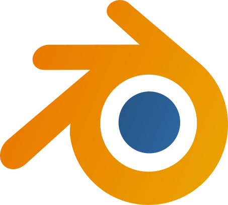
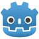
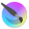
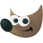
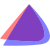
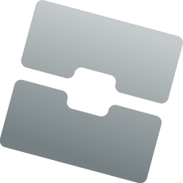
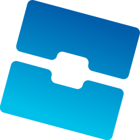
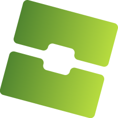
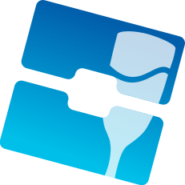

# Coral
An icon theme forked from Kora, replacing/modifying a few icons

## Differences
Icons from different packs are included in this repo, all licensed under the GPL3 license  
Those packs includes:  
Marwaita: https://www.gnome-look.org/p/1239855  
PlasmaX: https://www.gnome-look.org/p/1367155  
Infinity: https://www.gnome-look.org/p/2112373  

### Major changes
| Software                  | Icon source                | Changes                                       |
|---------------------------|----------------------------|-----------------------------------------------|
|  Blender                    | original Blender SVG       | added a subtle gradient                       |
|  Godot                        | from PlasmaX               | edited SVG to make the tones match            |
|  Inkscape                  | from PlasmaX               | edited SVG to make it darker                  |
|  Krita                        | from Marwaita              |                                               |
|  Spotify             | from Marwaita              |                                               |
|  Discord                    | from Kora                  | edited SVG to make the color closer to the official Discord burple|
|  Discord Canary      | from Kora                  | background shape changed to be like regular Discord |
|  Discord Development       | from Kora       | modified to match size and style of other Discord variants |
|  GIMP                          | from KDE's Breeze Dark     | edited SVG to make it bigger                  |
|  Steam                        | from Marwaita              |                                               |
|  OBS                            | from Kora                  | edited SVG to make it darker                  |
|  Libresprite               | made from scratch          |                                               |
|  Aseprite                  | made from scratch          |                                               |
|  PureRef                    | from Kora                  | edited SVG to make it darker                  |
|  DB Browser for SQLite| original DB Browser SVG    |                                               |

### Other changes
-  Settings-related icons have also been replaced by Infinity's system settings SVG
-  EndeavourOS (original Endeavour SVG)

### Manual changes
Some specific app icons have to be changed manually to match the theme. Those includes:
-  Roblox Player
-  Roblox Studio
-  Sober
-  Vinegar  

*All Roblox-related icons are based off the original Sober and Vinegar SVGs*

## License
[GPL3](https://www.gnu.org/licenses/gpl-3.0-standalone.html)