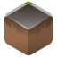
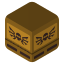
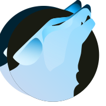

An icon theme forked from Kora, replacing/modifying a few icons while trying to make them more accurate to the original software logo's colors and shapes
  

  
## Credits
Icons from different packs are included in this repo, **all licensed under the GPL3 license**  
Those packs includes:  
[Kora](https://store.kde.org/p/1256209), [Breeze](https://github.com/KDE/breeze-icons), [Marwaita](https://www.gnome-look.org/p/1239855), [MoreWaita](https://www.gnome-look.org/p/2276064), [PlasmaX](https://www.gnome-look.org/p/1367155), [Infinity](https://www.gnome-look.org/p/2112373), [Reversal](https://www.gnome-look.org/p/1340791), [Flat Remix](https://store.kde.org/p/1012430), [FairyWren](https://www.gnome-look.org/p/1684521), [Yosa Max](https://www.gnome-look.org/p/1196255/)  
  
## Major differences  
<?xml version="1.0" ?>

	
Software (click to expand)

	<table border="1" width="100%">
		<tr>
			<th>Icon</th>
			<th>Source</th>
			<th>Changes</th>
		</tr>
		<tr>
			<td>
				
				 Blender
			</td>
			<td>original Blender SVG</td>
			<td>added a subtle gradient</td>
		</tr>
		<tr>
			<td>
				
				 Godot
			</td>
			<td>
				<a href="https://www.gnome-look.org/p/1367155" target="_blank">PlasmaX</a>
			</td>
			<td>edited SVG to make the tones match</td>
		</tr>
		<tr>
			<td>
				
				 Inkscape
			</td>
			<td>
				<a href="https://www.gnome-look.org/p/1367155" target="_blank">PlasmaX</a>
			</td>
			<td>edited SVG to make it darker</td>
		</tr>
		<tr>
			<td>
				
				 Krita
			</td>
			<td>
				<a href="https://www.gnome-look.org/p/1239855" target="_blank">Marwaita</a>
			</td>
			<td/>
		</tr>
		<tr>
			<td>
				
				 Spotify
			</td>
			<td>
				<a href="https://www.gnome-look.org/p/1239855" target="_blank">Marwaita</a>
			</td>
			<td>added a subtle gradient</td>
		</tr>
		<tr>
			<td>
				
				 Discord
			</td>
			<td>
				<a href="https://store.kde.org/p/1256209" target="_blank">Kora</a>
			</td>
			<td>edited SVG to make the color closer to the official Discord burple</td>
		</tr>
		<tr>
			<td>
				
				 Discord Canary
			</td>
			<td>
				<a href="https://store.kde.org/p/1256209" target="_blank">Kora</a>
			</td>
			<td>background shape changed to be like regular Discord</td>
		</tr>
		<tr>
			<td>
				
				 Discord Development
			</td>
			<td>
				<a href="https://store.kde.org/p/1256209" target="_blank">Kora</a>
			</td>
			<td>modified to match size and style of other Discord variants</td>
		</tr>
		<tr>
			<td>
				
				 GIMP
			</td>
			<td>
				<a href="https://github.com/KDE/breeze-icons" target="_blank">Breeze</a>
			</td>
			<td>edited SVG to make it bigger</td>
		</tr>
		<tr>
			<td>
				
				 Steam
			</td>
			<td>
				<a href="https://www.gnome-look.org/p/1239855" target="_blank">Marwaita</a>
			</td>
			<td/>
		</tr>
		<tr>
			<td>
				
				 OBS
			</td>
			<td>
				<a href="https://store.kde.org/p/1256209" target="_blank">Kora</a>
			</td>
			<td>edited SVG to make it darker</td>
		</tr>
		<tr>
			<td>
				
				 Libresprite
			</td>
			<td>made from scratch</td>
			<td/>
		</tr>
		<tr>
			<td>
				
				 Aseprite
			</td>
			<td>made from scratch</td>
			<td/>
		</tr>
		<tr>
			<td>
				
				 PureRef
			</td>
			<td>
				<a href="https://store.kde.org/p/1256209" target="_blank">Kora</a>
			</td>
			<td>edited SVG to make it darker</td>
		</tr>
		<tr>
			<td>
				
				 DB Browser for SQLite
			</td>
			<td>made from scratch</td>
			<td/>
		</tr>
		<tr>
			<td>
				
				 Audacity
			</td>
			<td>
				based on 
				<a href="https://www.gnome-look.org/p/1340791" target="_blank">Reversal</a>
				, but made from scratch
			</td>
			<td>changed colors and shapes</td>
		</tr>
		<tr>
			<td>
				
				 VSCodium
			</td>
			<td>
				<a href="https://github.com/VSCodium/icons/blob/main/icons/linux/nobg/blue1/paulo22s.png">from VSCodium's repository</a>
			</td>
			<td/>
		</tr>
		<tr>
			<td>
				
				 AppImageLauncher
			</td>
			<td>
				<a href="https://store.kde.org/p/1012430" target="_blank">Flat Remix</a>
			</td>
			<td>modified colors and shapes</td>
		</tr>
		<tr>
			<td>
				
				 Android Studio
			</td>
			<td>
				<a href="https://www.gnome-look.org/p/1684521" target="_blank">FairyWren</a>
			</td>
			<td>adjusted colors</td>
		</tr>
		<tr>
			<td>
				
				 Android Studio Canary
			</td>
			<td>
				<a href="https://www.gnome-look.org/p/1684521" target="_blank">FairyWren</a>
			</td>
			<td>adjusted colors</td>
		</tr>
		<tr>
			<td>
				
				 btop++
			</td>
			<td>
				partially from 
				<a href="https://store.kde.org/p/1256209" target="_blank">Kora</a>
			</td>
			<td>remade btop logo from scratch, used Kora's system monitor background, MoreWaita's btop color</td>
		</tr>
		<tr>
			<td>
				
				 Ark
			</td>
			<td>
				<a href="https://www.gnome-look.org/p/1196255/" target="_blank">Yosa Max</a>
			</td>
			<td>made the gradient more noticeable, rounded the corners and replaced the original zipper with Kora's zipper (from the application-x-sogouskin icon)</td>
		</tr>
		<tr>
			<td>
				
				 GitHub Desktop
			</td>
			<td>
				<a href="https://store.kde.org/p/1256209" target="_blank">Kora</a>
			</td>
			<td>adjusted colors</td>
		</tr>
		<tr>
			<td>
				
				 Color Picker
			</td>
			<td>
				<a href="https://www.gnome-look.org/p/1239855" target="_blank">Marwaita</a>
				 and 
				<a href="https://www.gnome-look.org/p/1196255/" target="_blank">Yosa Max</a>
			</td>
			<td>used Marwaita's color picker background and Yosa Max drop symbol</td>
		</tr>
		<tr>
			<td>
				
				 Kvantum
			</td>
			<td>
				<a href="https://store.kde.org/p/1256209" target="_blank">Kora</a>
			</td>
			<td>switched the colors to Marwaita's Kvantum icon</td>
		</tr>
		<tr>
			<td>
				
				 CMake
			</td>
			<td>
				<a href="https://store.kde.org/p/1256209" target="_blank">Kora</a>
			</td>
			<td>removed background and added gradients</td>
		</tr>
		<tr>
			<td>
				
				 Roblox
			</td>
			<td>made from scratch</td>
			<td/>
		</tr>
		<tr>
			<td>
				
				 Roblox Studio
			</td>
			<td>made from scratch</td>
			<td/>
		</tr>
		<tr>
			<td>
				
				 Vinegar
			</td>
			<td>
				made from scratch, then added 
				<a href="https://www.svgrepo.com/svg/443560/brand-winehq">this SVG</a>
				 on top of it
			</td>
			<td/>
		</tr>
		<tr>
			<td>
				
				 Sober
			</td>
			<td>made from scratch</td>
			<td/>
		</tr>
		<tr>
			<td>
				
				 OpenJDK Java 21 Shell
			</td>
			<td>
				<a href="https://store.kde.org/p/1256209" target="_blank">Kora</a>
			</td>
			<td/>
		</tr>
		<tr>
			<td>
				
				 Minecraft
			</td>
			<td>made from scratch</td>
			<td/>
		</tr>
		<tr>
			<td>
				
				 Trenchbroom
			</td>
			<td>made from scratch</td>
			<td/>
		</tr>
		<tr>
			<td>
				
				 Librewolf
			</td>
			<td>
				vectorized version of 
				<a href="https://www.reddit.com/r/LibreWolf/comments/t9c84n/icon_update/">this Reddit post</a>
			</td>
			<td/>
		</tr>
		<tr>
			<td>
				
				 AnimeEffects
			</td>
			<td>
				vectorized version based on 
				<a href="https://github.com/AnimeEffectsDevs/AnimeEffects">AnimeEffects repository</a>
			</td>
			<td/>
		</tr>
		<tr>
			<td>
				
				 Proton Calendar
			</td>
			<td>removed background to match other Proton applications</td>
			<td/>
		</tr>
	</table>

<?xml version="1.0" ?>

	
Places (click to expand)

	<table border="1" width="100%">
		<tr>
			<th>Icon</th>
			<th>Source</th>
			<th>Changes</th>
		</tr>
		<tr>
			<td>
				
				 Desktop
			</td>
			<td>
				<a href="https://store.kde.org/p/1256209" target="_blank">Kora</a>
			</td>
			<td>added a taskbar and icons</td>
		</tr>
		<tr>
			<td>
				
				 Documents
			</td>
			<td>
				<a href="https://store.kde.org/p/1256209" target="_blank">Kora</a>
			</td>
			<td>added Kora's clip icon to it</td>
		</tr>
		<tr>
			<td>
				
				 Videos
			</td>
			<td>
				<a href="https://store.kde.org/p/1256209" target="_blank">Kora</a>
			</td>
			<td>changed icon to a play button and added details</td>
		</tr>
		<tr>
			<td>
				
				 Books
			</td>
			<td>
				<a href="https://store.kde.org/p/1256209" target="_blank">Kora</a>
			</td>
			<td>standardized gradient</td>
		</tr>
		<tr>
			<td>
				
				 Wine
			</td>
			<td>
				<a href="https://store.kde.org/p/1256209" target="_blank">Kora</a>
			</td>
			<td>standardized gradient</td>
		</tr>
		<tr>
			<td>
				
				 Public
			</td>
			<td>
				<a href="https://store.kde.org/p/1256209" target="_blank">Kora</a>
				 and 
				<a href="https://www.svgrepo.com/svg/451439/walking">this stickman</a>
			</td>
			<td>changed the symbol to a stickman from SVG Repo</td>
		</tr>
		<tr>
			<td>
				
				 Locked
			</td>
			<td>
				<a href="https://store.kde.org/p/1256209" target="_blank">Kora</a>
			</td>
			<td>standardized gradient</td>
		</tr>
		<tr>
			<td>
				
				 Unlocked
			</td>
			<td>
				<a href="https://store.kde.org/p/1256209" target="_blank">Kora</a>
			</td>
			<td>standardized gradient</td>
		</tr>
		<tr>
			<td>
				
				 User share
			</td>
			<td>
				<a href="https://store.kde.org/p/1256209" target="_blank">Kora</a>
			</td>
			<td>changed symbol from white to dark blue to match other folder icons</td>
		</tr>
	</table>

<?xml version="1.0" ?>

	
Mimetypes (click to expand)

	<table border="1" width="100%">
		<tr>
			<th>Icon</th>
			<th>Source</th>
			<th>Changes</th>
		</tr>
		<tr>
			<td>
				
				 Zipped file
			</td>
			<td>
				<a href="https://store.kde.org/p/1256209" target="_blank">Kora</a>
			</td>
			<td>fused the original zip icon with application-x-sogouskin.svg, and adjusted colors to match Ark</td>
		</tr>
	</table>

<?xml version="1.0" ?>

	
Others (click to expand)

	<table border="1" width="100%">
		<tr>
			<th>Icon</th>
			<th>Source</th>
			<th>Changes</th>
		</tr>
		<tr>
			<td>
				
				 Settings
			</td>
			<td>
				<a href="https://www.gnome-look.org/p/2112373" target="_blank">Infinity</a>
				 and 
				<a href="https://www.gnome-look.org/p/1340791" target="_blank">Reversal</a>
			</td>
			<td>remade based on a fusion of Infinity's + Reversal' gear icon</td>
		</tr>
		<tr>
			<td>
				
				 EndeavourOS
			</td>
			<td>original EndeavourOS SVG</td>
			<td/>
		</tr>
	</table>

## License
[GPL3](https://www.gnu.org/licenses/gpl-3.0-standalone.html)
