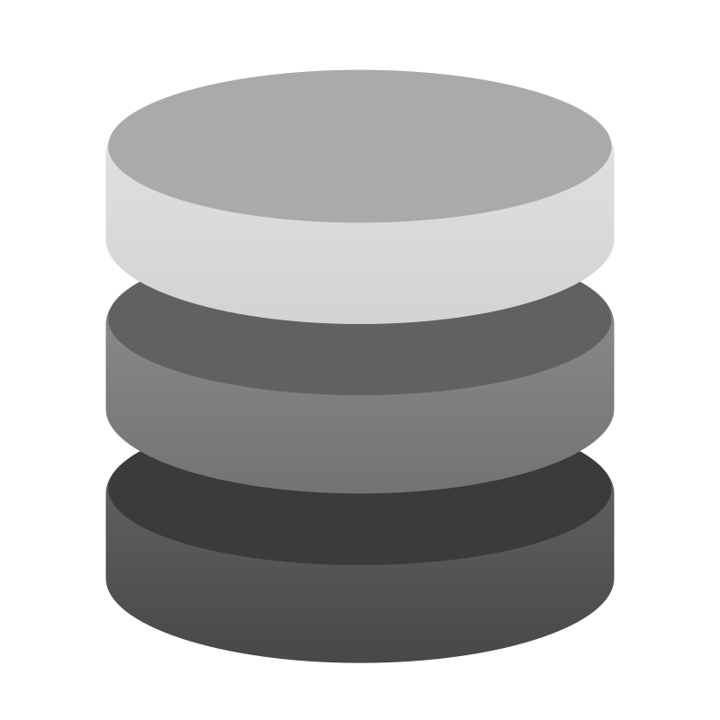
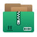
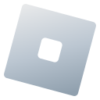
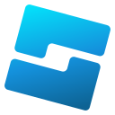
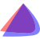

# Copycat
An icon theme forked from Kora, replacing/modifying a few icons

## Differences
Icons from different packs are included in this repo, **all licensed under the GPL3 license**  
Those packs includes:  
[Marwaita](https://www.gnome-look.org/p/1239855)  
[MoreWaita](https://www.gnome-look.org/p/2276064)  
[PlasmaX](https://www.gnome-look.org/p/1367155)  
[Infinity](https://www.gnome-look.org/p/2112373)  
[Reversal](https://www.gnome-look.org/p/1340791)  
[Flat Remix](https://store.kde.org/p/1012430)  
[FairyWren](https://www.gnome-look.org/p/1684521)  
[Yosa Max](https://www.gnome-look.org/p/1196255/)  

### Major changes

|  Software | Icon source | Changes | 
 | ---|---|---| 
 |  Blender | original Blender SVG | added a subtle gradient|
|  Godot | from PlasmaX | edited SVG to make the tones match|
|  Inkscape | from PlasmaX | edited SVG to make it darker|
|  Krita | from Marwaita | |
|  Spotify | from Marwaita | added a subtle gradient|
|  Discord | from Kora | edited SVG to make the color closer to the official Discord burple|
|  Discord Canary | from Kora | background shape changed to be like regular Discord|
|  Discord Development | from Kora | modified to match size and style of other Discord variants|
|  GIMP | from KDE's Breeze Dark | edited SVG to make it bigger|
|  Steam | from Marwaita | |
|  OBS | from Kora | edited SVG to make it darker|
|  Libresprite | made from scratch | |
|  Aseprite | made from scratch | |
|  PureRef | from Kora | edited SVG to make it darker|
|  DB Browser for SQLite | made from scratch | |
|  Audacity | from Reversal Black | changed colors and shapes|
|  VSCodium | [from VSCodium's repository](https://github.com/VSCodium/icons/blob/main/icons/linux/nobg/blue1/paulo22s.png) | |
|  AppImageLauncher | Flat Remix | modified colors and shapes|
|  Android Studio | from FairyWren | adjusted colors|
|  Android Studio Beta | from FairyWren | adjusted colors|
|  Android Studio Canary | from FairyWren | adjusted colors|
|  btop++ | partially of Kora | remade btop logo from scratch, used Kora's system monitor background, MoreWaita's btop color|
|  Ark | from Yosa Max | made the gradient more noticeable|
|  GitHub Desktop | from Kora | adjusted colors|
|  Color Picker | from Marwaita and Yosa Max | used Marwaita's color picker background and Yosa Max drop symbol|
|  Kvantum | from Kora | switched the colors to Marwaita's Kvantum icon|
|  CMake | from Kora | removed background and added gradients|
|  Roblox | made from scratch | |
|  Roblox Studio | made from scratch | |
|  Vinegar | made from scratch, then added [this SVG](https://www.svgrepo.com/svg/443560/brand-winehq) on top of it | |
|  Sober | made from scratch | |
|  OpenJDK Java 21 Shell | from Kora | |

|  Places | Icon source | Changes | 
 | ---|---|---| 
 |  Desktop | from Kora | added a taskbar and icons|
|  Documents | from Kora | added Kora's clip icon to it|
|  Downloads | from Kora | modified the arrow|
|  Music | from Kora | changed colors|
|  Music (open) | from Kora | changed colors|
|  Pictures | from Kora | changed colors|
|  Pictures (open) | from Kora | changed colors|
|  Videos | from Kora | changed icon to a play button and added details|

### Other changes
-  Settings-related icons have also been remade based on a fusion of Infinity's + Reversal's gear icon
-  EndeavourOS (original Endeavour SVG)

## License
[GPL3](https://www.gnu.org/licenses/gpl-3.0-standalone.html)

