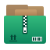
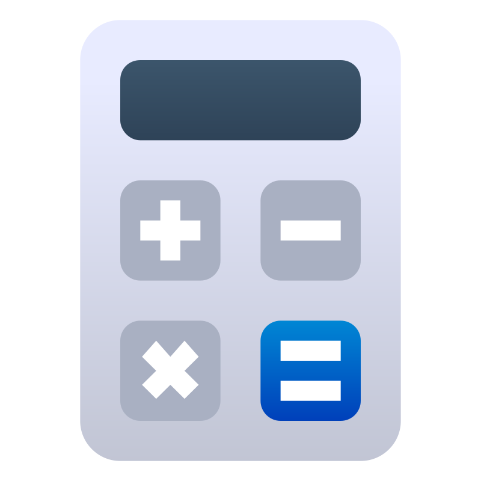

An icon theme forked from Kora, replacing/modifying a few icons while trying to make them more accurate to the original software logo's colors and shapes  
  
All folder icons were regenerated using Copyhex to fix small inconsistencies in gradients and change glyphs  
  
  
  
## Credits
Icons from different packs are included in this repo, **all licensed under the GPL3 license**  
Those packs includes:  
<a href="https://store.kde.org/p/1256209" target="_blank">Kora</a>, <a href="https://github.com/KDE/breeze-icons" target="_blank">Breeze</a>, <a href="https://www.gnome-look.org/p/1239855" target="_blank">Marwaita</a>, <a href="https://www.gnome-look.org/p/2276064" target="_blank">MoreWaita</a>, <a href="https://www.gnome-look.org/p/1367155" target="_blank">PlasmaX</a>, <a href="https://www.gnome-look.org/p/2112373" target="_blank">Infinity</a>, <a href="https://www.gnome-look.org/p/1340791" target="_blank">Reversal</a>, <a href="https://store.kde.org/p/1012430" target="_blank">Flat Remix</a>, <a href="https://www.gnome-look.org/p/1684521" target="_blank">FairyWren</a>, <a href="https://www.gnome-look.org/p/1196255/" target="_blank">Yosa Max</a>, <a href="https://www.gnome-look.org/p/1166289/" target="_blank">Papirus</a>, <a href="https://github.com/vinceliuice/Qogir-icon-theme" target="_blank">Qogir</a>, <a href="https://store.kde.org/p/1477945" target="_blank">Fluent</a>

## Major differences
<?xml version="1.0" ?>

	
Apps (click to expand)

	<table border="1" width="100%">
		<tr>
			<th>Icon</th>
			<th>Icon name</th>
			<th>Source</th>
			<th>Changes</th>
		</tr>
		<tr>
			<td>
				
			</td>
			<td>Blender</td>
			<td>
				<a href="https://commons.wikimedia.org/wiki/File:Blender_logo_no_text.svg" target="_blank">original Blender logo</a>
			</td>
			<td>added a subtle gradient</td>
		</tr>
		<tr>
			<td>
				
			</td>
			<td>Godot</td>
			<td>
				<a href="https://www.gnome-look.org/p/1367155" target="_blank">PlasmaX</a>
			</td>
			<td>edited SVG to make the tones match</td>
		</tr>
		<tr>
			<td>
				
			</td>
			<td>Inkscape</td>
			<td>
				<a href="https://www.gnome-look.org/p/1367155" target="_blank">PlasmaX</a>
			</td>
			<td>edited SVG to make it darker</td>
		</tr>
		<tr>
			<td>
				
			</td>
			<td>Krita</td>
			<td>
				<a href="https://www.gnome-look.org/p/1239855" target="_blank">Marwaita</a>
			</td>
			<td/>
		</tr>
		<tr>
			<td>
				
			</td>
			<td>Spotify</td>
			<td>
				<a href="https://www.gnome-look.org/p/1239855" target="_blank">Marwaita</a>
			</td>
			<td>added a subtle gradient</td>
		</tr>
		<tr>
			<td>
				
			</td>
			<td>Discord</td>
			<td>
				<a href="https://store.kde.org/p/1256209" target="_blank">Kora</a>
			</td>
			<td>edited SVG to make the color closer to the official Discord burple</td>
		</tr>
		<tr>
			<td>
				
			</td>
			<td>Discord Canary</td>
			<td>
				<a href="https://store.kde.org/p/1256209" target="_blank">Kora</a>
			</td>
			<td>background shape changed to be like regular Discord</td>
		</tr>
		<tr>
			<td>
				
			</td>
			<td>Discord Development</td>
			<td>
				<a href="https://store.kde.org/p/1256209" target="_blank">Kora</a>
			</td>
			<td>modified to match size and style of other Discord variants</td>
		</tr>
		<tr>
			<td>
				
			</td>
			<td>GIMP</td>
			<td>
				<a href="https://github.com/KDE/breeze-icons" target="_blank">Breeze</a>
			</td>
			<td>edited SVG to make it bigger</td>
		</tr>
		<tr>
			<td>
				
			</td>
			<td>Steam</td>
			<td>
				<a href="https://www.gnome-look.org/p/1239855" target="_blank">Marwaita</a>
			</td>
			<td/>
		</tr>
		<tr>
			<td>
				
			</td>
			<td>OBS</td>
			<td>
				<a href="https://store.kde.org/p/1256209" target="_blank">Kora</a>
			</td>
			<td>edited SVG to make it darker</td>
		</tr>
		<tr>
			<td>
				
			</td>
			<td>Libresprite</td>
			<td>made from scratch</td>
			<td/>
		</tr>
		<tr>
			<td>
				
			</td>
			<td>Aseprite</td>
			<td>made from scratch</td>
			<td/>
		</tr>
		<tr>
			<td>
				
			</td>
			<td>PureRef</td>
			<td>
				<a href="https://store.kde.org/p/1256209" target="_blank">Kora</a>
			</td>
			<td>edited SVG to make it darker</td>
		</tr>
		<tr>
			<td>
				
			</td>
			<td>DB Browser for SQLite</td>
			<td>
				adapted from 
				<a href="https://www.svgrepo.com/svg/28272/database-analysing" target="_blank">SVG Repo</a>
			</td>
			<td/>
		</tr>
		<tr>
			<td>
				
			</td>
			<td>Audacity</td>
			<td>
				<a href="https://www.gnome-look.org/p/1196255/" target="_blank">Yosa Max</a>
				 and 
				<a href="https://store.kde.org/p/1477945" target="_blank">Fluent</a>
			</td>
			<td>
				changed the headphones symbol to 
				<a href="https://store.kde.org/p/1477945" target="_blank">Fluent</a>
				 headphones, normalized the background shape with other rectangular 
				<a href="https://store.kde.org/p/1256209" target="_blank">Kora</a>
				 icons and adjusted the gradients
			</td>
		</tr>
		<tr>
			<td>
				
			</td>
			<td>VSCodium</td>
			<td>
				<a href="https://github.com/VSCodium/icons/blob/main/icons/linux/nobg/blue1/paulo22s.png" target="_blank">from VSCodium repository</a>
			</td>
			<td/>
		</tr>
		<tr>
			<td>
				
			</td>
			<td>AppImageLauncher</td>
			<td>
				<a href="https://store.kde.org/p/1012430" target="_blank">Flat Remix</a>
			</td>
			<td>modified colors and shapes</td>
		</tr>
		<tr>
			<td>
				
			</td>
			<td>btop++</td>
			<td>
				partially from 
				<a href="https://store.kde.org/p/1256209" target="_blank">Kora</a>
			</td>
			<td>
				remade btop logo from scratch, used 
				<a href="https://store.kde.org/p/1256209" target="_blank">Kora</a>
				 system monitor background, 
				<a href="https://www.gnome-look.org/p/2276064" target="_blank">MoreWaita</a>
				 btop color
			</td>
		</tr>
		<tr>
			<td>
				
			</td>
			<td>Ark</td>
			<td>
				<a href="https://github.com/vinceliuice/Qogir-icon-theme" target="_blank">Qogir</a>
			</td>
			<td>
				made the colors match with the zip mimetypes and replaced the original zipper with 
				<a href="https://store.kde.org/p/1256209" target="_blank">Kora</a>
				 zipper (from the application-x-sogouskin icon)
			</td>
		</tr>
		<tr>
			<td>
				
			</td>
			<td>GitHub Desktop</td>
			<td>
				<a href="https://store.kde.org/p/1256209" target="_blank">Kora</a>
			</td>
			<td>adjusted colors</td>
		</tr>
		<tr>
			<td>
				
			</td>
			<td>Color Picker</td>
			<td>
				<a href="https://www.gnome-look.org/p/1239855" target="_blank">Marwaita</a>
				 and 
				<a href="https://www.gnome-look.org/p/1196255/" target="_blank">Yosa Max</a>
			</td>
			<td>
				used 
				<a href="https://www.gnome-look.org/p/1239855" target="_blank">Marwaita</a>
				 color picker background and Yosa Max drop symbol
			</td>
		</tr>
		<tr>
			<td>
				
			</td>
			<td>Kvantum</td>
			<td>
				<a href="https://store.kde.org/p/1256209" target="_blank">Kora</a>
			</td>
			<td>
				switched the colors to 
				<a href="https://www.gnome-look.org/p/1239855" target="_blank">Marwaita</a>
				 Kvantum icon
			</td>
		</tr>
		<tr>
			<td>
				
			</td>
			<td>CMake</td>
			<td>
				<a href="https://store.kde.org/p/1256209" target="_blank">Kora</a>
			</td>
			<td>removed background and added gradients</td>
		</tr>
		<tr>
			<td>
				
			</td>
			<td>Roblox</td>
			<td>made from scratch</td>
			<td/>
		</tr>
		<tr>
			<td>
				
			</td>
			<td>Roblox Studio</td>
			<td>made from scratch</td>
			<td/>
		</tr>
		<tr>
			<td>
				
			</td>
			<td>Vinegar</td>
			<td>
				made from scratch, then added 
				<a href="https://www.svgrepo.com/svg/443560/brand-winehq" target="_blank">this SVG</a>
				 on top of it
			</td>
			<td/>
		</tr>
		<tr>
			<td>
				
			</td>
			<td>Sober</td>
			<td>made from scratch</td>
			<td/>
		</tr>
		<tr>
			<td>
				
			</td>
			<td>OpenJDK Java 21 Shell</td>
			<td>
				<a href="https://store.kde.org/p/1256209" target="_blank">Kora</a>
			</td>
			<td/>
		</tr>
		<tr>
			<td>
				
			</td>
			<td>Librewolf</td>
			<td>
				vectorized version of 
				<a href="https://www.reddit.com/r/LibreWolf/comments/t9c84n/icon_update/" target="_blank">this Reddit post</a>
			</td>
			<td/>
		</tr>
		<tr>
			<td>
				
			</td>
			<td>AnimeEffects</td>
			<td>
				vectorized version based on 
				<a href="https://github.com/AnimeEffectsDevs/AnimeEffects" target="_blank">AnimeEffects repository</a>
			</td>
			<td/>
		</tr>
		<tr>
			<td>
				
			</td>
			<td>Proton Calendar</td>
			<td>
				<a href="https://store.kde.org/p/1256209" target="_blank">Kora</a>
			</td>
			<td>removed background to match other Proton applications</td>
		</tr>
		<tr>
			<td>
				
			</td>
			<td>Mail</td>
			<td>
				<a href="https://www.gnome-look.org/p/1166289/" target="_blank">Papirus</a>
			</td>
			<td>
				changed colors to match 
				<a href="https://store.kde.org/p/1256209" target="_blank">Kora</a>
				 original mail icons and added gradients. @ symbol taken from the icon application-mbox
			</td>
		</tr>
		<tr>
			<td>
				
			</td>
			<td>BlueMail</td>
			<td>
				<a href="https://www.gnome-look.org/p/1166289/" target="_blank">Papirus</a>
			</td>
			<td>changed colors to be closer to the original logo and added gradients</td>
		</tr>
		<tr>
			<td>
				
			</td>
			<td>Bitwig</td>
			<td>
				<a href="https://store.kde.org/p/1256209" target="_blank">Kora</a>
			</td>
			<td>adjusted to match the colors and proportions of Bitwig mimetypes</td>
		</tr>
		<tr>
			<td>
				
			</td>
			<td>Vesktop</td>
			<td>
				vectorized version of the 
				<a href="https://github.com/Vencord/Vesktop" target="_blank">original logo</a>
				 and 
				<a href="https://store.kde.org/p/1256209" target="_blank">Kora</a>
			</td>
			<td>
				fused the 
				<a href="https://github.com/Vencord/Vesktop" target="_blank">original logo</a>
				 with the with the base shape of the agentdesktop icon from 
				<a href="https://store.kde.org/p/1256209" target="_blank">Kora</a>
				 (and used 
				<a href="https://vencord.dev/" target="_blank">this alternative logo</a>
				 to recreate the Z pattern in the "C" letter)
			</td>
		</tr>
		<tr>
			<td>
				
			</td>
			<td>Calculator</td>
			<td>
				<a href="www.svgrepo.com/svg/362041/calculator" target="_blank">SVG Repo</a>
			</td>
			<td>
				changed colors (replicated from 
				<a href="https://github.com/KDE/breeze-icons" target="_blank">Breeze</a>
				) and added gradients
			</td>
		</tr>
		<tr>
			<td>
				
			</td>
			<td>Filelight</td>
			<td>
				<a href="https://github.com/KDE/breeze-icons" target="_blank">Breeze</a>
			</td>
			<td>added gradients and removed some shadows</td>
		</tr>
	</table>

<?xml version="1.0" ?>

	
Mimetypes (click to expand)

	<table border="1" width="100%">
		<tr>
			<th>Icon</th>
			<th>Icon name</th>
			<th>Source</th>
			<th>Changes</th>
		</tr>
		<tr>
			<td>
				
			</td>
			<td>Kotlin</td>
			<td>
				<a href="https://store.kde.org/p/1256209" target="_blank">Kora</a>
				 and 
				<a href="https://commons.wikimedia.org/wiki/File:Kotlin_icon_(2021-present).svg" target="_blank">Wikimedia</a>
			</td>
			<td>updated the symbol to the new Kotlin logo and applied the colors of its gradient</td>
		</tr>
		<tr>
			<td>
				
			</td>
			<td>Rust</td>
			<td>
				<a href="https://store.kde.org/p/1256209" target="_blank">Kora</a>
				 and 
				<a href="https://commons.wikimedia.org/wiki/File:Kotlin_icon_(2021-present).svg" target="_blank">the original Rust SVG</a>
			</td>
			<td>changed the 'RS' text to the Rust symbol (without the gear)</td>
		</tr>
	</table>

<?xml version="1.0" ?>

	
Others (click to expand)

	<table border="1" width="100%">
		<tr>
			<th>Icon</th>
			<th>Icon name</th>
			<th>Source</th>
			<th>Changes</th>
		</tr>
		<tr>
			<td>
				
			</td>
			<td>Settings</td>
			<td>
				<a href="https://www.svgrepo.com/svg/362053/cog" target="_blank">SVG Repo</a>
			</td>
			<td>added gradients and modified proportions</td>
		</tr>
		<tr>
			<td>
				
			</td>
			<td>EndeavourOS</td>
			<td>
				<a href="https://github.com/endeavouros-team/EndeavourOS-Development?tab=readme-ov-file" target="_blank">original EndeavourOS SVG</a>
			</td>
			<td/>
		</tr>
	</table>

## License
[GPL3](https://www.gnu.org/licenses/gpl-3.0-standalone.html)
