# Folder-likes - Plain
|                                   Icon                                    |                   Is real                    |                           Full path                           |              File name              |                         Points to                         |     Origin directory      |
|---------------------------------------------------------------------------|----------------------------------------------|---------------------------------------------------------------|-------------------------------------|-----------------------------------------------------------|---------------------------|
|           ||`copycat/apps/scalable/file-manager-blue.svg`                  |`file-manager-blue`                  |                                                           |`apps/scalable/`           |
|      ||`copycat/apps/scalable/com.yuenhoe.filedrawer.svg`             |`com.yuenhoe.filedrawer`             |                                                           |`apps/scalable/`           |
|                     |  |<i>`copycat/apps/scalable/d3lphin.svg`</i>                     |<i>`d3lphin`</i>                     |<i>`system-file-manager.svg`</i>                           |<i>`apps/scalable/`</i>    |
|       |  |<i>`copycat/apps/scalable/org.kde.plasma.folder.svg`</i>       |<i>`org.kde.plasma.folder`</i>       |<i>`file-manager-blue.svg`</i>                             |<i>`apps/scalable/`</i>    |
|          |  |<i>`copycat/apps/scalable/thunar-filemanager.svg`</i>          |<i>`thunar-filemanager`</i>          |<i>`thunar.svg`</i>                                        |<i>`apps/scalable/`</i>    |
|            |  |<i>`copycat/apps/scalable/xfce-filemanager.svg`</i>            |<i>`xfce-filemanager`</i>            |<i>`file-manager.svg`</i>                                  |<i>`apps/scalable/`</i>    |
|    |  |<i>`copycat/apps/scalable/com.system76.CosmicFiles.svg`</i>    |<i>`com.system76.CosmicFiles`</i>    |<i>`file-manager-blue.svg`</i>                             |<i>`apps/scalable/`</i>    |
|                |  |<i>`copycat/apps/scalable/file-manager.svg`</i>                |<i>`file-manager`</i>                |<i>`file-manager-blue.svg`</i>                             |<i>`apps/scalable/`</i>    |
|   |  |<i>`copycat/apps/scalable/folder_doc_q4os_startmenu.svg`</i>   |<i>`folder_doc_q4os_startmenu`</i>   |<i>`file-manager-blue.svg`</i>                             |<i>`apps/scalable/`</i>    |
|             |  |<i>`copycat/apps/scalable/org.kde.dolphin.svg`</i>             |<i>`org.kde.dolphin`</i>             |<i>`file-manager-blue.svg`</i>                             |<i>`apps/scalable/`</i>    |
|                |  |<i>`copycat/apps/scalable/spacefm-blue.svg`</i>                |<i>`spacefm-blue`</i>                |<i>`file-manager-blue.svg`</i>                             |<i>`apps/scalable/`</i>    |
|            |  |<i>`copycat/apps/scalable/dde-file-manager.svg`</i>            |<i>`dde-file-manager`</i>            |<i>`file-manager.svg`</i>                                  |<i>`apps/scalable/`</i>    |
|                     |  |<i>`copycat/apps/scalable/dolphin.svg`</i>                     |<i>`dolphin`</i>                     |<i>`file-manager.svg`</i>                                  |<i>`apps/scalable/`</i>    |
|             |  |<i>`copycat/apps/scalable/gnome-commander.svg`</i>             |<i>`gnome-commander`</i>             |<i>`file-manager.svg`</i>                                  |<i>`apps/scalable/`</i>    |
|         |  |<i>`copycat/apps/scalable/gnome-encfs-manager.svg`</i>         |<i>`gnome-encfs-manager`</i>         |<i>`file-manager.svg`</i>                                  |<i>`apps/scalable/`</i>    |
|                         |  |<i>`copycat/apps/scalable/kfm.svg`</i>                         |<i>`kfm`</i>                         |<i>`file-manager.svg`</i>                                  |<i>`apps/scalable/`</i>    |
|                    |  |<i>`copycat/apps/scalable/nautilus.svg`</i>                    |<i>`nautilus`</i>                    |<i>`file-manager.svg`</i>                                  |<i>`apps/scalable/`</i>    |
|                        |  |<i>`copycat/apps/scalable/nemo.svg`</i>                        |<i>`nemo`</i>                        |<i>`file-manager.svg`</i>                                  |<i>`apps/scalable/`</i>    |
|          |  |<i>`copycat/apps/scalable/redhat-filemanager.svg`</i>          |<i>`redhat-filemanager`</i>          |<i>`file-manager.svg`</i>                                  |<i>`apps/scalable/`</i>    |
|         |  |<i>`copycat/apps/scalable/system-file-manager.svg`</i>         |<i>`system-file-manager`</i>         |<i>`file-manager.svg`</i>                                  |<i>`apps/scalable/`</i>    |
|                      |  |<i>`copycat/apps/scalable/thunar.svg`</i>                      |<i>`thunar`</i>                      |<i>`file-manager.svg`</i>                                  |<i>`apps/scalable/`</i>    |
|                      |  |<i>`copycat/apps/scalable/Thunar.svg`</i>                      |<i>`Thunar`</i>                      |<i>`thunar.svg`</i>                                        |<i>`apps/scalable/`</i>    |
|           |  |<i>`copycat/apps/scalable/user-file-manager.svg`</i>           |<i>`user-file-manager`</i>           |<i>`file-manager.svg`</i>                                  |<i>`apps/scalable/`</i>    |
|                          |  |<i>`copycat/apps/scalable/mc.svg`</i>                          |<i>`mc`</i>                          |<i>`gnome-commander.svg`</i>                               |<i>`apps/scalable/`</i>    |
|           |  |<i>`copycat/apps/scalable/MidnightCommander.svg`</i>           |<i>`MidnightCommander`</i>           |<i>`mc.svg`</i>                                            |<i>`apps/scalable/`</i>    |
|                 |  |<i>`copycat/apps/scalable/mucommander.svg`</i>                 |<i>`mucommander`</i>                 |<i>`gnome-commander.svg`</i>                               |<i>`apps/scalable/`</i>    |
||  |<i>`copycat/apps/scalable/nautilus-actions-config-tool.svg`</i>|<i>`nautilus-actions-config-tool`</i>|<i>`nautilus.svg`</i>                                      |<i>`apps/scalable/`</i>    |
|            |  |<i>`copycat/apps/scalable/nautilus-actions.svg`</i>            |<i>`nautilus-actions`</i>            |<i>`nautilus.svg`</i>                                      |<i>`apps/scalable/`</i>    |
|             |  |<i>`copycat/apps/scalable/org.gnome.files.svg`</i>             |<i>`org.gnome.files`</i>             |<i>`nautilus.svg`</i>                                      |<i>`apps/scalable/`</i>    |
|             |  |<i>`copycat/apps/scalable/org.gnome.Files.svg`</i>             |<i>`org.gnome.Files`</i>             |<i>`nautilus.svg`</i>                                      |<i>`apps/scalable/`</i>    |
|          |  |<i>`copycat/apps/scalable/org.gnome.nautilus.svg`</i>          |<i>`org.gnome.nautilus`</i>          |<i>`nautilus.svg`</i>                                      |<i>`apps/scalable/`</i>    |
|          |  |<i>`copycat/apps/scalable/org.gnome.Nautilus.svg`</i>          |<i>`org.gnome.Nautilus`</i>          |<i>`nautilus.svg`</i>                                      |<i>`apps/scalable/`</i>    |
|               |  |<i>`copycat/apps/scalable/org.kde.index.svg`</i>               |<i>`org.kde.index`</i>               |<i>`system-file-manager.svg`</i>                           |<i>`apps/scalable/`</i>    |
|        |  |<i>`copycat/apps/scalable/org.xfce.filemanager.svg`</i>        |<i>`org.xfce.filemanager`</i>        |<i>`system-file-manager.svg`</i>                           |<i>`apps/scalable/`</i>    |
||  |<i>`copycat/apps/scalable/org.xfce.panel.directorymenu.svg`</i>|<i>`org.xfce.panel.directorymenu`</i>|<i>`system-file-manager.svg`</i>                           |<i>`apps/scalable/`</i>    |
|             |  |<i>`copycat/apps/scalable/org.xfce.thunar.svg`</i>             |<i>`org.xfce.thunar`</i>             |<i>`system-file-manager.svg`</i>                           |<i>`apps/scalable/`</i>    |
|                  |  |<i>`copycat/apps/scalable/pcmanfm-qt.svg`</i>                  |<i>`pcmanfm-qt`</i>                  |<i>`system-file-manager.svg`</i>                           |<i>`apps/scalable/`</i>    |
|                     |  |<i>`copycat/apps/scalable/spacefm.svg`</i>                     |<i>`spacefm`</i>                     |<i>`spacefm-blue.svg`</i>                                  |<i>`apps/scalable/`</i>    |
|             |  |<i>`copycat/apps/scalable/fma-config-tool.svg`</i>             |<i>`fma-config-tool`</i>             |<i>`caja-actions.svg`</i>                                  |<i>`apps/scalable/`</i>    |
|                |  |<i>`copycat/apps/scalable/caja-actions.svg`</i>                |<i>`caja-actions`</i>                |<i>`system-file-manager.svg`</i>                           |<i>`apps/scalable/`</i>    |
|                    |  |<i>`copycat/places/scalable/folder.svg`</i>                    |<i>`folder`</i>                      |<i>`../../reserved/folder-flavors/kora/blue/folder.svg`</i>|<i>`places/scalable`</i>   |
|                  |  |<i>`copycat/places/scalable/folder_2.svg`</i>                  |<i>`folder_2`</i>                    |<i>`folder.svg`</i>                                        |<i>`places/scalable`</i>   |
|              |  |<i>`copycat/places/scalable/gnome-folder.svg`</i>              |<i>`gnome-folder`</i>                |<i>`folder.svg`</i>                                        |<i>`places/scalable`</i>   |
| |  |<i>`copycat/places/scalable/gnome-fs-directory-accept.svg`</i> |<i>`gnome-fs-directory-accept`</i>   |<i>`folder.svg`</i>                                        |<i>`places/scalable`</i>   |
|        |  |<i>`copycat/places/scalable/gnome-fs-directory.svg`</i>        |<i>`gnome-fs-directory`</i>          |<i>`folder.svg`</i>                                        |<i>`places/scalable`</i>   |
|             |  |<i>`copycat/places/scalable/gtk-directory.svg`</i>             |<i>`gtk-directory`</i>               |<i>`folder.svg`</i>                                        |<i>`places/scalable`</i>   |
|           |  |<i>`copycat/places/scalable/inode-directory.svg`</i>           |<i>`inode-directory`</i>             |<i>`folder.svg`</i>                                        |<i>`places/scalable`</i>   |
|              |  |<i>`copycat/places/scalable/stock_folder.svg`</i>              |<i>`stock_folder`</i>                |<i>`folder.svg`</i>                                        |<i>`places/scalable`</i>   |
|        |  |<i>`copycat/mimetypes/scalable/inode-directory.svg`</i>        |<i>`inode-directory`</i>             |<i>`../../places/scalable/folder.svg`</i>                  |<i>`mimetypes/scalable`</i>|
# Folder-likes - Variations
|                                   Icon                                   |                   Is real                    |                          Full path                           |             File name              |          Points to           |   Origin directory    |
|--------------------------------------------------------------------------|----------------------------------------------|--------------------------------------------------------------|------------------------------------|------------------------------|-----------------------|
|                     ||`copycat/apps/scalable/athena.svg`                            |`athena`                            |                              |`apps/scalable/`       |
|                  ||`copycat/apps/scalable/filezilla.svg`                         |`filezilla`                         |                              |`apps/scalable/`       |
|                ||`copycat/apps/scalable/kfoldersync.svg`                       |`kfoldersync`                       |                              |`apps/scalable/`       |
|                        ||`copycat/apps/scalable/xfe.svg`                               |`xfe`                               |                              |`apps/scalable/`       |
|              ||`copycat/apps/scalable/krusader_root.svg`                     |`krusader_root`                     |                              |`apps/scalable/`       |
|              ||`copycat/apps/scalable/krusader_user.svg`                     |`krusader_user`                     |                              |`apps/scalable/`       |
|               ||`copycat/apps/scalable/nautilus-alt.svg`                      |`nautilus-alt`                      |                              |`apps/scalable/`       |
|            ||`copycat/apps/scalable/network-manager.svg`                   |`network-manager`                   |                              |`apps/scalable/`       |
|       ||`copycat/apps/scalable/org.kde.plasma.vault.svg`              |`org.kde.plasma.vault`              |                              |`apps/scalable/`       |
|                ||`copycat/apps/scalable/plasmavault.svg`                       |`plasmavault`                       |                              |`apps/scalable/`       |
|                   ||`copycat/apps/scalable/winefile.svg`                          |`winefile`                          |                              |`apps/scalable/`       |
|        ||`copycat/apps/scalable/filemanager-actions.svg`               |`filemanager-actions`               |                              |`apps/scalable/`       |
|                   ||`copycat/apps/scalable/Finder_w.svg`                          |`Finder_w`                          |                              |`apps/scalable/`       |
|             |  |<i>`copycat/apps/scalable/AirPortUtility.svg`</i>             |<i>`AirPortUtility`</i>             |<i>`network-workgroup.svg`</i>|<i>`apps/scalable/`</i>|
|                 |  |<i>`copycat/apps/scalable/cs-network.svg`</i>                 |<i>`cs-network`</i>                 |<i>`network-workgroup.svg`</i>|<i>`apps/scalable/`</i>|
|   |  |<i>`copycat/apps/scalable/gnome-network-properties.svg`</i>   |<i>`gnome-network-properties`</i>   |<i>`network-workgroup.svg`</i>|<i>`apps/scalable/`</i>|
||  |<i>`copycat/apps/scalable/kali-wireless-attacks-trans.svg`</i>|<i>`kali-wireless-attacks-trans`</i>|<i>`wicd.svg`</i>             |<i>`apps/scalable/`</i>|
|              |  |<i>`copycat/apps/scalable/krusader_blue.svg`</i>              |<i>`krusader_blue`</i>              |<i>`krusader_user.svg`</i>    |<i>`apps/scalable/`</i>|
|               |  |<i>`copycat/apps/scalable/krusader_red.svg`</i>               |<i>`krusader_red`</i>               |<i>`krusader_root.svg`</i>    |<i>`apps/scalable/`</i>|
|                    |  |<i>`copycat/apps/scalable/linssid.svg`</i>                    |<i>`linssid`</i>                    |<i>`wicd.svg`</i>             |<i>`apps/scalable/`</i>|
|       |  |<i>`copycat/apps/scalable/mate-netspeed-applet.svg`</i>       |<i>`mate-netspeed-applet`</i>       |<i>`network-workgroup.svg`</i>|<i>`apps/scalable/`</i>|
|    |  |<i>`copycat/apps/scalable/mate-network-properties.svg`</i>    |<i>`mate-network-properties`</i>    |<i>`network-workgroup.svg`</i>|<i>`apps/scalable/`</i>|
|          |  |<i>`copycat/apps/scalable/network-workgroup.svg`</i>          |<i>`network-workgroup`</i>          |<i>`network-manager.svg`</i>  |<i>`apps/scalable/`</i>|
|             |  |<i>`copycat/apps/scalable/networkmanager.svg`</i>             |<i>`networkmanager`</i>             |<i>`network-workgroup.svg`</i>|<i>`apps/scalable/`</i>|
|                       |  |<i>`copycat/apps/scalable/wicd.svg`</i>                       |<i>`wicd`</i>                       |<i>`network-manager.svg`</i>  |<i>`apps/scalable/`</i>|
|                   |  |<i>`copycat/apps/scalable/wicd-gtk.svg`</i>                   |<i>`wicd-gtk`</i>                   |<i>`wicd.svg`</i>             |<i>`apps/scalable/`</i>|
|                 |  |<i>`copycat/apps/scalable/wifi-radar.svg`</i>                 |<i>`wifi-radar`</i>                 |<i>`wicd.svg`</i>             |<i>`apps/scalable/`</i>|
# Folder-likes - Derivations
|                                 Icon                                  |                   Is real                    |                     Full path                      |        File name         |           Points to           |   Origin directory    |
|-----------------------------------------------------------------------|----------------------------------------------|----------------------------------------------------|--------------------------|-------------------------------|-----------------------|
|      ||`copycat/apps/scalable/file-manager-green.svg`      |`file-manager-green`      |                               |`apps/scalable/`       |
|        ||`copycat/apps/scalable/file-manager-red.svg`        |`file-manager-red`        |                               |`apps/scalable/`       |
|||`copycat/apps/scalable/system-file-manager-root.svg`|`system-file-manager-root`|                               |`apps/scalable/`       |
|          ||`copycat/places/scalable/folder-black.svg`          |`folder-black`            |                               |`places/scalable`      |
|           ||`copycat/places/scalable/folder-blue.svg`           |`folder-blue`             |                               |`places/scalable`      |
|          ||`copycat/places/scalable/folder-brown.svg`          |`folder-brown`            |                               |`places/scalable`      |
|           ||`copycat/places/scalable/folder-cyan.svg`           |`folder-cyan`             |                               |`places/scalable`      |
|          ||`copycat/places/scalable/folder-green.svg`          |`folder-green`            |                               |`places/scalable`      |
|           ||`copycat/places/scalable/folder-grey.svg`           |`folder-grey`             |                               |`places/scalable`      |
|        ||`copycat/places/scalable/folder-magenta.svg`        |`folder-magenta`          |                               |`places/scalable`      |
|         ||`copycat/places/scalable/folder-orange.svg`         |`folder-orange`           |                               |`places/scalable`      |
|            ||`copycat/places/scalable/folder-red.svg`            |`folder-red`              |                               |`places/scalable`      |
|         ||`copycat/places/scalable/folder-violet.svg`         |`folder-violet`           |                               |`places/scalable`      |
|         ||`copycat/places/scalable/folder-yellow.svg`         |`folder-yellow`           |                               |`places/scalable`      |
|           |  |<i>`copycat/apps/scalable/spacefm-green.svg`</i>    |<i>`spacefm-green`</i>    |<i>`file-manager-green.svg`</i>|<i>`apps/scalable/`</i>|
|             |  |<i>`copycat/apps/scalable/spacefm-red.svg`</i>      |<i>`spacefm-red`</i>      |<i>`file-manager-red.svg`</i>  |<i>`apps/scalable/`</i>|
# Folder-likes - Locked
|                               Icon                                |                  Is real                   |                       Full path                       |         File name         |                            Points to                             |    Origin directory    |
|-------------------------------------------------------------------|--------------------------------------------|-------------------------------------------------------|---------------------------|------------------------------------------------------------------|------------------------|
|     ||<i>`copycat/places/scalable/folder-locked.svg`</i>     |<i>`folder-locked`</i>     |<i>`../../reserved/folder-flavors/kora/blue/folder-locked.svg`</i>|<i>`places/scalable`</i>|
|||<i>`copycat/places/scalable/certificate-server.svg`</i>|<i>`certificate-server`</i>|<i>`folder-locked.svg`</i>                                        |<i>`places/scalable`</i>|
|   ||<i>`copycat/places/scalable/folder-ecrypted.svg`</i>   |<i>`folder-ecrypted`</i>   |<i>`folder-locked.svg`</i>                                        |<i>`places/scalable`</i>|
|  ||<i>`copycat/places/scalable/folder-encrypted.svg`</i>  |<i>`folder-encrypted`</i>  |<i>`folder-locked.svg`</i>                                        |<i>`places/scalable`</i>|
# Folder-likes - Home
|                                 Icon                                 |                  Is real                   |                        Full path                         |          File name           |                          Points to                           |    Origin directory    |
|----------------------------------------------------------------------|--------------------------------------------|----------------------------------------------------------|------------------------------|--------------------------------------------------------------|------------------------|
|          ||<i>`copycat/places/scalable/folder_home.svg`</i>          |<i>`folder_home`</i>          |<i>`user-home.svg`</i>                                        |<i>`places/scalable`</i>|
|          ||<i>`copycat/places/scalable/folder-home.svg`</i>          |<i>`folder-home`</i>          |<i>`user-home.svg`</i>                                        |<i>`places/scalable`</i>|
|         ||<i>`copycat/places/scalable/folder-home2.svg`</i>         |<i>`folder-home2`</i>         |<i>`user-home.svg`</i>                                        |<i>`places/scalable`</i>|
|        ||<i>`copycat/places/scalable/gnome-fs-home.svg`</i>        |<i>`gnome-fs-home`</i>        |<i>`user-home.svg`</i>                                        |<i>`places/scalable`</i>|
|           ||<i>`copycat/places/scalable/gnome-home.svg`</i>           |<i>`gnome-home`</i>           |<i>`user-home.svg`</i>                                        |<i>`places/scalable`</i>|
|            ||<i>`copycat/places/scalable/user-home.svg`</i>            |<i>`user-home`</i>            |<i>`../../reserved/folder-flavors/kora/blue/user-home.svg`</i>|<i>`places/scalable`</i>|
|||<i>`copycat/places/scalable/user-home-drag-accept.svg`</i>|<i>`user-home-drag-accept`</i>|<i>`user-home.svg`</i>                                        |<i>`places/scalable`</i>|
|       ||<i>`copycat/places/scalable/user-home-open.svg`</i>       |<i>`user-home-open`</i>       |<i>`user-home.svg`</i>                                        |<i>`places/scalable`</i>|
# Folder-likes - Favorites
|                                   Icon                                   |                  Is real                   |                          Full path                           |            File name             |                              Points to                              |    Origin directory    |
|--------------------------------------------------------------------------|--------------------------------------------|--------------------------------------------------------------|----------------------------------|---------------------------------------------------------------------|------------------------|
|         ||<i>`copycat/places/scalable/folder-favorites.svg`</i>         |<i>`folder-favorites`</i>         |<i>`../../reserved/folder-flavors/kora/blue/folder-favorites.svg`</i>|<i>`places/scalable`</i>|
|                ||<i>`copycat/places/scalable/favorites.svg`</i>                |<i>`favorites`</i>                |<i>`folder-favorites.svg`</i>                                        |<i>`places/scalable`</i>|
|           ||<i>`copycat/places/scalable/user-bookmarks.svg`</i>           |<i>`user-bookmarks`</i>           |<i>`folder-favorites.svg`</i>                                        |<i>`places/scalable`</i>|
|         ||<i>`copycat/places/scalable/folder-bookmarks.svg`</i>         |<i>`folder-bookmarks`</i>         |<i>`user-bookmarks.svg`</i>                                          |<i>`places/scalable`</i>|
|          ||<i>`copycat/places/scalable/folder-bookmark.svg`</i>          |<i>`folder-bookmark`</i>          |<i>`user-bookmarks.svg`</i>                                          |<i>`places/scalable`</i>|
|        ||<i>`copycat/places/scalable/gnome-fs-bookmark.svg`</i>        |<i>`gnome-fs-bookmark`</i>        |<i>`user-bookmarks.svg`</i>                                          |<i>`places/scalable`</i>|
|           ||<i>`copycat/places/scalable/stock_bookmark.svg`</i>           |<i>`stock_bookmark`</i>           |<i>`user-bookmarks.svg`</i>                                          |<i>`places/scalable`</i>|
|         ||<i>`copycat/places/scalable/bookmark-missing.svg`</i>         |<i>`bookmark-missing`</i>         |<i>`../../reserved/folder-flavors/kora/blue/bookmark-missing.svg`</i>|<i>`places/scalable`</i>|
|||<i>`copycat/places/scalable/gnome-fs-bookmark-missing.svg`</i>|<i>`gnome-fs-bookmark-missing`</i>|<i>`bookmark-missing.svg`</i>                                        |<i>`places/scalable`</i>|
|    ||<i>`copycat/places/scalable/stock_delete-bookmark.svg`</i>    |<i>`stock_delete-bookmark`</i>    |<i>`bookmark-missing.svg`</i>                                        |<i>`places/scalable`</i>|
# Folder-likes - Downloads
|                                Icon                                 |                  Is real                   |                        Full path                        |          File name          |                             Points to                              |    Origin directory    |
|---------------------------------------------------------------------|--------------------------------------------|---------------------------------------------------------|-----------------------------|--------------------------------------------------------------------|------------------------|
|||<i>`copycat/places/scalable/folder-download-open.svg`</i>|<i>`folder-download-open`</i>|<i>`folder-download.svg`</i>                                        |<i>`places/scalable`</i>|
|    ||<i>`copycat/places/scalable/folder-downloads.svg`</i>    |<i>`folder-downloads`</i>    |<i>`folder-download.svg`</i>                                        |<i>`places/scalable`</i>|
|     ||<i>`copycat/places/scalable/folder-download.svg`</i>     |<i>`folder-download`</i>     |<i>`../../reserved/folder-flavors/kora/blue/folder-download.svg`</i>|<i>`places/scalable`</i>|
# Folder-likes - Pictures
|                                Icon                                 |                   Is real                    |                     Full path                      |       File name        |                             Points to                              |    Origin directory    |
|---------------------------------------------------------------------|----------------------------------------------|----------------------------------------------------|------------------------|--------------------------------------------------------------------|------------------------|
|||`copycat/places/scalable/folder-pictures-open.svg`  |`folder-pictures-open`  |                                                                    |`places/scalable`       |
|     |  |<i>`copycat/places/scalable/folder-pictures.svg`</i>|<i>`folder-pictures`</i>|<i>`../../reserved/folder-flavors/kora/blue/folder-pictures.svg`</i>|<i>`places/scalable`</i>|
|     |  |<i>`copycat/places/scalable/folder_pictures.svg`</i>|<i>`folder_pictures`</i>|<i>`folder-pictures.svg`</i>                                        |<i>`places/scalable`</i>|
|      |  |<i>`copycat/places/scalable/folder-picture.svg`</i> |<i>`folder-picture`</i> |<i>`folder-pictures.svg`</i>                                        |<i>`places/scalable`</i>|
|         |  |<i>`copycat/places/scalable/user-images.svg`</i>    |<i>`user-images`</i>    |<i>`folder-pictures.svg`</i>                                        |<i>`places/scalable`</i>|
|       |  |<i>`copycat/places/scalable/user-pictures.svg`</i>  |<i>`user-pictures`</i>  |<i>`folder-pictures.svg`</i>                                        |<i>`places/scalable`</i>|
# Folder-likes - Music
|                               Icon                               |                   Is real                    |                    Full path                     |      File name       |                            Points to                            |    Origin directory    |
|------------------------------------------------------------------|----------------------------------------------|--------------------------------------------------|----------------------|-----------------------------------------------------------------|------------------------|
|||`copycat/places/scalable/folder-music-open.svg`   |`folder-music-open`   |                                                                 |`places/scalable`       |
|     |  |<i>`copycat/places/scalable/folder-music.svg`</i> |<i>`folder-music`</i> |<i>`../../reserved/folder-flavors/kora/blue/folder-music.svg`</i>|<i>`places/scalable`</i>|
|    |  |<i>`copycat/places/scalable/library-music.svg`</i>|<i>`library-music`</i>|<i>`folder-music.svg`</i>                                        |<i>`places/scalable`</i>|
|     |  |<i>`copycat/places/scalable/folder-sound.svg`</i> |<i>`folder-sound`</i> |<i>`folder-music.svg`</i>                                        |<i>`places/scalable`</i>|
# Folder-likes - Remote
|                               Icon                               |                  Is real                   |                      Full path                       |        File name         |                            Points to                             |    Origin directory    |
|------------------------------------------------------------------|--------------------------------------------|------------------------------------------------------|--------------------------|------------------------------------------------------------------|------------------------|
|||<i>`copycat/places/scalable/folder-remote-apf.svg`</i>|<i>`folder-remote-apf`</i>|<i>`folder-remote.svg`</i>                                        |<i>`places/scalable`</i>|
|||<i>`copycat/places/scalable/folder-remote-ftp.svg`</i>|<i>`folder-remote-ftp`</i>|<i>`folder-remote.svg`</i>                                        |<i>`places/scalable`</i>|
|||<i>`copycat/places/scalable/folder-remote-nfs.svg`</i>|<i>`folder-remote-nfs`</i>|<i>`folder-remote.svg`</i>                                        |<i>`places/scalable`</i>|
|||<i>`copycat/places/scalable/folder-remote-smb.svg`</i>|<i>`folder-remote-smb`</i>|<i>`folder-remote.svg`</i>                                        |<i>`places/scalable`</i>|
|||<i>`copycat/places/scalable/folder-remote-ssh.svg`</i>|<i>`folder-remote-ssh`</i>|<i>`folder-remote.svg`</i>                                        |<i>`places/scalable`</i>|
|    ||<i>`copycat/places/scalable/folder-remote.svg`</i>    |<i>`folder-remote`</i>    |<i>`../../reserved/folder-flavors/kora/blue/folder-remote.svg`</i>|<i>`places/scalable`</i>|
|       ||<i>`copycat/places/scalable/knetattach.svg`</i>       |<i>`knetattach`</i>       |<i>`folder-remote.svg`</i>                                        |<i>`places/scalable`</i>|
# Folder-likes - Network
|                               Icon                               |                  Is real                   |                      Full path                       |        File name         |                             Points to                              |    Origin directory    |
|------------------------------------------------------------------|--------------------------------------------|------------------------------------------------------|--------------------------|--------------------------------------------------------------------|------------------------|
|  ||<i>`copycat/places/scalable/network-manager.svg`</i>  |<i>`network-manager`</i>  |<i>`../../reserved/folder-flavors/kora/blue/network-manager.svg`</i>|<i>`places/scalable`</i>|
|   ||<i>`copycat/places/scalable/folder-network.svg`</i>   |<i>`folder-network`</i>   |<i>`network-manager.svg`</i>                                        |<i>`places/scalable`</i>|
|    ||<i>`copycat/places/scalable/network_local.svg`</i>    |<i>`network_local`</i>    |<i>`network-manager.svg`</i>                                        |<i>`places/scalable`</i>|
|   ||<i>`copycat/places/scalable/network-server.svg`</i>   |<i>`network-server`</i>   |<i>`network-manager.svg`</i>                                        |<i>`places/scalable`</i>|
|          ||<i>`copycat/places/scalable/network.svg`</i>          |<i>`network`</i>          |<i>`network-manager.svg`</i>                                        |<i>`places/scalable`</i>|
|||<i>`copycat/places/scalable/network-workgroup.svg`</i>|<i>`network-workgroup`</i>|<i>`network-manager.svg`</i>                                        |<i>`places/scalable`</i>|
|       ||<i>`copycat/places/scalable/repository.svg`</i>       |<i>`repository`</i>       |<i>`folder-network.svg`</i>                                         |<i>`places/scalable`</i>|
# Folder-likes - Desktop
|                                Icon                                 |                   Is real                    |                        Full path                        |          File name          |                                     Points to                                      |    Origin directory    |
|---------------------------------------------------------------------|----------------------------------------------|---------------------------------------------------------|-----------------------------|------------------------------------------------------------------------------------|------------------------|
|        ||`copycat/places/scalable/user-desktop.svg`               |`user-desktop`               |                                                                                    |`places/scalable`       |
|             |  |<i>`copycat/places/scalable/desktop.svg`</i>             |<i>`desktop`</i>             |<i>`user-desktop.svg`</i>                                                           |<i>`places/scalable`</i>|
|     |  |<i>`copycat/places/scalable/gnome-ccdesktop.svg`</i>     |<i>`gnome-ccdesktop`</i>     |<i>`user-desktop.svg`</i>                                                           |<i>`places/scalable`</i>|
||  |<i>`copycat/places/scalable/gnome-desktop-config.svg`</i>|<i>`gnome-desktop-config`</i>|<i>`/mnt/seagate/symlinks/copycat-repo/copycat/places/scalable/user-desktop.svg`</i>|<i>`places/scalable`</i>|
|       |  |<i>`copycat/places/scalable/gnome-desktop.svg`</i>       |<i>`gnome-desktop`</i>       |<i>`user-desktop.svg`</i>                                                           |<i>`places/scalable`</i>|
|    |  |<i>`copycat/places/scalable/gnome-fs-desktop.svg`</i>    |<i>`gnome-fs-desktop`</i>    |<i>`user-desktop.svg`</i>                                                           |<i>`places/scalable`</i>|
# Folder-likes - Open
|                                  Icon                                  |                   Is real                    |                         Full path                          |           File name            |          Points to          |    Origin directory    |
|------------------------------------------------------------------------|----------------------------------------------|------------------------------------------------------------|--------------------------------|-----------------------------|------------------------|
|            ||`copycat/places/scalable/folder-open.svg`                   |`folder-open`                   |                             |`places/scalable`       |
|      ||`copycat/places/scalable/folder-music-open.svg`             |`folder-music-open`             |                             |`places/scalable`       |
|   ||`copycat/places/scalable/folder-pictures-open.svg`          |`folder-pictures-open`          |                             |`places/scalable`       |
|||`copycat/places/scalable/folder-publicshare-open.svg`       |`folder-publicshare-open`       |                             |`places/scalable`       |
|            |  |<i>`copycat/places/scalable/folder_open.svg`</i>            |<i>`folder_open`</i>            |<i>`folder-open.svg`</i>     |<i>`places/scalable`</i>|
|   |  |<i>`copycat/places/scalable/folder-download-open.svg`</i>   |<i>`folder-download-open`</i>   |<i>`folder-download.svg`</i> |<i>`places/scalable`</i>|
|  |  |<i>`copycat/places/scalable/folder-templates-open.svg`</i>  |<i>`folder-templates-open`</i>  |<i>`folder-templates.svg`</i>|<i>`places/scalable`</i>|
||  |<i>`copycat/places/scalable/gnome-fs-directory-open.svg`</i>|<i>`gnome-fs-directory-open`</i>|<i>`folder-open.svg`</i>     |<i>`places/scalable`</i>|
|             |  |<i>`copycat/places/scalable/stock_open.svg`</i>             |<i>`stock_open`</i>             |<i>`folder-open.svg`</i>     |<i>`places/scalable`</i>|
|         |  |<i>`copycat/places/scalable/user-home-open.svg`</i>         |<i>`user-home-open`</i>         |<i>`user-home.svg`</i>       |<i>`places/scalable`</i>|
# Folder-likes - Image
|                             Icon                             |                  Is real                   |                    Full path                     |      File name       |                            Points to                            |    Origin directory    |
|--------------------------------------------------------------|--------------------------------------------|--------------------------------------------------|----------------------|-----------------------------------------------------------------|------------------------|
| ||<i>`copycat/places/scalable/folder-image.svg`</i> |<i>`folder-image`</i> |<i>`../../reserved/folder-flavors/kora/blue/folder-image.svg`</i>|<i>`places/scalable`</i>|
|||<i>`copycat/places/scalable/folder-images.svg`</i>|<i>`folder-images`</i>|<i>`folder-image.svg`</i>                                        |<i>`places/scalable`</i>|
# Folder-likes - Drive
|                                Icon                                |                   Is real                    |                    Full path                     |      File name       |                            Points to                             |    Origin directory    |
|--------------------------------------------------------------------|----------------------------------------------|--------------------------------------------------|----------------------|------------------------------------------------------------------|------------------------|
|||`copycat/places/scalable/folder-google-drive.svg` |`folder-google-drive` |                                                                  |`places/scalable`       |
|      |  |<i>`copycat/places/scalable/folder-gdrive.svg`</i>|<i>`folder-gdrive`</i>|<i>`../../reserved/folder-flavors/kora/blue/folder-gdrive.svg`</i>|<i>`places/scalable`</i>|
|      |  |<i>`copycat/places/scalable/insync-folder.svg`</i>|<i>`insync-folder`</i>|<i>`folder-google-drive.svg`</i>                                  |<i>`places/scalable`</i>|
# Folder-likes - Uniques
|                                Icon                                |                   Is real                    |                       Full path                        |         File name          |                               Points to                                |    Origin directory    |
|--------------------------------------------------------------------|----------------------------------------------|--------------------------------------------------------|----------------------------|------------------------------------------------------------------------|------------------------|
| ||`copycat/places/scalable/folder-drag-accept.svg`        |`folder-drag-accept.svg`    |                                                                        |`places/scalable`       |
|          ||`copycat/places/scalable/folder-go.svg`                 |`folder-go`                 |                                                                        |`places/scalable`       |
|     ||`copycat/places/scalable/folder-3dprint.svg`            |`folder-3dprint`            |                                                                        |`places/scalable`       |
|  |  |<i>`copycat/places/scalable/folder-activities.svg`</i>  |<i>`folder-activities`</i>  |<i>`../../reserved/folder-flavors/kora/blue/folder-activities.svg`</i>  |<i>`places/scalable`</i>|
|         |  |<i>`copycat/places/scalable/folder-add.svg`</i>         |<i>`folder-add`</i>         |<i>`../../reserved/folder-flavors/kora/blue/folder-add.svg`</i>         |<i>`places/scalable`</i>|
|     |  |<i>`copycat/places/scalable/folder-android.svg`</i>     |<i>`folder-android`</i>     |<i>`../../reserved/folder-flavors/kora/blue/folder-android.svg`</i>     |<i>`places/scalable`</i>|
||  |<i>`copycat/places/scalable/folder-applications.svg`</i>|<i>`folder-applications`</i>|<i>`../../reserved/folder-flavors/kora/blue/folder-applications.svg`</i>|<i>`places/scalable`</i>|
|     |  |<i>`copycat/places/scalable/folder-arduino.svg`</i>     |<i>`folder-arduino`</i>     |<i>`../../reserved/folder-flavors/kora/blue/folder-arduino.svg`</i>     |<i>`places/scalable`</i>|
|       |  |<i>`copycat/places/scalable/folder-books.svg`</i>       |<i>`folder-books`</i>       |<i>`../../reserved/folder-flavors/kora/blue/folder-books.svg`</i>       |<i>`places/scalable`</i>|
|          |  |<i>`copycat/places/scalable/folder-cd.svg`</i>          |<i>`folder-cd`</i>          |<i>`../../reserved/folder-flavors/kora/blue/folder-cd.svg`</i>          |<i>`places/scalable`</i>|
| |  |<i>`copycat/places/scalable/folder-development.svg`</i> |<i>`folder-development`</i> |<i>`../../reserved/folder-flavors/kora/blue/folder-development.svg`</i> |<i>`places/scalable`</i>|
|     |  |<i>`copycat/places/scalable/folder-dropbox.svg`</i>     |<i>`folder-dropbox`</i>     |<i>`../../reserved/folder-flavors/kora/blue/folder-dropbox.svg`</i>     |<i>`places/scalable`</i>|
| |  |<i>`copycat/places/scalable/folder-yandex-disk.svg`</i> |<i>`folder-yandex-disk`</i> |<i>`../../reserved/folder-flavors/kora/blue/folder-yandex-disk.svg`</i> |<i>`places/scalable`</i>|
|       |  |<i>`copycat/places/scalable/folder-steam.svg`</i>       |<i>`folder-steam`</i>       |<i>`../../reserved/folder-flavors/kora/blue/folder-steam.svg`</i>       |<i>`places/scalable`</i>|
|         |  |<i>`copycat/places/scalable/folder-git.svg`</i>         |<i>`folder-git`</i>         |<i>`../../reserved/folder-flavors/kora/blue/folder-git.svg`</i>         |<i>`places/scalable`</i>|
|      |  |<i>`copycat/places/scalable/folder-gitlab.svg`</i>      |<i>`folder-gitlab`</i>      |<i>`../../reserved/folder-flavors/kora/blue/folder-gitlab.svg`</i>      |<i>`places/scalable`</i>|
|      |  |<i>`copycat/places/scalable/folder-github.svg`</i>      |<i>`folder-github`</i>      |<i>`../../reserved/folder-flavors/kora/blue/folder-github.svg`</i>      |<i>`places/scalable`</i>|
|       |  |<i>`copycat/places/scalable/folder-gnome.svg`</i>       |<i>`folder-gnome`</i>       |<i>`../../reserved/folder-flavors/kora/blue/folder-gnome.svg`</i>       |<i>`places/scalable`</i>|
|   |  |<i>`copycat/places/scalable/folder-important.svg`</i>   |<i>`folder-important`</i>   |<i>`../../reserved/folder-flavors/kora/blue/folder-important.svg`</i>   |<i>`places/scalable`</i>|
|        |  |<i>`copycat/places/scalable/folder-java.svg`</i>        |<i>`folder-java`</i>        |<i>`../../reserved/folder-flavors/kora/blue/folder-java.svg`</i>        |<i>`places/scalable`</i>|
|         |  |<i>`copycat/places/scalable/folder-kde.svg`</i>         |<i>`folder-kde`</i>         |<i>`../../reserved/folder-flavors/kora/blue/folder-kde.svg`</i>         |<i>`places/scalable`</i>|
|       |  |<i>`copycat/places/scalable/folder-linux.svg`</i>       |<i>`folder-linux`</i>       |<i>`../../reserved/folder-flavors/kora/blue/folder-linux.svg`</i>       |<i>`places/scalable`</i>|
|        |  |<i>`copycat/places/scalable/folder-mail.svg`</i>        |<i>`folder-mail`</i>        |<i>`../../reserved/folder-flavors/kora/blue/folder-mail.svg`</i>        |<i>`places/scalable`</i>|
|   |  |<i>`copycat/places/scalable/folder-nextcloud.svg`</i>   |<i>`folder-nextcloud`</i>   |<i>`../../reserved/folder-flavors/kora/blue/folder-nextcloud.svg`</i>   |<i>`places/scalable`</i>|
|       |  |<i>`copycat/places/scalable/folder-print.svg`</i>       |<i>`folder-print`</i>       |<i>`../../reserved/folder-flavors/kora/blue/folder-print.svg`</i>       |<i>`places/scalable`</i>|
|     |  |<i>`copycat/places/scalable/folder-private.svg`</i>     |<i>`folder-private`</i>     |<i>`../../reserved/folder-flavors/kora/blue/folder-private.svg`</i>     |<i>`places/scalable`</i>|
|    |  |<i>`copycat/places/scalable/folder-projects.svg`</i>    |<i>`folder-projects`</i>    |<i>`../../reserved/folder-flavors/kora/blue/folder-projects.svg`</i>    |<i>`places/scalable`</i>|
|        |  |<i>`copycat/places/scalable/folder-root.svg`</i>        |<i>`folder-root`</i>        |<i>`../../reserved/folder-flavors/kora/blue/folder-root.svg`</i>        |<i>`places/scalable`</i>|
|        |  |<i>`copycat/places/scalable/folder-snap.svg`</i>        |<i>`folder-snap`</i>        |<i>`../../reserved/folder-flavors/kora/blue/folder-snap.svg`</i>        |<i>`places/scalable`</i>|
|      |  |<i>`copycat/places/scalable/folder-system.svg`</i>      |<i>`folder-system`</i>      |<i>`../../reserved/folder-flavors/kora/blue/folder-system.svg`</i>      |<i>`places/scalable`</i>|
|         |  |<i>`copycat/places/scalable/folder-tar.svg`</i>         |<i>`folder-tar`</i>         |<i>`../../reserved/folder-flavors/kora/blue/folder-tar.svg`</i>         |<i>`places/scalable`</i>|
|      |  |<i>`copycat/places/scalable/folder-backup.svg`</i>      |<i>`folder-backup`</i>      |<i>`../../reserved/folder-flavors/kora/blue/folder-backup.svg`</i>      |<i>`places/scalable`</i>|
|        |  |<i>`copycat/places/scalable/folder-wine.svg`</i>        |<i>`folder-wine`</i>        |<i>`../../reserved/folder-flavors/kora/blue/folder-wine.svg`</i>        |<i>`places/scalable`</i>|
|      |  |<i>`copycat/places/scalable/folder-pcloud.svg`</i>      |<i>`folder-pcloud`</i>      |<i>`../../reserved/folder-flavors/kora/blue/folder-pcloud.svg`</i>      |<i>`places/scalable`</i>|
|  |  |<i>`copycat/places/scalable/folder-copy-cloud.svg`</i>  |<i>`folder-copy-cloud`</i>  |<i>`../../reserved/folder-flavors/kora/blue/folder-copy-cloud.svg`</i>  |<i>`places/scalable`</i>|
|   |  |<i>`copycat/places/scalable/folder-nextcloud.svg`</i>   |<i>`folder-nextcloud`</i>   |<i>`../../reserved/folder-flavors/kora/blue/folder-nextcloud.svg`</i>   |<i>`places/scalable`</i>|
|    |  |<i>`copycat/places/scalable/folder-owncloud.svg`</i>    |<i>`folder-owncloud`</i>    |<i>`../../reserved/folder-flavors/kora/blue/folder-owncloud.svg`</i>    |<i>`places/scalable`</i>|
|        |  |<i>`copycat/places/scalable/folder-sync.svg`</i>        |<i>`folder-sync`</i>        |<i>`../../reserved/folder-flavors/kora/blue/folder-sync.svg`</i>        |<i>`places/scalable`</i>|
|   |  |<i>`copycat/places/scalable/folder-syncthing.svg`</i>   |<i>`folder-syncthing`</i>   |<i>`../../reserved/folder-flavors/kora/blue/folder-syncthing.svg`</i>   |<i>`places/scalable`</i>|
|     |  |<i>`copycat/places/scalable/folder-torrent.svg`</i>     |<i>`folder-torrent`</i>     |<i>`../../reserved/folder-flavors/kora/blue/folder-torrent.svg`</i>     |<i>`places/scalable`</i>|
|        |  |<i>`copycat/places/scalable/folder-vbox.svg`</i>        |<i>`folder-vbox`</i>        |<i>`../../reserved/folder-flavors/kora/blue/folder-vbox.svg`</i>        |<i>`places/scalable`</i>|
# Folder-likes - Videos
|                              Icon                               |                  Is real                   |                      Full path                      |        File name        |                            Points to                             |    Origin directory    |
|-----------------------------------------------------------------|--------------------------------------------|-----------------------------------------------------|-------------------------|------------------------------------------------------------------|------------------------|
|   ||<i>`copycat/places/scalable/folder-videos.svg`</i>   |<i>`folder-videos`</i>   |<i>`../../reserved/folder-flavors/kora/blue/folder-videos.svg`</i>|<i>`places/scalable`</i>|
|||<i>`copycat/places/scalable/folder-video-alt.svg`</i>|<i>`folder-video-alt`</i>|<i>`folder-videos.svg`</i>                                        |<i>`places/scalable`</i>|
|    ||<i>`copycat/places/scalable/folder-video.svg`</i>    |<i>`folder-video`</i>    |<i>`folder-videos.svg`</i>                                        |<i>`places/scalable`</i>|
# Folder-likes - Templates
|                                 Icon                                 |                  Is real                   |                        Full path                         |          File name           |                              Points to                              |    Origin directory    |
|----------------------------------------------------------------------|--------------------------------------------|----------------------------------------------------------|------------------------------|---------------------------------------------------------------------|------------------------|
|     ||<i>`copycat/places/scalable/folder-templates.svg`</i>     |<i>`folder-templates`</i>     |<i>`../../reserved/folder-flavors/kora/blue/folder-templates.svg`</i>|<i>`places/scalable`</i>|
|||<i>`copycat/places/scalable/folder-templates-open.svg`</i>|<i>`folder-templates-open`</i>|<i>`folder-templates.svg`</i>                                        |<i>`places/scalable`</i>|
# Folder-likes - Recent
|                             Icon                             |                  Is real                   |                    Full path                     |      File name       |                            Points to                             |    Origin directory    |
|--------------------------------------------------------------|--------------------------------------------|--------------------------------------------------|----------------------|------------------------------------------------------------------|------------------------|
|||<i>`copycat/places/scalable/folder-recent.svg`</i>|<i>`folder-recent`</i>|<i>`../../reserved/folder-flavors/kora/blue/folder-recent.svg`</i>|<i>`places/scalable`</i>|
|  ||<i>`copycat/places/scalable/folder-temp.svg`</i>  |<i>`folder-temp`</i>  |<i>`folder-recent.svg`</i>                                        |<i>`places/scalable`</i>|
# Folder-likes - Cloud
|                                Icon                                |                  Is real                   |                       Full path                        |         File name          |                             Points to                              |    Origin directory    |
|--------------------------------------------------------------------|--------------------------------------------|--------------------------------------------------------|----------------------------|--------------------------------------------------------------------|------------------------|
|       ||<i>`copycat/places/scalable/folder-cloud.svg`</i>       |<i>`folder-cloud`</i>       |<i>`folder-meocloud.svg`</i>                                        |<i>`places/scalable`</i>|
|||<i>`copycat/places/scalable/folder-CloudStation.svg`</i>|<i>`folder-CloudStation`</i>|<i>`folder-meocloud.svg`</i>                                        |<i>`places/scalable`</i>|
|  ||<i>`copycat/places/scalable/folder-mail-cloud.svg`</i>  |<i>`folder-mail-cloud`</i>  |<i>`folder-meocloud.svg`</i>                                        |<i>`places/scalable`</i>|
|    ||<i>`copycat/places/scalable/folder-meocloud.svg`</i>    |<i>`folder-meocloud`</i>    |<i>`../../reserved/folder-flavors/kora/blue/folder-meocloud.svg`</i>|<i>`places/scalable`</i>|
|    ||<i>`copycat/places/scalable/folder-synology.svg`</i>    |<i>`folder-synology`</i>    |<i>`folder-meocloud.svg`</i>                                        |<i>`places/scalable`</i>|
# Folder-likes - Documents
|                                 Icon                                 |                  Is real                   |                        Full path                         |          File name           |                              Points to                              |    Origin directory    |
|----------------------------------------------------------------------|--------------------------------------------|----------------------------------------------------------|------------------------------|---------------------------------------------------------------------|------------------------|
|     ||<i>`copycat/places/scalable/folder-documents.svg`</i>     |<i>`folder-documents`</i>     |<i>`../../reserved/folder-flavors/kora/blue/folder-documents.svg`</i>|<i>`places/scalable`</i>|
|           ||<i>`copycat/places/scalable/folder_man.svg`</i>           |<i>`folder_man`</i>           |<i>`folder-documents.svg`</i>                                        |<i>`places/scalable`</i>|
|||<i>`copycat/places/scalable/folder_wordprocessing.svg`</i>|<i>`folder_wordprocessing`</i>|<i>`folder-documents.svg`</i>                                        |<i>`places/scalable`</i>|
# Folder-likes - Image People
|                                Icon                                |                  Is real                   |                       Full path                        |         File name          |                               Points to                                |    Origin directory    |
|--------------------------------------------------------------------|--------------------------------------------|--------------------------------------------------------|----------------------------|------------------------------------------------------------------------|------------------------|
|||<i>`copycat/places/scalable/folder-image-people.svg`</i>|<i>`folder-image-people`</i>|<i>`../../reserved/folder-flavors/kora/blue/folder-image-people.svg`</i>|<i>`places/scalable`</i>|
|       ||<i>`copycat/places/scalable/folder_home2.svg`</i>       |<i>`folder_home2`</i>       |<i>`folder-image-people.svg`</i>                                        |<i>`places/scalable`</i>|
# Folder-likes - Mega
|                              Icon                              |                  Is real                   |                     Full path                      |       File name        |                                     Points to                                     |    Origin directory    |
|----------------------------------------------------------------|--------------------------------------------|----------------------------------------------------|------------------------|-----------------------------------------------------------------------------------|------------------------|
|||<i>`copycat/places/scalable/folder-megasync.svg`</i>|<i>`folder-megasync`</i>|<i>`/mnt/seagate/symlinks/copycat-repo/copycat/places/scalable/folder-mega.svg`</i>|<i>`places/scalable`</i>|
|    ||<i>`copycat/places/scalable/folder-mega.svg`</i>    |<i>`folder-mega`</i>    |<i>`../../reserved/folder-flavors/kora/blue/folder-mega.svg`</i>                   |<i>`places/scalable`</i>|
# Folder-likes - Public
|                                  Icon                                  |                   Is real                    |                       Full path                       |         File name         |                               Points to                               |    Origin directory    |
|------------------------------------------------------------------------|----------------------------------------------|-------------------------------------------------------|---------------------------|-----------------------------------------------------------------------|------------------------|
|||`copycat/places/scalable/folder-publicshare-open.svg`  |`folder-publicshare-open`  |                                                                       |`places/scalable`       |
|     |  |<i>`copycat/places/scalable/folder-publicshare.svg`</i>|<i>`folder-publicshare`</i>|<i>`../../reserved/folder-flavors/kora/blue/folder-publicshare.svg`</i>|<i>`places/scalable`</i>|
|          |  |<i>`copycat/places/scalable/folder-public.svg`</i>     |<i>`folder-public`</i>     |<i>`folder-publicshare.svg`</i>                                        |<i>`places/scalable`</i>|
# Folder-likes - Share
|                                        Icon                                         |                  Is real                   |                                Full path                                |                  File name                  |                           Points to                           |    Origin directory    |
|-------------------------------------------------------------------------------------|--------------------------------------------|-------------------------------------------------------------------------|---------------------------------------------|---------------------------------------------------------------|------------------------|
|        ||<i>`copycat/places/scalable/gnome-mime-x-directory-share.svg`</i>        |<i>`gnome-mime-x-directory-share`</i>        |<i>`user-share.svg`</i>                                        |<i>`places/scalable`</i>|
|    ||<i>`copycat/places/scalable/gnome-mime-x-directory-smb-share.svg`</i>    |<i>`gnome-mime-x-directory-smb-share`</i>    |<i>`user-share.svg`</i>                                        |<i>`places/scalable`</i>|
|||<i>`copycat/places/scalable/gnome-mime-x-directory-smb-workgroup.svg`</i>|<i>`gnome-mime-x-directory-smb-workgroup`</i>|<i>`user-share.svg`</i>                                        |<i>`places/scalable`</i>|
|                    ||<i>`copycat/places/scalable/gnome-fs-network.svg`</i>                    |<i>`gnome-fs-network`</i>                    |<i>`user-share.svg`</i>                                        |<i>`places/scalable`</i>|
|                       ||<i>`copycat/places/scalable/gnome-network.svg`</i>                       |<i>`gnome-network`</i>                       |<i>`user-share.svg`</i>                                        |<i>`places/scalable`</i>|
|                         ||<i>`copycat/places/scalable/gtk-network.svg`</i>                         |<i>`gtk-network`</i>                         |<i>`user-share.svg`</i>                                        |<i>`places/scalable`</i>|
|             ||<i>`copycat/places/scalable/network-server-database.svg`</i>             |<i>`network-server-database`</i>             |<i>`user-share.svg`</i>                                        |<i>`places/scalable`</i>|
|                 ||<i>`copycat/places/scalable/redhat-system-group.svg`</i>                 |<i>`redhat-system-group`</i>                 |<i>`user-share.svg`</i>                                        |<i>`places/scalable`</i>|
|                  ||<i>`copycat/places/scalable/stock_shared-by-me.svg`</i>                  |<i>`stock_shared-by-me`</i>                  |<i>`user-share.svg`</i>                                        |<i>`places/scalable`</i>|
|                  ||<i>`copycat/places/scalable/stock_shared-to-me.svg`</i>                  |<i>`stock_shared-to-me`</i>                  |<i>`user-share.svg`</i>                                        |<i>`places/scalable`</i>|
|                          ||<i>`copycat/places/scalable/user-share.svg`</i>                          |<i>`user-share`</i>                          |<i>`../../reserved/folder-flavors/kora/blue/user-share.svg`</i>|<i>`places/scalable`</i>|
|                                ||<i>`copycat/places/scalable/neat.svg`</i>                                |<i>`neat`</i>                                |<i>`user-share.svg`</i>                                        |<i>`places/scalable`</i>|
# Folder-likes - Saved Search
|                                      Icon                                       |                  Is real                   |                              Full path                              |                File name                |                               Points to                                |    Origin directory    |
|---------------------------------------------------------------------------------|--------------------------------------------|---------------------------------------------------------------------|-----------------------------------------|------------------------------------------------------------------------|------------------------|
|             ||<i>`copycat/places/scalable/folder-saved-search.svg`</i>             |<i>`folder-saved-search`</i>             |<i>`../../reserved/folder-flavors/kora/blue/folder-saved-search.svg`</i>|<i>`places/scalable`</i>|
|||<i>`copycat/places/scalable/application-x-gnome-saved-search.svg`</i>|<i>`application-x-gnome-saved-search`</i>|<i>`folder-saved-search.svg`</i>                                        |<i>`places/scalable`</i>|
# Folder-likes - Text
|                            Icon                            |                  Is real                   |                   Full path                    |     File name      |                           Points to                            |    Origin directory    |
|------------------------------------------------------------|--------------------------------------------|------------------------------------------------|--------------------|----------------------------------------------------------------|------------------------|
|||<i>`copycat/places/scalable/folder-text.svg`</i>|<i>`folder-text`</i>|<i>`../../reserved/folder-flavors/kora/blue/folder-text.svg`</i>|<i>`places/scalable`</i>|
| ||<i>`copycat/places/scalable/folder-txt.svg`</i> |<i>`folder-txt`</i> |<i>`folder-text.svg`</i>                                        |<i>`places/scalable`</i>|
# Folder-likes - Unlocked
|                              Icon                               |                  Is real                   |                      Full path                      |        File name        |                             Points to                              |    Origin directory    |
|-----------------------------------------------------------------|--------------------------------------------|-----------------------------------------------------|-------------------------|--------------------------------------------------------------------|------------------------|
| ||<i>`copycat/places/scalable/folder-unlocked.svg`</i> |<i>`folder-unlocked`</i> |<i>`../../reserved/folder-flavors/kora/blue/folder-unlocked.svg`</i>|<i>`places/scalable`</i>|
|||<i>`copycat/places/scalable/folder-decrypted.svg`</i>|<i>`folder-decrypted`</i>|<i>`folder-unlocked.svg`</i>                                        |<i>`places/scalable`</i>|
# Folder-likes - Visiting
|                                    Icon                                    |                   Is real                    |                           Full path                            |             File name              |         Points to          |    Origin directory    |
|----------------------------------------------------------------------------|----------------------------------------------|----------------------------------------------------------------|------------------------------------|----------------------------|------------------------|
|            ||`copycat/places/scalable/folder-visiting.svg`                   |`folder-visiting`                   |                            |`places/scalable`       |
||  |<i>`copycat/places/scalable/gnome-fs-directory-visiting.svg`</i>|<i>`gnome-fs-directory-visiting`</i>|<i>`folder-visiting.svg`</i>|<i>`places/scalable`</i>|
# Trash
|                                    Icon                                    |                   Is real                    |                           Full path                            |             File name              |         Points to          |    Origin directory    |
|----------------------------------------------------------------------------|----------------------------------------------|----------------------------------------------------------------|------------------------------------|----------------------------|------------------------|
|            ||`copycat/places/scalable/user-trash-full.svg`                   |`user-trash-full`                   |                            |`places/scalable`       |
|                 ||`copycat/places/scalable/user-trash.svg`                        |`user-trash`                        |                            |`places/scalable`       |
|               ||`copycat/apps/scalable/trashindicator.svg`                      |`trashindicator`                    |                            |`apps/scalable/`        |
|                  |  |<i>`copycat/places/scalable/edittrash.svg`</i>                  |<i>`edittrash`</i>                  |<i>`user-trash-full.svg`</i>|<i>`places/scalable`</i>|
|                 |  |<i>`copycat/places/scalable/emptytrash.svg`</i>                 |<i>`emptytrash`</i>                 |<i>`user-trash.svg`</i>     |<i>`places/scalable`</i>|
||  |<i>`copycat/places/scalable/gnome-fs-trash-empty-accept.svg`</i>|<i>`gnome-fs-trash-empty-accept`</i>|<i>`user-trash-full.svg`</i>|<i>`places/scalable`</i>|
|       |  |<i>`copycat/places/scalable/gnome-fs-trash-empty.svg`</i>       |<i>`gnome-fs-trash-empty`</i>       |<i>`user-trash.svg`</i>     |<i>`places/scalable`</i>|
|        |  |<i>`copycat/places/scalable/gnome-fs-trash-full.svg`</i>        |<i>`gnome-fs-trash-full`</i>        |<i>`user-trash-full.svg`</i>|<i>`places/scalable`</i>|
|     |  |<i>`copycat/places/scalable/gnome-stock-trash-full.svg`</i>     |<i>`gnome-stock-trash-full`</i>     |<i>`user-trash-full.svg`</i>|<i>`places/scalable`</i>|
|          |  |<i>`copycat/places/scalable/gnome-stock-trash.svg`</i>          |<i>`gnome-stock-trash`</i>          |<i>`user-trash.svg`</i>     |<i>`places/scalable`</i>|
|           |  |<i>`copycat/places/scalable/stock_trash_full.svg`</i>           |<i>`stock_trash_full`</i>           |<i>`user-trash-full.svg`</i>|<i>`places/scalable`</i>|
|             |  |<i>`copycat/places/scalable/trashcan_empty.svg`</i>             |<i>`trashcan_empty`</i>             |<i>`user-trash.svg`</i>     |<i>`places/scalable`</i>|
|          |  |<i>`copycat/places/scalable/trashcan_full-new.svg`</i>          |<i>`trashcan_full-new`</i>          |<i>`user-trash-full.svg`</i>|<i>`places/scalable`</i>|
|              |  |<i>`copycat/places/scalable/trashcan_full.svg`</i>              |<i>`trashcan_full`</i>              |<i>`user-trash-full.svg`</i>|<i>`places/scalable`</i>|
|           |  |<i>`copycat/places/scalable/xfce-trash_empty.svg`</i>           |<i>`xfce-trash_empty`</i>           |<i>`user-trash.svg`</i>     |<i>`places/scalable`</i>|
|            |  |<i>`copycat/places/scalable/xfce-trash-full.svg`</i>            |<i>`xfce-trash-full`</i>            |<i>`user-trash-full.svg`</i>|<i>`places/scalable`</i>|
|            |  |<i>`copycat/places/scalable/xfce-trash_full.svg`</i>            |<i>`xfce-trash_full`</i>            |<i>`user-trash-full.svg`</i>|<i>`places/scalable`</i>|
# Mail
|                                  Icon                                  |                   Is real                    |                         Full path                          |            File name             |                                    Points to                                     |   Origin directory    |
|------------------------------------------------------------------------|----------------------------------------------|------------------------------------------------------------|----------------------------------|----------------------------------------------------------------------------------|-----------------------|
|            ||`copycat/places/scalable/mail-outbox.svg`                   |`mail-outbox`                     |                                                                                  |`places/scalable`      |
|           ||`copycat/places/scalable/mail-mailbox.svg`                  |`mail-mailbox`                    |                                                                                  |`places/scalable`      |
|             ||`copycat/places/scalable/mail-inbox.svg`                    |`mail-inbox`                      |                                                                                  |`places/scalable`      |
|             ||`copycat/apps/scalable/google-inbox.svg`                    |`google-inbox`                    |                                                                                  |`apps/scalable/`       |
|               ||`copycat/apps/scalable/mailspring.svg`                      |`mailspring`                      |                                                                                  |`apps/scalable/`       |
|                     ||`copycat/apps/scalable/mutt.svg`                            |`mutt`                            |                                                                                  |`apps/scalable/`       |
|    ||`copycat/apps/scalable/kontact-import-wizard.svg`           |`kontact-import-wizard`           |                                                                                  |`apps/scalable/`       |
|                 ||`copycat/apps/scalable/bluemail.svg`                        |`bluemail`                        |                                                                                  |`apps/scalable/`       |
|     ||`copycat/apps/scalable/org.kde.merkuro.mail.svg`            |`org.kde.merkuro.mail`            |                                                                                  |`apps/scalable/`       |
|             ||`copycat/apps/scalable/mail_generic.svg`                    |`mail_generic`                    |                                                                                  |`apps/scalable/`       |
|       |  |<i>`copycat/apps/scalable/claws-mail-128x128.svg`</i>       |<i>`claws-mail-128x128`</i>       |<i>`/mnt/seagate/symlinks/copycat-repo/copycat/apps/scalable/mail_generic.svg`</i>|<i>`apps/scalable/`</i>|
|         |  |<i>`copycat/apps/scalable/claws-mail-32x32.svg`</i>         |<i>`claws-mail-32x32`</i>         |<i>`/mnt/seagate/symlinks/copycat-repo/copycat/apps/scalable/mail_generic.svg`</i>|<i>`apps/scalable/`</i>|
|         |  |<i>`copycat/apps/scalable/claws-mail-64x64.svg`</i>         |<i>`claws-mail-64x64`</i>         |<i>`/mnt/seagate/symlinks/copycat-repo/copycat/apps/scalable/mail_generic.svg`</i>|<i>`apps/scalable/`</i>|
|               |  |<i>`copycat/apps/scalable/claws-mail.svg`</i>               |<i>`claws-mail`</i>               |<i>`/mnt/seagate/symlinks/copycat-repo/copycat/apps/scalable/mail_generic.svg`</i>|<i>`apps/scalable/`</i>|
|                   |  |<i>`copycat/apps/scalable/e-mail.svg`</i>                   |<i>`e-mail`</i>                   |<i>`/mnt/seagate/symlinks/copycat-repo/copycat/apps/scalable/mail_generic.svg`</i>|<i>`apps/scalable/`</i>|
|                 |  |<i>`copycat/apps/scalable/clawsker.svg`</i>                 |<i>`clawsker`</i>                 |<i>`/mnt/seagate/symlinks/copycat-repo/copycat/apps/scalable/mail_generic.svg`</i>|<i>`apps/scalable/`</i>|
|                |  |<i>`copycat/apps/scalable/kube-mail.svg`</i>                |<i>`kube-mail`</i>                |<i>`/mnt/seagate/symlinks/copycat-repo/copycat/apps/scalable/mail_generic.svg`</i>|<i>`apps/scalable/`</i>|
|             |  |<i>`copycat/apps/scalable/xfce-newmail.svg`</i>             |<i>`xfce-newmail`</i>             |<i>`/mnt/seagate/symlinks/copycat-repo/copycat/apps/scalable/mail_generic.svg`</i>|<i>`apps/scalable/`</i>|
|               |  |<i>`copycat/apps/scalable/unity-mail.svg`</i>               |<i>`unity-mail`</i>               |<i>`/mnt/seagate/symlinks/copycat-repo/copycat/apps/scalable/mail_generic.svg`</i>|<i>`apps/scalable/`</i>|
|                |  |<i>`copycat/apps/scalable/yast-mail.svg`</i>                |<i>`yast-mail`</i>                |<i>`/mnt/seagate/symlinks/copycat-repo/copycat/apps/scalable/mail_generic.svg`</i>|<i>`apps/scalable/`</i>|
|             |  |<i>`copycat/apps/scalable/email-client.svg`</i>             |<i>`email-client`</i>             |<i>`/mnt/seagate/symlinks/copycat-repo/copycat/apps/scalable/mail_generic.svg`</i>|<i>`apps/scalable/`</i>|
|                    |  |<i>`copycat/apps/scalable/email.svg`</i>                    |<i>`email`</i>                    |<i>`/mnt/seagate/symlinks/copycat-repo/copycat/apps/scalable/mail_generic.svg`</i>|<i>`apps/scalable/`</i>|
|            |  |<i>`copycat/apps/scalable/x-office-mail.svg`</i>            |<i>`x-office-mail`</i>            |<i>`/mnt/seagate/symlinks/copycat-repo/copycat/apps/scalable/mail_generic.svg`</i>|<i>`apps/scalable/`</i>|
|                |  |<i>`copycat/apps/scalable/xfce-mail.svg`</i>                |<i>`xfce-mail`</i>                |<i>`/mnt/seagate/symlinks/copycat-repo/copycat/apps/scalable/mail_generic.svg`</i>|<i>`apps/scalable/`</i>|
|       |  |<i>`copycat/apps/scalable/io.elementary.mail.svg`</i>       |<i>`io.elementary.mail`</i>       |<i>`/mnt/seagate/symlinks/copycat-repo/copycat/apps/scalable/mail_generic.svg`</i>|<i>`apps/scalable/`</i>|
|    |  |<i>`copycat/apps/scalable/unity-webapps-mail-ru.svg`</i>    |<i>`unity-webapps-mail-ru`</i>    |<i>`/mnt/seagate/symlinks/copycat-repo/copycat/apps/scalable/mail_generic.svg`</i>|<i>`apps/scalable/`</i>|
|   |  |<i>`copycat/apps/scalable/ximian-evolution-email.svg`</i>   |<i>`ximian-evolution-email`</i>   |<i>`/mnt/seagate/symlinks/copycat-repo/copycat/apps/scalable/mail_generic.svg`</i>|<i>`apps/scalable/`</i>|
|            |  |<i>`copycat/apps/scalable/internet-mail.svg`</i>            |<i>`internet-mail`</i>            |<i>`/mnt/seagate/symlinks/copycat-repo/copycat/apps/scalable/mail_generic.svg`</i>|<i>`apps/scalable/`</i>|
|              |  |<i>`copycat/apps/scalable/deepin-mail.svg`</i>              |<i>`deepin-mail`</i>              |<i>`/mnt/seagate/symlinks/copycat-repo/copycat/apps/scalable/mail_generic.svg`</i>|<i>`apps/scalable/`</i>|
|                 |  |<i>`copycat/apps/scalable/kmailcvt.svg`</i>                 |<i>`kmailcvt`</i>                 |<i>`/mnt/seagate/symlinks/copycat-repo/copycat/apps/scalable/mail_generic.svg`</i>|<i>`apps/scalable/`</i>|
|      |  |<i>`copycat/apps/scalable/org.xfce.mailreader.svg`</i>      |<i>`org.xfce.mailreader`</i>      |<i>`/mnt/seagate/symlinks/copycat-repo/copycat/apps/scalable/mail_generic.svg`</i>|<i>`apps/scalable/`</i>|
|                   |  |<i>`copycat/apps/scalable/xfmail.svg`</i>                   |<i>`xfmail`</i>                   |<i>`/mnt/seagate/symlinks/copycat-repo/copycat/apps/scalable/mail_generic.svg`</i>|<i>`apps/scalable/`</i>|
|             |  |<i>`copycat/apps/scalable/redhat-email.svg`</i>             |<i>`redhat-email`</i>             |<i>`/mnt/seagate/symlinks/copycat-repo/copycat/apps/scalable/mail_generic.svg`</i>|<i>`apps/scalable/`</i>|
|              |  |<i>`copycat/apps/scalable/mail-client.svg`</i>              |<i>`mail-client`</i>              |<i>`/mnt/seagate/symlinks/copycat-repo/copycat/apps/scalable/mail_generic.svg`</i>|<i>`apps/scalable/`</i>|
|             |  |<i>`copycat/apps/scalable/mail-generic.svg`</i>             |<i>`mail-generic`</i>             |<i>`/mnt/seagate/symlinks/copycat-repo/copycat/apps/scalable/mail_generic.svg`</i>|<i>`apps/scalable/`</i>|
|        |  |<i>`copycat/apps/scalable/mail-notification.svg`</i>        |<i>`mail-notification`</i>        |<i>`/mnt/seagate/symlinks/copycat-repo/copycat/apps/scalable/mail_generic.svg`</i>|<i>`apps/scalable/`</i>|
|                     |  |<i>`copycat/apps/scalable/mail.svg`</i>                     |<i>`mail`</i>                     |<i>`/mnt/seagate/symlinks/copycat-repo/copycat/apps/scalable/mail_generic.svg`</i>|<i>`apps/scalable/`</i>|
|                  |  |<i>`copycat/apps/scalable/mailnag.svg`</i>                  |<i>`mailnag`</i>                  |<i>`/mnt/seagate/symlinks/copycat-repo/copycat/apps/scalable/mail_generic.svg`</i>|<i>`apps/scalable/`</i>|
|           |  |<i>`copycat/apps/scalable/mailru-mail.ru.svg`</i>           |<i>`mailru-mail.ru`</i>           |<i>`/mnt/seagate/symlinks/copycat-repo/copycat/apps/scalable/mail_generic.svg`</i>|<i>`apps/scalable/`</i>|
|   |  |<i>`copycat/apps/scalable/package_internet_email.svg`</i>   |<i>`package_internet_email`</i>   |<i>`/mnt/seagate/symlinks/copycat-repo/copycat/apps/scalable/mail_generic.svg`</i>|<i>`apps/scalable/`</i>|
|                    |  |<i>`copycat/apps/scalable/kmail.svg`</i>                    |<i>`kmail`</i>                    |<i>`/mnt/seagate/symlinks/copycat-repo/copycat/apps/scalable/mail_generic.svg`</i>|<i>`apps/scalable/`</i>|
|                   |  |<i>`copycat/apps/scalable/kmail2.svg`</i>                   |<i>`kmail2`</i>                   |<i>`/mnt/seagate/symlinks/copycat-repo/copycat/apps/scalable/mail_generic.svg`</i>|<i>`apps/scalable/`</i>|
|           |  |<i>`copycat/apps/scalable/evolution-mail.svg`</i>           |<i>`evolution-mail`</i>           |<i>`/mnt/seagate/symlinks/copycat-repo/copycat/apps/scalable/mail_generic.svg`</i>|<i>`apps/scalable/`</i>|
|         |  |<i>`copycat/apps/scalable/preferences-mail.svg`</i>         |<i>`preferences-mail`</i>         |<i>`/mnt/seagate/symlinks/copycat-repo/copycat/apps/scalable/mail_generic.svg`</i>|<i>`apps/scalable/`</i>|
|            |  |<i>`copycat/apps/scalable/internet_mail.svg`</i>            |<i>`internet_mail`</i>            |<i>`/mnt/seagate/symlinks/copycat-repo/copycat/apps/scalable/mail_generic.svg`</i>|<i>`apps/scalable/`</i>|
||  |<i>`copycat/apps/scalable/org.claws_mail.Claws-Mail.svg`</i>|<i>`org.claws_mail.Claws-Mail`</i>|<i>`/mnt/seagate/symlinks/copycat-repo/copycat/apps/scalable/mail_generic.svg`</i>|<i>`apps/scalable/`</i>|
# Has text - mimetypes
|                                                 Icon                                                  |                   Is real                    |                                     Full path                                      |                      File name                      |Points to|  Origin directory  |
|-------------------------------------------------------------------------------------------------------|----------------------------------------------|------------------------------------------------------------------------------------|-----------------------------------------------------|---------|--------------------|
|                            ||`copycat/mimetypes/scalable/android-package-archive.svg`                            |`android-package-archive`                            |         |`mimetypes/scalable`|
|                                   ||`copycat/mimetypes/scalable/application-7zip.svg`                                   |`application-7zip`                                   |         |`mimetypes/scalable`|
|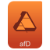                             ||`copycat/mimetypes/scalable/application-afdesigner.svg`                             |`application-afdesigner`                             |         |`mimetypes/scalable`|
|                                ||`copycat/mimetypes/scalable/application-archive.svg`                                |`application-archive`                                |         |`mimetypes/scalable`|
|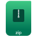                            ||`copycat/mimetypes/scalable/application-archive-zip.svg`                            |`application-archive-zip`                            |         |`mimetypes/scalable`|
|                                  ||`copycat/mimetypes/scalable/application-ascii.svg`                                  |`application-ascii`                                  |         |`mimetypes/scalable`|
|                         ||`copycat/mimetypes/scalable/application-audio-playlist.svg`                         |`application-audio-playlist`                         |         |`mimetypes/scalable`|
|                                  ||`copycat/mimetypes/scalable/application-audio.svg`                                  |`application-audio`                                  |         |`mimetypes/scalable`|
|                            ||`copycat/mimetypes/scalable/application-certificate.svg`                            |`application-certificate`                            |         |`mimetypes/scalable`|
|                               ||`copycat/mimetypes/scalable/application-database.svg`                               |`application-database`                               |         |`mimetypes/scalable`|
|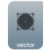                       ||`copycat/mimetypes/scalable/application-drawing-template.svg`                       |`application-drawing-template`                       |         |`mimetypes/scalable`|
|                               ||`copycat/mimetypes/scalable/application-epub+zip.svg`                               |`application-epub+zip`                               |         |`mimetypes/scalable`|
|                             ||`copycat/mimetypes/scalable/application-executable.svg`                             |`application-executable`                             |         |`mimetypes/scalable`|
|                                  ||`copycat/mimetypes/scalable/application-flash.svg`                                  |`application-flash`                                  |         |`mimetypes/scalable`|
|                                   ||`copycat/mimetypes/scalable/application-font.svg`                                   |`application-font`                                   |         |`mimetypes/scalable`|
|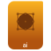                            ||`copycat/mimetypes/scalable/application-illustrator.svg`                            |`application-illustrator`                            |         |`mimetypes/scalable`|
|                             ||`copycat/mimetypes/scalable/application-image-avif.svg`                             |`application-image-avif`                             |         |`mimetypes/scalable`|
|                              ||`copycat/mimetypes/scalable/application-image-bmp.svg`                              |`application-image-bmp`                              |         |`mimetypes/scalable`|
|                              ||`copycat/mimetypes/scalable/application-image-exr.svg`                              |`application-image-exr`                              |         |`mimetypes/scalable`|
|                              ||`copycat/mimetypes/scalable/application-image-gif.svg`                              |`application-image-gif`                              |         |`mimetypes/scalable`|
|                              ||`copycat/mimetypes/scalable/application-image-ico.svg`                              |`application-image-ico`                              |         |`mimetypes/scalable`|
|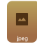                              ||`copycat/mimetypes/scalable/application-image-jpg.svg`                              |`application-image-jpg`                              |         |`mimetypes/scalable`|
|                              ||`copycat/mimetypes/scalable/application-image-jxl.svg`                              |`application-image-jxl`                              |         |`mimetypes/scalable`|
|                              ||`copycat/mimetypes/scalable/application-image-png.svg`                              |`application-image-png`                              |         |`mimetypes/scalable`|
|                              ||`copycat/mimetypes/scalable/application-image-psd.svg`                              |`application-image-psd`                              |         |`mimetypes/scalable`|
|                              ||`copycat/mimetypes/scalable/application-image-tga.svg`                              |`application-image-tga`                              |         |`mimetypes/scalable`|
|                             ||`copycat/mimetypes/scalable/application-image-tiff.svg`                             |`application-image-tiff`                             |         |`mimetypes/scalable`|
|                                   ||`copycat/mimetypes/scalable/application-info.svg`                                   |`application-info`                                   |         |`mimetypes/scalable`|
|                             ||`copycat/mimetypes/scalable/application-javascript.svg`                             |`application-javascript`                             |         |`mimetypes/scalable`|
|                                   ||`copycat/mimetypes/scalable/application-java.svg`                                   |`application-java`                                   |         |`mimetypes/scalable`|
|                                   ||`copycat/mimetypes/scalable/application-json.svg`                                   |`application-json`                                   |         |`mimetypes/scalable`|
|                            ||`copycat/mimetypes/scalable/application-mathematica.svg`                            |`application-mathematica`                            |         |`mimetypes/scalable`|
|                                   ||`copycat/mimetypes/scalable/application-mbox.svg`                                   |`application-mbox`                                   |         |`mimetypes/scalable`|
|                        ||`copycat/mimetypes/scalable/application-msword-template.svg`                        |`application-msword-template`                        |         |`mimetypes/scalable`|
|                                    ||`copycat/mimetypes/scalable/application-pdf.svg`                                    |`application-pdf`                                    |         |`mimetypes/scalable`|
|                             ||`copycat/mimetypes/scalable/application-postscript.svg`                             |`application-postscript`                             |         |`mimetypes/scalable`|
|                           ||`copycat/mimetypes/scalable/application-presentation.svg`                           |`application-presentation`                           |         |`mimetypes/scalable`|
|                  ||`copycat/mimetypes/scalable/application-presentation-template.svg`                  |`application-presentation-template`                  |         |`mimetypes/scalable`|
|                                    ||`copycat/mimetypes/scalable/application-rss.svg`                                    |`application-rss`                                    |         |`mimetypes/scalable`|
|                                    ||`copycat/mimetypes/scalable/application-rtf.svg`                                    |`application-rtf`                                    |         |`mimetypes/scalable`|
|                               ||`copycat/mimetypes/scalable/application-software.svg`                               |`application-software`                               |         |`mimetypes/scalable`|
|                                  ||`copycat/mimetypes/scalable/application-table.svg`                                  |`application-table`                                  |         |`mimetypes/scalable`|
|                         ||`copycat/mimetypes/scalable/application-table-template.svg`                         |`application-table-template`                         |         |`mimetypes/scalable`|
|                                   ||`copycat/mimetypes/scalable/application-toml.svg`                                   |`application-toml`                                   |         |`mimetypes/scalable`|
|                                ||`copycat/mimetypes/scalable/application-torrent.svg`                                |`application-torrent`                                |         |`mimetypes/scalable`|
|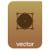                                 ||`copycat/mimetypes/scalable/application-vector.svg`                                 |`application-vector`                                 |         |`mimetypes/scalable`|
|                                  ||`copycat/mimetypes/scalable/application-video.svg`                                  |`application-video`                                  |         |`mimetypes/scalable`|
|                           ||`copycat/mimetypes/scalable/application-vnd.appimage.svg`                           |`application-vnd.appimage`                           |         |`mimetypes/scalable`|
|                      ||`copycat/mimetypes/scalable/application-vnd.comicbook+zip.svg`                      |`application-vnd.comicbook+zip`                      |         |`mimetypes/scalable`|
|                   ||`copycat/mimetypes/scalable/application-vnd.google-earth.kml.svg`                   |`application-vnd.google-earth.kml`                   |         |`mimetypes/scalable`|
|                          ||`copycat/mimetypes/scalable/application-vnd.ms-access.svg`                          |`application-vnd.ms-access`                          |         |`mimetypes/scalable`|
|                      ||`copycat/mimetypes/scalable/application-vnd.ms-powerpoint.svg`                      |`application-vnd.ms-powerpoint`                      |         |`mimetypes/scalable`|
|              ||`copycat/mimetypes/scalable/application-vnd.nokia.xml.qt.resource.svg`              |`application-vnd.nokia.xml.qt.resource`              |         |`mimetypes/scalable`|
|           ||`copycat/mimetypes/scalable/application-vnd.oasis.opendocument.chart.svg`           |`application-vnd.oasis.opendocument.chart`           |         |`mimetypes/scalable`|
|  ||`copycat/mimetypes/scalable/application-vnd.oasis.opendocument.chart-template.svg`  |`application-vnd.oasis.opendocument.chart-template`  |         |`mimetypes/scalable`|
|        ||`copycat/mimetypes/scalable/application-vnd.oasis.opendocument.database.svg`        |`application-vnd.oasis.opendocument.database`        |         |`mimetypes/scalable`|
|         ||`copycat/mimetypes/scalable/application-vnd.oasis.opendocument.formula.svg`         |`application-vnd.oasis.opendocument.formula`         |         |`mimetypes/scalable`|
|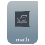||`copycat/mimetypes/scalable/application-vnd.oasis.opendocument.formula-template.svg`|`application-vnd.oasis.opendocument.formula-template`|         |`mimetypes/scalable`|
|           ||`copycat/mimetypes/scalable/application-vnd.oasis.opendocument.image.svg`           |`application-vnd.oasis.opendocument.image`           |         |`mimetypes/scalable`|
|  ||`copycat/mimetypes/scalable/application-vnd.oasis.opendocument.image-template.svg`  |`application-vnd.oasis.opendocument.image-template`  |         |`mimetypes/scalable`|
|    ||`copycat/mimetypes/scalable/application-vnd.oasis.opendocument.presentation.svg`    |`application-vnd.oasis.opendocument.presentation`    |         |`mimetypes/scalable`|
|     ||`copycat/mimetypes/scalable/application-vnd.oasis.opendocument.spreadsheet.svg`     |`application-vnd.oasis.opendocument.spreadsheet`     |         |`mimetypes/scalable`|
|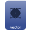                            ||`copycat/mimetypes/scalable/application-vnd.scribus.svg`                            |`application-vnd.scribus`                            |         |`mimetypes/scalable`|
|                           ||`copycat/mimetypes/scalable/application-web-template.svg`                           |`application-web-template`                           |         |`mimetypes/scalable`|
|                                   ||`copycat/mimetypes/scalable/application-word.svg`                                   |`application-word`                                   |         |`mimetypes/scalable`|
|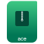                                  ||`copycat/mimetypes/scalable/application-x-ace.svg`                                  |`application-x-ace`                                  |         |`mimetypes/scalable`|
|                                  ||`copycat/mimetypes/scalable/application-x-arj.svg`                                  |`application-x-arj`                                  |         |`mimetypes/scalable`|
|                                  ||`copycat/mimetypes/scalable/application-x-asp.svg`                                  |`application-x-asp`                                  |         |`mimetypes/scalable`|
|                              ||`copycat/mimetypes/scalable/application-x-blender.svg`                              |`application-x-blender`                              |         |`mimetypes/scalable`|
|                                ||`copycat/mimetypes/scalable/application-x-bzdvi.svg`                                |`application-x-bzdvi`                                |         |`mimetypes/scalable`|
|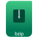                                 ||`copycat/mimetypes/scalable/application-x-bzip.svg`                                 |`application-x-bzip`                                 |         |`mimetypes/scalable`|
|                                  ||`copycat/mimetypes/scalable/application-x-cbr.svg`                                  |`application-x-cbr`                                  |         |`mimetypes/scalable`|
|                             ||`copycat/mimetypes/scalable/application-x-cd-image.svg`                             |`application-x-cd-image`                             |         |`mimetypes/scalable`|
|                                  ||`copycat/mimetypes/scalable/application-x-chm.svg`                                  |`application-x-chm`                                  |         |`mimetypes/scalable`|
|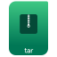                       ||`copycat/mimetypes/scalable/application-x-compressed-tar.svg`                       |`application-x-compressed-tar`                       |         |`mimetypes/scalable`|
|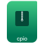                                 ||`copycat/mimetypes/scalable/application-x-cpio.svg`                                 |`application-x-cpio`                                 |         |`mimetypes/scalable`|
|                           ||`copycat/mimetypes/scalable/application-x-deb-debian.svg`                           |`application-x-deb-debian`                           |         |`mimetypes/scalable`|
|                        ||`copycat/mimetypes/scalable/application-x-deb-linuxmint.svg`                        |`application-x-deb-linuxmint`                        |         |`mimetypes/scalable`|
|                           ||`copycat/mimetypes/scalable/application-x-deb-ubuntu.svg`                           |`application-x-deb-ubuntu`                           |         |`mimetypes/scalable`|
|                       ||`copycat/mimetypes/scalable/application-x-desktop-budgie.svg`                       |`application-x-desktop-budgie`                       |         |`mimetypes/scalable`|
|                        ||`copycat/mimetypes/scalable/application-x-desktop-gnome.svg`                        |`application-x-desktop-gnome`                        |         |`mimetypes/scalable`|
|                          ||`copycat/mimetypes/scalable/application-x-desktop-kde.svg`                          |`application-x-desktop-kde`                          |         |`mimetypes/scalable`|
|                    ||`copycat/mimetypes/scalable/application-x-desktop-linuxmint.svg`                    |`application-x-desktop-linuxmint`                    |         |`mimetypes/scalable`|
|                         ||`copycat/mimetypes/scalable/application-x-desktop-lxde.svg`                         |`application-x-desktop-lxde`                         |         |`mimetypes/scalable`|
|                        ||`copycat/mimetypes/scalable/application-x-desktop-unity.svg`                        |`application-x-desktop-unity`                        |         |`mimetypes/scalable`|
|                         ||`copycat/mimetypes/scalable/application-x-desktop-xfce.svg`                         |`application-x-desktop-xfce`                         |         |`mimetypes/scalable`|
|                    ||`copycat/mimetypes/scalable/application-x-gameboy-color-rom.svg`                    |`application-x-gameboy-color-rom`                    |         |`mimetypes/scalable`|
|                                ||`copycat/mimetypes/scalable/application-x-glade.svg`                                |`application-x-glade`                                |         |`mimetypes/scalable`|
|                                ||`copycat/mimetypes/scalable/application-x-gzdvi.svg`                                |`application-x-gzdvi`                                |         |`mimetypes/scalable`|
|                                 ||`copycat/mimetypes/scalable/application-x-gzip.svg`                                 |`application-x-gzip`                                 |         |`mimetypes/scalable`|
|                           ||`copycat/mimetypes/scalable/application-x-ipynb+json.svg`                           |`application-x-ipynb+json`                           |         |`mimetypes/scalable`|
|                                  ||`copycat/mimetypes/scalable/application-x-jsx.svg`                                  |`application-x-jsx`                                  |         |`mimetypes/scalable`|
|                             ||`copycat/mimetypes/scalable/application-x-keepassx.svg`                             |`application-x-keepassx`                             |         |`mimetypes/scalable`|
|                 ||`copycat/mimetypes/scalable/application-x-kexiproject-shortcut.svg`                 |`application-x-kexiproject-shortcut`                 |         |`mimetypes/scalable`|
|                             ||`copycat/mimetypes/scalable/application-x-kmymoney.svg`                             |`application-x-kmymoney`                             |         |`mimetypes/scalable`|
|                                ||`copycat/mimetypes/scalable/application-x-krita.svg`                                |`application-x-krita`                                |         |`mimetypes/scalable`|
|                                  ||`copycat/mimetypes/scalable/application-x-lha.svg`                                  |`application-x-lha`                                  |         |`mimetypes/scalable`|
|                            ||`copycat/mimetypes/scalable/application-x-love-game.svg`                            |`application-x-love-game`                            |         |`mimetypes/scalable`|
|                                  ||`copycat/mimetypes/scalable/application-x-lyx.svg`                                  |`application-x-lyx`                                  |         |`mimetypes/scalable`|
|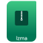                                 ||`copycat/mimetypes/scalable/application-x-lzma.svg`                                 |`application-x-lzma`                                 |         |`mimetypes/scalable`|
|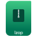                                 ||`copycat/mimetypes/scalable/application-x-lzop.svg`                                 |`application-x-lzop`                                 |         |`mimetypes/scalable`|
|                         ||`copycat/mimetypes/scalable/application-x-mono-develop.svg`                         |`application-x-mono-develop`                         |         |`mimetypes/scalable`|
|                    ||`copycat/mimetypes/scalable/application-x-ms-dos-executable.svg`                    |`application-x-ms-dos-executable`                    |         |`mimetypes/scalable`|
|                                  ||`copycat/mimetypes/scalable/application-x-msi.svg`                                  |`application-x-msi`                                  |         |`mimetypes/scalable`|
|                          ||`copycat/mimetypes/scalable/application-x-ms-shortcut.svg`                          |`application-x-ms-shortcut`                          |         |`mimetypes/scalable`|
|                              ||`copycat/mimetypes/scalable/application-x-osm+xml.svg`                              |`application-x-osm+xml`                              |         |`mimetypes/scalable`|
|                     ||`copycat/mimetypes/scalable/application-x-partial-download.svg`                     |`application-x-partial-download`                     |         |`mimetypes/scalable`|
|                                 ||`copycat/mimetypes/scalable/application-x-perl.svg`                                 |`application-x-perl`                                 |         |`mimetypes/scalable`|
|                                  ||`copycat/mimetypes/scalable/application-x-php.svg`                                  |`application-x-php`                                  |         |`mimetypes/scalable`|
|                                    ||`copycat/mimetypes/scalable/application-xps.svg`                                    |`application-xps`                                    |         |`mimetypes/scalable`|
|                                  ||`copycat/mimetypes/scalable/application-x-rar.svg`                                  |`application-x-rar`                                  |         |`mimetypes/scalable`|
|                           ||`copycat/mimetypes/scalable/application-x-revelation.svg`                           |`application-x-revelation`                           |         |`mimetypes/scalable`|
|                           ||`copycat/mimetypes/scalable/application-x-rpm-fedora.svg`                           |`application-x-rpm-fedora`                           |         |`mimetypes/scalable`|
|                         ||`copycat/mimetypes/scalable/application-x-rpm-opensuse.svg`                         |`application-x-rpm-opensuse`                         |         |`mimetypes/scalable`|
|                           ||`copycat/mimetypes/scalable/application-x-rpm-redhat.svg`                           |`application-x-rpm-redhat`                           |         |`mimetypes/scalable`|
|                                 ||`copycat/mimetypes/scalable/application-x-ruby.svg`                                 |`application-x-ruby`                                 |         |`mimetypes/scalable`|
|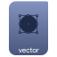                              ||`copycat/mimetypes/scalable/application-x-scribus.svg`                              |`application-x-scribus`                              |         |`mimetypes/scalable`|
|                           ||`copycat/mimetypes/scalable/application-x-smb-server.svg`                           |`application-x-smb-server`                           |         |`mimetypes/scalable`|
|                        ||`copycat/mimetypes/scalable/application-x-smb-workgroup.svg`                        |`application-x-smb-workgroup`                        |         |`mimetypes/scalable`|
|                        ||`copycat/mimetypes/scalable/application-x-solus-package.svg`                        |`application-x-solus-package`                        |         |`mimetypes/scalable`|
|                               ||`copycat/mimetypes/scalable/application-x-sqlite.svg`                               |`application-x-sqlite`                               |         |`mimetypes/scalable`|
|                              ||`copycat/mimetypes/scalable/application-x-stuffit.svg`                              |`application-x-stuffit`                              |         |`mimetypes/scalable`|
|                               ||`copycat/mimetypes/scalable/application-x-subrip.svg`                               |`application-x-subrip`                               |         |`mimetypes/scalable`|
|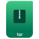                                  ||`copycat/mimetypes/scalable/application-x-tar.svg`                                  |`application-x-tar`                                  |         |`mimetypes/scalable`|
|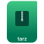                                 ||`copycat/mimetypes/scalable/application-x-tarz.svg`                                 |`application-x-tarz`                                 |         |`mimetypes/scalable`|
|                                  ||`copycat/mimetypes/scalable/application-x-tha.svg`                                  |`application-x-tha`                                  |         |`mimetypes/scalable`|
|                                ||`copycat/mimetypes/scalable/application-x-theme.svg`                                |`application-x-theme`                                |         |`mimetypes/scalable`|
|                                  ||`copycat/mimetypes/scalable/application-x-thz.svg`                                  |`application-x-thz`                                  |         |`mimetypes/scalable`|
|                                ||`copycat/mimetypes/scalable/application-x-trash.svg`                                |`application-x-trash`                                |         |`mimetypes/scalable`|
|                                  ||`copycat/mimetypes/scalable/application-x-tsx.svg`                                  |`application-x-tsx`                                  |         |`mimetypes/scalable`|
|                                  ||`copycat/mimetypes/scalable/application-x-tzo.svg`                                  |`application-x-tzo`                                  |         |`mimetypes/scalable`|
|                      ||`copycat/mimetypes/scalable/application-x-virtualbox-vbox.svg`                      |`application-x-virtualbox-vbox`                      |         |`mimetypes/scalable`|
|                       ||`copycat/mimetypes/scalable/application-x-virtualbox-vdi.svg`                       |`application-x-virtualbox-vdi`                       |         |`mimetypes/scalable`|
|                              ||`copycat/mimetypes/scalable/application-x-wii-rom.svg`                              |`application-x-wii-rom`                              |         |`mimetypes/scalable`|
|                              ||`copycat/mimetypes/scalable/application-x-wii-wad.svg`                              |`application-x-wii-wad`                              |         |`mimetypes/scalable`|
|                   ||`copycat/mimetypes/scalable/application-x-wine-extension-ini.svg`                   |`application-x-wine-extension-ini`                   |         |`mimetypes/scalable`|
|                                   ||`copycat/mimetypes/scalable/application-yaml.svg`                                   |`application-yaml`                                   |         |`mimetypes/scalable`|
|                                         ||`copycat/mimetypes/scalable/audio-flac.svg`                                         |`audio-flac`                                         |         |`mimetypes/scalable`|
|                                         ||`copycat/mimetypes/scalable/audio-midi.svg`                                         |`audio-midi`                                         |         |`mimetypes/scalable`|
|                                          ||`copycat/mimetypes/scalable/audio-mp3.svg`                                          |`audio-mp3`                                          |         |`mimetypes/scalable`|
|                                          ||`copycat/mimetypes/scalable/audio-wav.svg`                                          |`audio-wav`                                          |         |`mimetypes/scalable`|
|                             ||`copycat/mimetypes/scalable/audio-x-smart-playlist.svg`                             |`audio-x-smart-playlist`                             |         |`mimetypes/scalable`|
|                                          ||`copycat/mimetypes/scalable/encrypted.svg`                                          |`encrypted`                                          |         |`mimetypes/scalable`|
|                  ||`copycat/mimetypes/scalable/gnome-mime-application-magicpoint.svg`                  |`gnome-mime-application-magicpoint`                  |         |`mimetypes/scalable`|
|                         ||`copycat/mimetypes/scalable/gnome-mime-text-x-makefile.svg`                         |`gnome-mime-text-x-makefile`                         |         |`mimetypes/scalable`|
|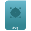                                      ||`copycat/mimetypes/scalable/image-vnd.dwg.svg`                                      |`image-vnd.dwg`                                      |         |`mimetypes/scalable`|
|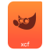                                        ||`copycat/mimetypes/scalable/image-x-xcf.svg`                                        |`image-x-xcf`                                        |         |`mimetypes/scalable`|
|                                              ||`copycat/mimetypes/scalable/radio.svg`                                              |`radio`                                              |         |`mimetypes/scalable`|
|                                  ||`copycat/mimetypes/scalable/stock_addressbook.svg`                                  |`stock_addressbook`                                  |         |`mimetypes/scalable`|
|                                      ||`copycat/mimetypes/scalable/text-calendar.svg`                                      |`text-calendar`                                      |         |`mimetypes/scalable`|
|                                      ||`copycat/mimetypes/scalable/text-css_orig.svg`                                      |`text-css_orig`                                      |         |`mimetypes/scalable`|
|                                           ||`copycat/mimetypes/scalable/text-css.svg`                                           |`text-css`                                           |         |`mimetypes/scalable`|
|                                          ||`copycat/mimetypes/scalable/text-html.svg`                                          |`text-html`                                          |         |`mimetypes/scalable`|
|                                          ||`copycat/mimetypes/scalable/text-less.svg`                                          |`text-less`                                          |         |`mimetypes/scalable`|
|                                      ||`copycat/mimetypes/scalable/text-markdown.svg`                                      |`text-markdown`                                      |         |`mimetypes/scalable`|
|                                          ||`copycat/mimetypes/scalable/text-rust.svg`                                          |`text-rust`                                          |         |`mimetypes/scalable`|
|                             ||`copycat/mimetypes/scalable/text-vnd.wap.wmlscript.svg`                             |`text-vnd.wap.wmlscript`                             |         |`mimetypes/scalable`|
|                                          ||`copycat/mimetypes/scalable/text-wiki.svg`                                          |`text-wiki`                                          |         |`mimetypes/scalable`|
|                                      ||`copycat/mimetypes/scalable/text-x-adasrc.svg`                                      |`text-x-adasrc`                                      |         |`mimetypes/scalable`|
|                                     ||`copycat/mimetypes/scalable/text-x-arduino.svg`                                     |`text-x-arduino`                                     |         |`mimetypes/scalable`|
|                                   ||`copycat/mimetypes/scalable/text-x-changelog.svg`                                   |`text-x-changelog`                                   |         |`mimetypes/scalable`|
|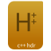                                      ||`copycat/mimetypes/scalable/text-x-c++hdr.svg`                                      |`text-x-c++hdr`                                      |         |`mimetypes/scalable`|
|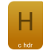                                        ||`copycat/mimetypes/scalable/text-x-chdr.svg`                                        |`text-x-chdr`                                        |         |`mimetypes/scalable`|
|                                     ||`copycat/mimetypes/scalable/text-x-copying.svg`                                     |`text-x-copying`                                     |         |`mimetypes/scalable`|
|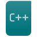                                         ||`copycat/mimetypes/scalable/text-x-cpp.svg`                                         |`text-x-cpp`                                         |         |`mimetypes/scalable`|
|                                      ||`copycat/mimetypes/scalable/text-x-csharp.svg`                                      |`text-x-csharp`                                      |         |`mimetypes/scalable`|
|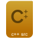                                         ||`copycat/mimetypes/scalable/text-x-c++.svg`                                         |`text-x-c++`                                         |         |`mimetypes/scalable`|
|                                           ||`copycat/mimetypes/scalable/text-x-c.svg`                                           |`text-x-c`                                           |         |`mimetypes/scalable`|
|                                        ||`copycat/mimetypes/scalable/text-x-dsrc.svg`                                        |`text-x-dsrc`                                        |         |`mimetypes/scalable`|
|                                     ||`copycat/mimetypes/scalable/text-x-fortran.svg`                                     |`text-x-fortran`                                     |         |`mimetypes/scalable`|
|                         ||`copycat/mimetypes/scalable/text-x-gettext-translation.svg`                         |`text-x-gettext-translation`                         |         |`mimetypes/scalable`|
|                                          ||`copycat/mimetypes/scalable/text-x-go.svg`                                          |`text-x-go`                                          |         |`mimetypes/scalable`|
|                                       ||`copycat/mimetypes/scalable/text-x-gtkrc.svg`                                       |`text-x-gtkrc`                                       |         |`mimetypes/scalable`|
|                                     ||`copycat/mimetypes/scalable/text-x-install.svg`                                     |`text-x-install`                                     |         |`mimetypes/scalable`|
|                                      ||`copycat/mimetypes/scalable/text-x-kotlin.svg`                                      |`text-x-kotlin`                                      |         |`mimetypes/scalable`|
|                                      ||`copycat/mimetypes/scalable/text-x-matlab.svg`                                      |`text-x-matlab`                                      |         |`mimetypes/scalable`|
|                                           ||`copycat/mimetypes/scalable/text-xml.svg`                                           |`text-xml`                                           |         |`mimetypes/scalable`|
|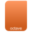                                      ||`copycat/mimetypes/scalable/text-x-octave.svg`                                      |`text-x-octave`                                      |         |`mimetypes/scalable`|
|                                      ||`copycat/mimetypes/scalable/text-x-pascal.svg`                                      |`text-x-pascal`                                      |         |`mimetypes/scalable`|
|                                      ||`copycat/mimetypes/scalable/text-x-readme.svg`                                      |`text-x-readme`                                      |         |`mimetypes/scalable`|
|                                    ||`copycat/mimetypes/scalable/text-x-rpm-spec.svg`                                    |`text-x-rpm-spec`                                    |         |`mimetypes/scalable`|
|                                        ||`copycat/mimetypes/scalable/text-x-ruby.svg`                                        |`text-x-ruby`                                        |         |`mimetypes/scalable`|
|                                        ||`copycat/mimetypes/scalable/text-x-sass.svg`                                        |`text-x-sass`                                        |         |`mimetypes/scalable`|
|                                       ||`copycat/mimetypes/scalable/text-x-scala.svg`                                       |`text-x-scala`                                       |         |`mimetypes/scalable`|
|                                      ||`copycat/mimetypes/scalable/text-x-script.svg`                                      |`text-x-script`                                      |         |`mimetypes/scalable`|
|                                         ||`copycat/mimetypes/scalable/text-x-tcl.svg`                                         |`text-x-tcl`                                         |         |`mimetypes/scalable`|
|                                     ||`copycat/mimetypes/scalable/text-x-texmacs.svg`                                     |`text-x-texmacs`                                     |         |`mimetypes/scalable`|
|                                         ||`copycat/mimetypes/scalable/text-x-tex.svg`                                         |`text-x-tex`                                         |         |`mimetypes/scalable`|
|                                  ||`copycat/mimetypes/scalable/text-x-typescript.svg`                                  |`text-x-typescript`                                  |         |`mimetypes/scalable`|
|                                        ||`copycat/mimetypes/scalable/text-x-vala.svg`                                        |`text-x-vala`                                        |         |`mimetypes/scalable`|
|                                    ||`copycat/mimetypes/scalable/text-x-wxmathml.svg`                                    |`text-x-wxmathml`                                    |         |`mimetypes/scalable`|
|                                            ||`copycat/mimetypes/scalable/unknown.svg`                                            |`unknown`                                            |         |`mimetypes/scalable`|
|                                    ||`copycat/mimetypes/scalable/x-media-podcast.svg`                                    |`x-media-podcast`                                    |         |`mimetypes/scalable`|
|                                                ||`copycat/mimetypes/scalable/xoj.svg`                                                |`xoj`                                                |         |`mimetypes/scalable`|
|                                               ||`copycat/mimetypes/scalable/xopt.svg`                                               |`xopt`                                               |         |`mimetypes/scalable`|
# Has text - Apps
|                                             Icon                                             |                   Is real                    |                                 Full path                                 |                    File name                    |                                    Points to                                     |   Origin directory    |
|----------------------------------------------------------------------------------------------|----------------------------------------------|---------------------------------------------------------------------------|-------------------------------------------------|----------------------------------------------------------------------------------|-----------------------|
|                                ||`copycat/apps/scalable/0cc-famitracker.svg`                                |`0cc-famitracker`                                |                                                                                  |`apps/scalable/`       |
|                                       ||`copycat/apps/scalable/1cestart.svg`                                       |`1cestart`                                       |                                                                                  |`apps/scalable/`       |
|                                        ||`copycat/apps/scalable/2048-qt.svg`                                        |`2048-qt`                                        |                                                                                  |`apps/scalable/`       |
|                                           ||`copycat/apps/scalable/2048.svg`                                           |`2048`                                           |                                                                                  |`apps/scalable/`       |
|                                      ||`copycat/apps/scalable/4diac-ide.svg`                                      |`4diac-ide`                                      |                                                                                  |`apps/scalable/`       |
|                                        ||`copycat/apps/scalable/4digits.svg`                                        |`4digits`                                        |                                                                                  |`apps/scalable/`       |
|                                          ||`copycat/apps/scalable/4Pane.svg`                                          |`4Pane`                                          |                                                                                  |`apps/scalable/`       |
|                                  ||`copycat/apps/scalable/6180-the-moon.svg`                                  |`6180-the-moon`                                  |                                                                                  |`apps/scalable/`       |
|                                           ||`copycat/apps/scalable/7kaa.svg`                                           |`7kaa`                                           |                                                                                  |`apps/scalable/`       |
|                         ||`copycat/apps/scalable/accessories-calculator.svg`                         |`accessories-calculator`                         |                                                                                  |`apps/scalable/`       |
|                         ||`copycat/apps/scalable/accessories-dictionary.svg`                         |`accessories-dictionary`                         |                                                                                  |`apps/scalable/`       |
|                                     ||`copycat/apps/scalable/acreloaded.svg`                                     |`acreloaded`                                     |                                                                                  |`apps/scalable/`       |
|                                  ||`copycat/apps/scalable/activitywatch.svg`                                  |`activitywatch`                                  |                                                                                  |`apps/scalable/`       |
|                                        ||`copycat/apps/scalable/ADLplug.svg`                                        |`ADLplug`                                        |                                                                                  |`apps/scalable/`       |
|                               ||`copycat/apps/scalable/AdobeIllustrator.svg`                               |`AdobeIllustrator`                               |                                                                                  |`apps/scalable/`       |
|                                 ||`copycat/apps/scalable/AdobePhotoshop.svg`                                 |`AdobePhotoshop`                                 |                                                                                  |`apps/scalable/`       |
|                                   ||`copycat/apps/scalable/agentdesktop.svg`                                   |`agentdesktop`                                   |                                                                                  |`apps/scalable/`       |
|                                          ||`copycat/apps/scalable/agent.svg`                                          |`agent`                                          |                                                                                  |`apps/scalable/`       |
|                            ||`copycat/apps/scalable/airtame-application.svg`                            |`airtame-application`                            |                                                                                  |`apps/scalable/`       |
|                         ||`copycat/apps/scalable/amarok_change_language.svg`                         |`amarok_change_language`                         |                                                                                  |`apps/scalable/`       |
|                                      ||`copycat/apps/scalable/amazonmp3.svg`                                      |`amazonmp3`                                      |                                                                                  |`apps/scalable/`       |
|                                   ||`copycat/apps/scalable/amazon-store.svg`                                   |`amazon-store`                                   |                                                                                  |`apps/scalable/`       |
|                                ||`copycat/apps/scalable/angular-console.svg`                                |`angular-console`                                |                                                                                  |`apps/scalable/`       |
|                                        ||`copycat/apps/scalable/apktool.svg`                                        |`apktool`                                        |                                                                                  |`apps/scalable/`       |
|                                        ||`copycat/apps/scalable/appcode.svg`                                        |`appcode`                                        |                                                                                  |`apps/scalable/`       |
|                            ||`copycat/apps/scalable/appimagekit-diffuse.svg`                            |`appimagekit-diffuse`                            |                                                                                  |`apps/scalable/`       |
|                       ||`copycat/apps/scalable/appimagekit-paymo-widget.svg`                       |`appimagekit-paymo-widget`                       |                                                                                  |`apps/scalable/`       |
|             ||`copycat/apps/scalable/applications-education-mathematics.svg`             |`applications-education-mathematics`             |                                                                                  |`apps/scalable/`       |
|                           ||`copycat/apps/scalable/applications-haskell.svg`                           |`applications-haskell`                           |                                                                                  |`apps/scalable/`       |
|                               ||`copycat/apps/scalable/applications-php.svg`                               |`applications-php`                               |                                                                                  |`apps/scalable/`       |
|                                     ||`copycat/apps/scalable/applixware.svg`                                     |`applixware`                                     |                                                                                  |`apps/scalable/`       |
|                                          ||`copycat/apps/scalable/aqemu.svg`                                          |`aqemu`                                          |                                                                                  |`apps/scalable/`       |
|                                ||`copycat/apps/scalable/arcolinux-hello.svg`                                |`arcolinux-hello`                                |                                                                                  |`apps/scalable/`       |
|                                        ||`copycat/apps/scalable/arduino.svg`                                        |`arduino`                                        |                                                                                  |`apps/scalable/`       |
|                                     ||`copycat/apps/scalable/artikulate.svg`                                     |`artikulate`                                     |                                                                                  |`apps/scalable/`       |
|                                   ||`copycat/apps/scalable/aspia_client.svg`                                   |`aspia_client`                                   |                                                                                  |`apps/scalable/`       |
|                                  ||`copycat/apps/scalable/aspia_console.svg`                                  |`aspia_console`                                  |                                                                                  |`apps/scalable/`       |
|                                ||`copycat/apps/scalable/astah_community.svg`                                |`astah_community`                                |                                                                                  |`apps/scalable/`       |
|                                      ||`copycat/apps/scalable/astah_gsn.svg`                                      |`astah_gsn`                                      |                                                                                  |`apps/scalable/`       |
|                             ||`copycat/apps/scalable/astah_professional.svg`                             |`astah_professional`                             |                                                                                  |`apps/scalable/`       |
|                                    ||`copycat/apps/scalable/astah_sysml.svg`                                    |`astah_sysml`                                    |                                                                                  |`apps/scalable/`       |
|                                      ||`copycat/apps/scalable/astah_uml.svg`                                      |`astah_uml`                                      |                                                                                  |`apps/scalable/`       |
|                                   ||`copycat/apps/scalable/astah_viewer.svg`                                   |`astah_viewer`                                   |                                                                                  |`apps/scalable/`       |
|                                     ||`copycat/apps/scalable/atlauncher.svg`                                     |`atlauncher`                                     |                                                                                  |`apps/scalable/`       |
|                                        ||`copycat/apps/scalable/autokey.svg`                                        |`autokey`                                        |                                                                                  |`apps/scalable/`       |
|                                    ||`copycat/apps/scalable/avimetaedit.svg`                                    |`avimetaedit`                                    |                                                                                  |`apps/scalable/`       |
|                                  ||`copycat/apps/scalable/avogadro-icon.svg`                                  |`avogadro-icon`                                  |                                                                                  |`apps/scalable/`       |
|                                    ||`copycat/apps/scalable/awesomebump.svg`                                    |`awesomebump`                                    |                                                                                  |`apps/scalable/`       |
|                                         ||`copycat/apps/scalable/azardi.svg`                                         |`azardi`                                         |                                                                                  |`apps/scalable/`       |
|                                        ||`copycat/apps/scalable/bashtop.svg`                                        |`bashtop`                                        |                                                                                  |`apps/scalable/`       |
|                                            ||`copycat/apps/scalable/bbc.svg`                                            |`bbc`                                            |                                                                                  |`apps/scalable/`       |
|                                     ||`copycat/apps/scalable/billard-gl.svg`                                     |`billard-gl`                                     |                                                                                  |`apps/scalable/`       |
|                                       ||`copycat/apps/scalable/birdfont.svg`                                       |`birdfont`                                       |                                                                                  |`apps/scalable/`       |
|                                        ||`copycat/apps/scalable/bitcoin.svg`                                        |`bitcoin`                                        |                                                                                  |`apps/scalable/`       |
|                               ||`copycat/apps/scalable/bitmap2component.svg`                               |`bitmap2component`                               |                                                                                  |`apps/scalable/`       |
|                                          ||`copycat/apps/scalable/bless.svg`                                          |`bless`                                          |                                                                                  |`apps/scalable/`       |
|                                       ||`copycat/apps/scalable/bluemail.svg`                                       |`bluemail`                                       |                                                                                  |`apps/scalable/`       |
|                                       ||`copycat/apps/scalable/brackets.svg`                                       |`brackets`                                       |                                                                                  |`apps/scalable/`       |
|                     ||`copycat/apps/scalable/br.com.jeanhertel.adriconf.svg`                     |`br.com.jeanhertel.adriconf`                     |                                                                                  |`apps/scalable/`       |
|                                     ||`copycat/apps/scalable/briss-icon.svg`                                     |`briss-icon`                                     |                                                                                  |`apps/scalable/`       |
|                                ||`copycat/apps/scalable/btrfs-assistant.svg`                                |`btrfs-assistant`                                |                                                                                  |`apps/scalable/`       |
|                                          ||`copycat/apps/scalable/byobu.svg`                                          |`byobu`                                          |                                                                                  |`apps/scalable/`       |
|                                         ||`copycat/apps/scalable/cacher.svg`                                         |`cacher`                                         |                                                                                  |`apps/scalable/`       |
|                                       ||`copycat/apps/scalable/calendar.svg`                                       |`calendar`                                       |                                                                                  |`apps/scalable/`       |
|                               ||`copycat/apps/scalable/calligraplanwork.svg`                               |`calligraplanwork`                               |                                                                                  |`apps/scalable/`       |
|                                         ||`copycat/apps/scalable/cantor.svg`                                         |`cantor`                                         |                                                                                  |`apps/scalable/`       |
|                                        ||`copycat/apps/scalable/caption.svg`                                        |`caption`                                        |                                                                                  |`apps/scalable/`       |
|                                           ||`copycat/apps/scalable/cemu.svg`                                           |`cemu`                                           |                                                                                  |`apps/scalable/`       |
|                                    ||`copycat/apps/scalable/chmsee-icon.svg`                                    |`chmsee-icon`                                    |                                                                                  |`apps/scalable/`       |
|||`copycat/apps/scalable/chrome-fljalecfjciodhpcledpamjachpmelml-Default.svg`|`chrome-fljalecfjciodhpcledpamjachpmelml-Default`|                                                                                  |`apps/scalable/`       |
|                                   ||`copycat/apps/scalable/chromium-dev.svg`                                   |`chromium-dev`                                   |                                                                                  |`apps/scalable/`       |
|                                   ||`copycat/apps/scalable/cine-encoder.svg`                                   |`cine-encoder`                                   |                                                                                  |`apps/scalable/`       |
|                                          ||`copycat/apps/scalable/Civ-V.svg`                                          |`Civ-V`                                          |                                                                                  |`apps/scalable/`       |
|                                          ||`copycat/apps/scalable/clion.svg`                                          |`clion`                                          |                                                                                  |`apps/scalable/`       |
|                                          ||`copycat/apps/scalable/colon.svg`                                          |`colon`                                          |                                                                                  |`apps/scalable/`       |
|                          ||`copycat/apps/scalable/com.bitstower.Markets.svg`                          |`com.bitstower.Markets`                          |                                                                                  |`apps/scalable/`       |
|                  ||`copycat/apps/scalable/com.dhsdevelopments.Climaxima.svg`                  |`com.dhsdevelopments.Climaxima`                  |                                                                                  |`apps/scalable/`       |
|                   ||`copycat/apps/scalable/com.github.aimproxy.dotfonts.svg`                   |`com.github.aimproxy.dotfonts`                   |                                                                                  |`apps/scalable/`       |
|                 ||`copycat/apps/scalable/com.github.artemanufrij.hashit.svg`                 |`com.github.artemanufrij.hashit`                 |                                                                                  |`apps/scalable/`       |
|            ||`copycat/apps/scalable/com.github.artemanufrij.regextester.svg`            |`com.github.artemanufrij.regextester`            |                                                                                  |`apps/scalable/`       |
|                 ||`copycat/apps/scalable/com.github.artemanufrij.webpin.svg`                 |`com.github.artemanufrij.webpin`                 |                                                                                  |`apps/scalable/`       |
|                  ||`copycat/apps/scalable/com.github.bartzaalberg.alias.svg`                  |`com.github.bartzaalberg.alias`                  |                                                                                  |`apps/scalable/`       |
|       ||`copycat/apps/scalable/com.github.bartzaalberg.bookmark-manager.svg`       |`com.github.bartzaalberg.bookmark-manager`       |                                                                                  |`apps/scalable/`       |
|             ||`copycat/apps/scalable/com.github.bartzaalberg.php-tester.svg`             |`com.github.bartzaalberg.php-tester`             |                                                                                  |`apps/scalable/`       |
|            ||`copycat/apps/scalable/com.github.bartzaalberg.vala-tester.svg`            |`com.github.bartzaalberg.vala-tester`            |                                                                                  |`apps/scalable/`       |
|                 ||`copycat/apps/scalable/com.github.basjam.valacompiler.svg`                 |`com.github.basjam.valacompiler`                 |                                                                                  |`apps/scalable/`       |
|            ||`copycat/apps/scalable/com.github.cassidyjames.clairvoyant.svg`            |`com.github.cassidyjames.clairvoyant`            |                                                                                  |`apps/scalable/`       |
|             ||`copycat/apps/scalable/com.github.cassidyjames.principles.svg`             |`com.github.cassidyjames.principles`             |                                                                                  |`apps/scalable/`       |
|                    ||`copycat/apps/scalable/com.github.cjfloss.envelope.svg`                    |`com.github.cjfloss.envelope`                    |                                                                                  |`apps/scalable/`       |
|            ||`copycat/apps/scalable/com.github.coralynnmay.goodvibesapp.svg`            |`com.github.coralynnmay.goodvibesapp`            |                                                                                  |`apps/scalable/`       |
|                   ||`copycat/apps/scalable/com.github.eudaldgr.elements.svg`                   |`com.github.eudaldgr.elements`                   |                                                                                  |`apps/scalable/`       |
|                  ||`copycat/apps/scalable/com.github.fushinari.Wordbook.svg`                  |`com.github.fushinari.Wordbook`                  |                                                                                  |`apps/scalable/`       |
|                      ||`copycat/apps/scalable/com.github.gi_lom.dialect.svg`                      |`com.github.gi_lom.dialect`                      |                                                                                  |`apps/scalable/`       |
|                       ||`copycat/apps/scalable/com.github.hugolabe.Wike.svg`                       |`com.github.hugolabe.Wike`                       |                                                                                  |`apps/scalable/`       |
|                        ||`copycat/apps/scalable/com.github.huluti.Coulr.svg`                        |`com.github.huluti.Coulr`                        |                                                                                  |`apps/scalable/`       |
|                 ||`copycat/apps/scalable/com.github.huluti.ImCompressor.svg`                 |`com.github.huluti.ImCompressor`                 |                                                                                  |`apps/scalable/`       |
|               ||`copycat/apps/scalable/com.github.jeremyvaartjes.comgen.svg`               |`com.github.jeremyvaartjes.comgen`               |                                                                                  |`apps/scalable/`       |
|            ||`copycat/apps/scalable/com.github.johnfactotum.QuickLookup.svg`            |`com.github.johnfactotum.QuickLookup`            |                                                                                  |`apps/scalable/`       |
|                   ||`copycat/apps/scalable/com.github.kjlaw89.archetype.svg`                   |`com.github.kjlaw89.archetype`                   |                                                                                  |`apps/scalable/`       |
|                     ||`copycat/apps/scalable/com.github.mdh34.quickdocs.svg`                     |`com.github.mdh34.quickdocs`                     |                                                                                  |`apps/scalable/`       |
|             ||`copycat/apps/scalable/com.github.muriloventuroso.easyssh.svg`             |`com.github.muriloventuroso.easyssh`             |                                                                                  |`apps/scalable/`       |
|                     ||`copycat/apps/scalable/com.github.padjis.ghistory.svg`                     |`com.github.padjis.ghistory`                     |                                                                                  |`apps/scalable/`       |
|              ||`copycat/apps/scalable/com.github.plugarut.pwned-checker.svg`              |`com.github.plugarut.pwned-checker`              |                                                                                  |`apps/scalable/`       |
|                      ||`copycat/apps/scalable/com.github.ranfdev.raddiu.svg`                      |`com.github.ranfdev.raddiu`                      |                                                                                  |`apps/scalable/`       |
|                 ||`copycat/apps/scalable/com.github.ryonakano.konbucase.svg`                 |`com.github.ryonakano.konbucase`                 |                                                                                  |`apps/scalable/`       |
|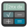               ||`copycat/apps/scalable/com.github.subhadeepjasu.pebbles.svg`               |`com.github.subhadeepjasu.pebbles`               |                                                                                  |`apps/scalable/`       |
|                    ||`copycat/apps/scalable/com.github.thejambi.psnotes.svg`                    |`com.github.thejambi.psnotes`                    |                                                                                  |`apps/scalable/`       |
|                   ||`copycat/apps/scalable/com.github.timecraft.js-test.svg`                   |`com.github.timecraft.js-test`                   |                                                                                  |`apps/scalable/`       |
|               ||`copycat/apps/scalable/com.github.zren.kdeconnectdevice.svg`               |`com.github.zren.kdeconnectdevice`               |                                                                                  |`apps/scalable/`       |
|                       ||`copycat/apps/scalable/com.gitlab.zehkira.Myuzi.svg`                       |`com.gitlab.zehkira.Myuzi`                       |                                                                                  |`apps/scalable/`       |
|         ||`copycat/apps/scalable/com.rafaelmardojai.WebfontKitGenerator.svg`         |`com.rafaelmardojai.WebfontKitGenerator`         |                                                                                  |`apps/scalable/`       |
|                                   ||`copycat/apps/scalable/cudatext-512.svg`                                   |`cudatext-512`                                   |                                                                                  |`apps/scalable/`       |
|                                      ||`copycat/apps/scalable/cura-icon.svg`                                      |`cura-icon`                                      |                                                                                  |`apps/scalable/`       |
|                                     ||`copycat/apps/scalable/cutemarked.svg`                                     |`cutemarked`                                     |                                                                                  |`apps/scalable/`       |
|                                          ||`copycat/apps/scalable/cvpcb.svg`                                          |`cvpcb`                                          |                                                                                  |`apps/scalable/`       |
|                            ||`copycat/apps/scalable/cz.pervoj.valdo-gtk.svg`                            |`cz.pervoj.valdo-gtk`                            |                                                                                  |`apps/scalable/`       |
|                                       ||`copycat/apps/scalable/datagrip.svg`                                       |`datagrip`                                       |                                                                                  |`apps/scalable/`       |
|                                      ||`copycat/apps/scalable/dataspell.svg`                                      |`dataspell`                                      |                                                                                  |`apps/scalable/`       |
|                                   ||`copycat/apps/scalable/dconf-editor.svg`                                   |`dconf-editor`                                   |                                                                                  |`apps/scalable/`       |
|                                   ||`copycat/apps/scalable/de_logo_48px.svg`                                   |`de_logo_48px`                                   |                                                                                  |`apps/scalable/`       |
|                                         ||`copycat/apps/scalable/denemo.svg`                                         |`denemo`                                         |                                                                                  |`apps/scalable/`       |
|                                       ||`copycat/apps/scalable/deskreen.svg`                                       |`deskreen`                                       |                                                                                  |`apps/scalable/`       |
|                        ||`copycat/apps/scalable/desktop-environment-tde.svg`                        |`desktop-environment-tde`                        |                                                                                  |`apps/scalable/`       |
|                                  ||`copycat/apps/scalable/dev.boxi.Boxi.svg`                                  |`dev.boxi.Boxi`                                  |                                                                                  |`apps/scalable/`       |
|                           ||`copycat/apps/scalable/dev.geopjr.Collision.svg`                           |`dev.geopjr.Collision`                           |                                                                                  |`apps/scalable/`       |
|                           ||`copycat/apps/scalable/dev.geopjr.Hashbrown.svg`                           |`dev.geopjr.Hashbrown`                           |                                                                                  |`apps/scalable/`       |
|                                        ||`copycat/apps/scalable/devhelp.svg`                                        |`devhelp`                                        |                                                                                  |`apps/scalable/`       |
|                            ||`copycat/apps/scalable/dev.mufeed.Wordbook.svg`                            |`dev.mufeed.Wordbook`                            |                                                                                  |`apps/scalable/`       |
|                     ||`copycat/apps/scalable/dev.vlinkz.NixosConfEditor.svg`                     |`dev.vlinkz.NixosConfEditor`                     |                                                                                  |`apps/scalable/`       |
|                                        ||`copycat/apps/scalable/dianara.svg`                                        |`dianara`                                        |                                                                                  |`apps/scalable/`       |
|                              ||`copycat/apps/scalable/digitallyimported.svg`                              |`digitallyimported`                              |                                                                                  |`apps/scalable/`       |
|                      ||`copycat/apps/scalable/distributor-logo-absolute.svg`                      |`distributor-logo-absolute`                      |                                                                                  |`apps/scalable/`       |
|                      ||`copycat/apps/scalable/distributor-logo-academix.svg`                      |`distributor-logo-academix`                      |                                                                                  |`apps/scalable/`       |
|                           ||`copycat/apps/scalable/distributor-logo-aix.svg`                           |`distributor-logo-aix`                           |                                                                                  |`apps/scalable/`       |
|                      ||`copycat/apps/scalable/distributor-logo-archbang.svg`                      |`distributor-logo-archbang`                      |                                                                                  |`apps/scalable/`       |
|                        ||`copycat/apps/scalable/distributor-logo-ms-dos.svg`                        |`distributor-logo-ms-dos`                        |                                                                                  |`apps/scalable/`       |
|                        ||`copycat/apps/scalable/distributor-logo-pop-os.svg`                        |`distributor-logo-pop-os`                        |                                                                                  |`apps/scalable/`       |
|                        ||`copycat/apps/scalable/distributor-logo-simply.svg`                        |`distributor-logo-simply`                        |                                                                                  |`apps/scalable/`       |
|              ||`copycat/apps/scalable/distributor-logo-ultimate-edition.svg`              |`distributor-logo-ultimate-edition`              |                                                                                  |`apps/scalable/`       |
|                         ||`copycat/apps/scalable/distributor-logo-zorin.svg`                         |`distributor-logo-zorin`                         |                                                                                  |`apps/scalable/`       |
|                                       ||`copycat/apps/scalable/dmanager.svg`                                       |`dmanager`                                       |                                                                                  |`apps/scalable/`       |
|                                        ||`copycat/apps/scalable/dmd-doc.svg`                                        |`dmd-doc`                                        |                                                                                  |`apps/scalable/`       |
|                                     ||`copycat/apps/scalable/dosbox-ece.svg`                                     |`dosbox-ece`                                     |                                                                                  |`apps/scalable/`       |
|                                 ||`copycat/apps/scalable/dosbox-staging.svg`                                 |`dosbox-staging`                                 |                                                                                  |`apps/scalable/`       |
|                                         ||`copycat/apps/scalable/dosbox.svg`                                         |`dosbox`                                         |                                                                                  |`apps/scalable/`       |
|                                       ||`copycat/apps/scalable/dosbox-x.svg`                                       |`dosbox-x`                                       |                                                                                  |`apps/scalable/`       |
|                                       ||`copycat/apps/scalable/dotcover.svg`                                       |`dotcover`                                       |                                                                                  |`apps/scalable/`       |
|                                      ||`copycat/apps/scalable/dotmemory.svg`                                      |`dotmemory`                                      |                                                                                  |`apps/scalable/`       |
|                                        ||`copycat/apps/scalable/dotpeek.svg`                                        |`dotpeek`                                        |                                                                                  |`apps/scalable/`       |
|                                       ||`copycat/apps/scalable/dottrace.svg`                                       |`dottrace`                                       |                                                                                  |`apps/scalable/`       |
|                         ||`copycat/apps/scalable/double-action-boogaloo.svg`                         |`double-action-boogaloo`                         |                                                                                  |`apps/scalable/`       |
|                                         ||`copycat/apps/scalable/eiciel.svg`                                         |`eiciel`                                         |                                                                                  |`apps/scalable/`       |
|                               ||`copycat/apps/scalable/emulationstation.svg`                               |`emulationstation`                               |                                                                                  |`apps/scalable/`       |
|                              ||`copycat/apps/scalable/enhanced_browsing.svg`                              |`enhanced_browsing`                              |                                                                                  |`apps/scalable/`       |
|                                           ||`copycat/apps/scalable/ente.svg`                                           |`ente`                                           |                                                                                  |`apps/scalable/`       |
|                                     ||`copycat/apps/scalable/epic-games.svg`                                     |`epic-games`                                     |                                                                                  |`apps/scalable/`       |
|                                      ||`copycat/apps/scalable/eqonomize.svg`                                      |`eqonomize`                                      |                                                                                  |`apps/scalable/`       |
|                             ||`copycat/apps/scalable/eu.scarpetta.QtWAW.svg`                             |`eu.scarpetta.QtWAW`                             |                                                                                  |`apps/scalable/`       |
|                                      ||`copycat/apps/scalable/extraterm.svg`                                      |`extraterm`                                      |                                                                                  |`apps/scalable/`       |
|                                       ||`copycat/apps/scalable/facebook.svg`                                       |`facebook`                                       |                                                                                  |`apps/scalable/`       |
|                                    ||`copycat/apps/scalable/famitracker.svg`                                    |`famitracker`                                    |                                                                                  |`apps/scalable/`       |
|                              ||`copycat/apps/scalable/fcitx-sogoupinyin.svg`                              |`fcitx-sogoupinyin`                              |                                                                                  |`apps/scalable/`       |
|                                       ||`copycat/apps/scalable/feedback.svg`                                       |`feedback`                                       |                                                                                  |`apps/scalable/`       |
|                                        ||`copycat/apps/scalable/filebot.svg`                                        |`filebot`                                        |                                                                                  |`apps/scalable/`       |
|                                      ||`copycat/apps/scalable/filezilla.svg`                                      |`filezilla`                                      |                                                                                  |`apps/scalable/`       |
|                                 ||`copycat/apps/scalable/filmulator-gui.svg`                                 |`filmulator-gui`                                 |                                                                                  |`apps/scalable/`       |
|                                       ||`copycat/apps/scalable/FlashCS6.svg`                                       |`FlashCS6`                                       |                                                                                  |`apps/scalable/`       |
|                                          ||`copycat/apps/scalable/fokus.svg`                                          |`fokus`                                          |                                                                                  |`apps/scalable/`       |
|                                      ||`copycat/apps/scalable/fontforge.svg`                                      |`fontforge`                                      |                                                                                  |`apps/scalable/`       |
|                                    ||`copycat/apps/scalable/fontypython.svg`                                    |`fontypython`                                    |                                                                                  |`apps/scalable/`       |
|                                     ||`copycat/apps/scalable/foursquare.svg`                                     |`foursquare`                                     |                                                                                  |`apps/scalable/`       |
|                                        ||`copycat/apps/scalable/freecad.svg`                                        |`freecad`                                        |                                                                                  |`apps/scalable/`       |
|                                 ||`copycat/apps/scalable/freeciv-manual.svg`                                 |`freeciv-manual`                                 |                                                                                  |`apps/scalable/`       |
|                                 ||`copycat/apps/scalable/freeciv-server.svg`                                 |`freeciv-server`                                 |                                                                                  |`apps/scalable/`       |
|                                      ||`copycat/apps/scalable/freedroid.svg`                                      |`freedroid`                                      |                                                                                  |`apps/scalable/`       |
|                           ||`copycat/apps/scalable/freeoffice-planmaker.svg`                           |`freeoffice-planmaker`                           |                                                                                  |`apps/scalable/`       |
|                       ||`copycat/apps/scalable/freeoffice-presentations.svg`                       |`freeoffice-presentations`                       |                                                                                  |`apps/scalable/`       |
|                           ||`copycat/apps/scalable/freeoffice-textmaker.svg`                           |`freeoffice-textmaker`                           |                                                                                  |`apps/scalable/`       |
|                              ||`copycat/apps/scalable/FreeTexturePacker.svg`                              |`FreeTexturePacker`                              |                                                                                  |`apps/scalable/`       |
|                                       ||`copycat/apps/scalable/fritzing.svg`                                       |`fritzing`                                       |                                                                                  |`apps/scalable/`       |
|                                ||`copycat/apps/scalable/fs-uae-launcher.svg`                                |`fs-uae-launcher`                                |                                                                                  |`apps/scalable/`       |
|                                        ||`copycat/apps/scalable/ftb-app.svg`                                        |`ftb-app`                                        |                                                                                  |`apps/scalable/`       |
|                                           ||`copycat/apps/scalable/fuse.svg`                                           |`fuse`                                           |                                                                                  |`apps/scalable/`       |
|                                   ||`copycat/apps/scalable/gimagereader.svg`                                   |`gimagereader`                                   |                                                                                  |`apps/scalable/`       |
|                                          ||`copycat/apps/scalable/gisto.svg`                                          |`gisto`                                          |                                                                                  |`apps/scalable/`       |
|                             ||`copycat/apps/scalable/gksu-root-terminal.svg`                             |`gksu-root-terminal`                             |                                                                                  |`apps/scalable/`       |
|                          ||`copycat/apps/scalable/glyphr-studio-desktop.svg`                          |`glyphr-studio-desktop`                          |                                                                                  |`apps/scalable/`       |
|                               ||`copycat/apps/scalable/gnome-characters.svg`                               |`gnome-characters`                               |                                                                                  |`apps/scalable/`       |
|                                 ||`copycat/apps/scalable/gnome-mahjongg.svg`                                 |`gnome-mahjongg`                                 |                                                                                  |`apps/scalable/`       |
|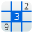                                   ||`copycat/apps/scalable/gnome-sudoku.svg`                                   |`gnome-sudoku`                                   |                                                                                  |`apps/scalable/`       |
|                                 ||`copycat/apps/scalable/gnome-tetravex.svg`                                 |`gnome-tetravex`                                 |                                                                                  |`apps/scalable/`       |
|                                         ||`copycat/apps/scalable/goland.svg`                                         |`goland`                                         |                                                                                  |`apps/scalable/`       |
|                                  ||`copycat/apps/scalable/google-agenda.svg`                                  |`google-agenda`                                  |                                                                                  |`apps/scalable/`       |
|                             ||`copycat/apps/scalable/google-chrome-beta.svg`                             |`google-chrome-beta`                             |                                                                                  |`apps/scalable/`       |
|                              ||`copycat/apps/scalable/google-chrome-dev.svg`                              |`google-chrome-dev`                              |                                                                                  |`apps/scalable/`       |
|                               ||`copycat/apps/scalable/google-earth-pro.svg`                               |`google-earth-pro`                               |                                                                                  |`apps/scalable/`       |
|                                ||`copycat/apps/scalable/google-hangouts.svg`                                |`google-hangouts`                                |                                                                                  |`apps/scalable/`       |
|                                     ||`copycat/apps/scalable/googleplus.svg`                                     |`googleplus`                                     |                                                                                  |`apps/scalable/`       |
|                               ||`copycat/apps/scalable/google-translate.svg`                               |`google-translate`                               |                                                                                  |`apps/scalable/`       |
|                                     ||`copycat/apps/scalable/goterminal.svg`                                     |`goterminal`                                     |                                                                                  |`apps/scalable/`       |
|                                       ||`copycat/apps/scalable/GP6-icon.svg`                                       |`GP6-icon`                                       |                                                                                  |`apps/scalable/`       |
|                                           ||`copycat/apps/scalable/gqrx.svg`                                           |`gqrx`                                           |                                                                                  |`apps/scalable/`       |
|                                         ||`copycat/apps/scalable/grafx2.svg`                                         |`grafx2`                                         |                                                                                  |`apps/scalable/`       |
|                                ||`copycat/apps/scalable/grub-customizer.svg`                                |`grub-customizer`                                |                                                                                  |`apps/scalable/`       |
|                                         ||`copycat/apps/scalable/gsharp.svg`                                         |`gsharp`                                         |                                                                                  |`apps/scalable/`       |
|                                    ||`copycat/apps/scalable/gtranslator.svg`                                    |`gtranslator`                                    |                                                                                  |`apps/scalable/`       |
|                                       ||`copycat/apps/scalable/guitarix.svg`                                       |`guitarix`                                       |                                                                                  |`apps/scalable/`       |
|                                          ||`copycat/apps/scalable/gummi.svg`                                          |`gummi`                                          |                                                                                  |`apps/scalable/`       |
|                                         ||`copycat/apps/scalable/gzdoom.svg`                                         |`gzdoom`                                         |                                                                                  |`apps/scalable/`       |
|                                       ||`copycat/apps/scalable/haroopad.svg`                                       |`haroopad`                                       |                                                                                  |`apps/scalable/`       |
|                                         ||`copycat/apps/scalable/hashit.svg`                                         |`hashit`                                         |                                                                                  |`apps/scalable/`       |
|                                         ||`copycat/apps/scalable/hatari.svg`                                         |`hatari`                                         |                                                                                  |`apps/scalable/`       |
|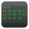                                     ||`copycat/apps/scalable/hex-editor.svg`                                     |`hex-editor`                                     |                                                                                  |`apps/scalable/`       |
|                                  ||`copycat/apps/scalable/hivelytracker.svg`                                  |`hivelytracker`                                  |                                                                                  |`apps/scalable/`       |
|                                        ||`copycat/apps/scalable/hp_logo.svg`                                        |`hp_logo`                                        |                                                                                  |`apps/scalable/`       |
|                                       ||`copycat/apps/scalable/hydrogen.svg`                                       |`hydrogen`                                       |                                                                                  |`apps/scalable/`       |
|                                          ||`copycat/apps/scalable/hyper.svg`                                          |`hyper`                                          |                                                                                  |`apps/scalable/`       |
|                                            ||`copycat/apps/scalable/ice.svg`                                            |`ice`                                            |                                                                                  |`apps/scalable/`       |
|                                          ||`copycat/apps/scalable/imhex.svg`                                          |`imhex`                                          |                                                                                  |`apps/scalable/`       |
|                  ||`copycat/apps/scalable/in.bharatkalluri.shortcircuit.svg`                  |`in.bharatkalluri.shortcircuit`                  |                                                                                  |`apps/scalable/`       |
|                              ||`copycat/apps/scalable/insomnia-designer.svg`                              |`insomnia-designer`                              |                                                                                  |`apps/scalable/`       |
|                                       ||`copycat/apps/scalable/intellij.svg`                                       |`intellij`                                       |                                                                                  |`apps/scalable/`       |
|                                          ||`copycat/apps/scalable/intel.svg`                                          |`intel`                                          |                                                                                  |`apps/scalable/`       |
|                             ||`copycat/apps/scalable/io.elementary.code.svg`                             |`io.elementary.code`                             |                                                                                  |`apps/scalable/`       |
|                             ||`copycat/apps/scalable/io.github.ImEditor.svg`                             |`io.github.ImEditor`                             |                                                                                  |`apps/scalable/`       |
|                            ||`copycat/apps/scalable/io.github.OpenToonz.svg`                            |`io.github.OpenToonz`                            |                                                                                  |`apps/scalable/`       |
|                                        ||`copycat/apps/scalable/ipython.svg`                                        |`ipython`                                        |                                                                                  |`apps/scalable/`       |
|                                           ||`copycat/apps/scalable/jadx.svg`                                           |`jadx`                                           |                                                                                  |`apps/scalable/`       |
|                                          ||`copycat/apps/scalable/jblue.svg`                                          |`jblue`                                          |                                                                                  |`apps/scalable/`       |
|                              ||`copycat/apps/scalable/jetbrains-toolbox.svg`                              |`jetbrains-toolbox`                              |                                                                                  |`apps/scalable/`       |
|                                         ||`copycat/apps/scalable/JForex.svg`                                         |`JForex`                                         |                                                                                  |`apps/scalable/`       |
|                                          ||`copycat/apps/scalable/jgray.svg`                                          |`jgray`                                          |                                                                                  |`apps/scalable/`       |
|                                         ||`copycat/apps/scalable/jgreen.svg`                                         |`jgreen`                                         |                                                                                  |`apps/scalable/`       |
|                                         ||`copycat/apps/scalable/joplin.svg`                                         |`joplin`                                         |                                                                                  |`apps/scalable/`       |
|                               ||`copycat/apps/scalable/jpexs-decompiler.svg`                               |`jpexs-decompiler`                               |                                                                                  |`apps/scalable/`       |
|                                    ||`copycat/apps/scalable/JRomManager.svg`                                    |`JRomManager`                                    |                                                                                  |`apps/scalable/`       |
|                                      ||`copycat/apps/scalable/KakaoTalk.svg`                                      |`KakaoTalk`                                      |                                                                                  |`apps/scalable/`       |
|                                        ||`copycat/apps/scalable/kakoune.svg`                                        |`kakoune`                                        |                                                                                  |`apps/scalable/`       |
|                                       ||`copycat/apps/scalable/kalgebra.svg`                                       |`kalgebra`                                       |                                                                                  |`apps/scalable/`       |
|                                       ||`copycat/apps/scalable/kanagram.svg`                                       |`kanagram`                                       |                                                                                  |`apps/scalable/`       |
|                                       ||`copycat/apps/scalable/kanatest.svg`                                       |`kanatest`                                       |                                                                                  |`apps/scalable/`       |
|                                        ||`copycat/apps/scalable/kbibtex.svg`                                        |`kbibtex`                                        |                                                                                  |`apps/scalable/`       |
|                                      ||`copycat/apps/scalable/kblackbox.svg`                                      |`kblackbox`                                      |                                                                                  |`apps/scalable/`       |
|                                 ||`copycat/apps/scalable/kde-frameworks.svg`                                 |`kde-frameworks`                                 |                                                                                  |`apps/scalable/`       |
|                                       ||`copycat/apps/scalable/kdevelop.svg`                                       |`kdevelop`                                       |                                                                                  |`apps/scalable/`       |
|                                    ||`copycat/apps/scalable/kega-fusion.svg`                                    |`kega-fusion`                                    |                                                                                  |`apps/scalable/`       |
|                                      ||`copycat/apps/scalable/keurocalc.svg`                                      |`keurocalc`                                      |                                                                                  |`apps/scalable/`       |
|                                       ||`copycat/apps/scalable/khotkeys.svg`                                       |`khotkeys`                                       |                                                                                  |`apps/scalable/`       |
|                                          ||`copycat/apps/scalable/kicad.svg`                                          |`kicad`                                          |                                                                                  |`apps/scalable/`       |
|                                           ||`copycat/apps/scalable/kid3.svg`                                           |`kid3`                                           |                                                                                  |`apps/scalable/`       |
|                                           ||`copycat/apps/scalable/kile.svg`                                           |`kile`                                           |                                                                                  |`apps/scalable/`       |
|                                ||`copycat/apps/scalable/kimagemapeditor.svg`                                |`kimagemapeditor`                                |                                                                                  |`apps/scalable/`       |
|                                  ||`copycat/apps/scalable/klatexformula.svg`                                  |`klatexformula`                                  |                                                                                  |`apps/scalable/`       |
|                                        ||`copycat/apps/scalable/klavaro.svg`                                        |`klavaro`                                        |                                                                                  |`apps/scalable/`       |
|                                        ||`copycat/apps/scalable/klayout.svg`                                        |`klayout`                                        |                                                                                  |`apps/scalable/`       |
|                                       ||`copycat/apps/scalable/kmymoney.svg`                                       |`kmymoney`                                       |                                                                                  |`apps/scalable/`       |
|                                   ||`copycat/apps/scalable/koodo-reader.svg`                                   |`koodo-reader`                                   |                                                                                  |`apps/scalable/`       |
|                                         ||`copycat/apps/scalable/korgac.svg`                                         |`korgac`                                         |                                                                                  |`apps/scalable/`       |
|                                        ||`copycat/apps/scalable/krename.svg`                                        |`krename`                                        |                                                                                  |`apps/scalable/`       |
|                                     ||`copycat/apps/scalable/kronometer.svg`                                     |`kronometer`                                     |                                                                                  |`apps/scalable/`       |
|                                        ||`copycat/apps/scalable/kshisen.svg`                                        |`kshisen`                                        |                                                                                  |`apps/scalable/`       |
|                                        ||`copycat/apps/scalable/ksudoku.svg`                                        |`ksudoku`                                        |                                                                                  |`apps/scalable/`       |
|                                           ||`copycat/apps/scalable/ktip.svg`                                           |`ktip`                                           |                                                                                  |`apps/scalable/`       |
|                                        ||`copycat/apps/scalable/kvantum.svg`                                        |`kvantum`                                        |                                                                                  |`apps/scalable/`       |
|                                          ||`copycat/apps/scalable/kvirc.svg`                                          |`kvirc`                                          |                                                                                  |`apps/scalable/`       |
|                                 ||`copycat/apps/scalable/kwalletmanager.svg`                                 |`kwalletmanager`                                 |                                                                                  |`apps/scalable/`       |
|                                          ||`copycat/apps/scalable/kwave.svg`                                          |`kwave`                                          |                                                                                  |`apps/scalable/`       |
|                                      ||`copycat/apps/scalable/kwordquiz.svg`                                      |`kwordquiz`                                      |                                                                                  |`apps/scalable/`       |
|                                        ||`copycat/apps/scalable/l3afpad.svg`                                        |`l3afpad`                                        |                                                                                  |`apps/scalable/`       |
|                                   ||`copycat/apps/scalable/LanguageTool.svg`                                   |`LanguageTool`                                   |                                                                                  |`apps/scalable/`       |
|                                         ||`copycat/apps/scalable/lastfm.svg`                                         |`lastfm`                                         |                                                                                  |`apps/scalable/`       |
|                                     ||`copycat/apps/scalable/latte-dock.svg`                                     |`latte-dock`                                     |                                                                                  |`apps/scalable/`       |
|                                       ||`copycat/apps/scalable/leonflix.svg`                                       |`leonflix`                                       |                                                                                  |`apps/scalable/`       |
|                                           ||`copycat/apps/scalable/lftp.svg`                                           |`lftp`                                           |                                                                                  |`apps/scalable/`       |
|                               ||`copycat/apps/scalable/libreoffice-math.svg`                               |`libreoffice-math`                               |                                                                                  |`apps/scalable/`       |
|                                    ||`copycat/apps/scalable/lsp-plugins.svg`                                    |`lsp-plugins`                                    |                                                                                  |`apps/scalable/`       |
|                                         ||`copycat/apps/scalable/lzdoom.svg`                                         |`lzdoom`                                         |                                                                                  |`apps/scalable/`       |
|                                           ||`copycat/apps/scalable/mame.svg`                                           |`mame`                                           |                                                                                  |`apps/scalable/`       |
|                              ||`copycat/apps/scalable/manjaro-architect.svg`                              |`manjaro-architect`                              |                                                                                  |`apps/scalable/`       |
|                                       ||`copycat/apps/scalable/marknoto.svg`                                       |`marknoto`                                       |                                                                                  |`apps/scalable/`       |
|                                       ||`copycat/apps/scalable/markpado.svg`                                       |`markpado`                                       |                                                                                  |`apps/scalable/`       |
|                            ||`copycat/apps/scalable/mate-inhibit-applet.svg`                            |`mate-inhibit-applet`                            |                                                                                  |`apps/scalable/`       |
|                                         ||`copycat/apps/scalable/maxima.svg`                                         |`maxima`                                         |                                                                                  |`apps/scalable/`       |
|                                ||`copycat/apps/scalable/maxthon-browser.svg`                                |`maxthon-browser`                                |                                                                                  |`apps/scalable/`       |
|                                       ||`copycat/apps/scalable/mednaffe.svg`                                       |`mednaffe`                                       |                                                                                  |`apps/scalable/`       |
|                                    ||`copycat/apps/scalable/megabasterd.svg`                                    |`megabasterd`                                    |                                                                                  |`apps/scalable/`       |
|                                           ||`copycat/apps/scalable/mega.svg`                                           |`mega`                                           |                                                                                  |`apps/scalable/`       |
|                               ||`copycat/apps/scalable/mendeley-desktop.svg`                               |`mendeley-desktop`                               |                                                                                  |`apps/scalable/`       |
|                                     ||`copycat/apps/scalable/mhwaveedit.svg`                                     |`mhwaveedit`                                     |                                                                                  |`apps/scalable/`       |
|                            ||`copycat/apps/scalable/microsoft-edge-beta.svg`                            |`microsoft-edge-beta`                            |                                                                                  |`apps/scalable/`       |
|                             ||`copycat/apps/scalable/microsoft-edge-dev.svg`                             |`microsoft-edge-dev`                             |                                                                                  |`apps/scalable/`       |
|                                          ||`copycat/apps/scalable/micro.svg`                                          |`micro`                                          |                                                                                  |`apps/scalable/`       |
|                                 ||`copycat/apps/scalable/miktex-console.svg`                                 |`miktex-console`                                 |                                                                                  |`apps/scalable/`       |
|                                       ||`copycat/apps/scalable/mikutter.svg`                                       |`mikutter`                                       |                                                                                  |`apps/scalable/`       |
|                                   ||`copycat/apps/scalable/milkytracker.svg`                                   |`milkytracker`                                   |                                                                                  |`apps/scalable/`       |
|                                       ||`copycat/apps/scalable/minetime.svg`                                       |`minetime`                                       |                                                                                  |`apps/scalable/`       |
|                                     ||`copycat/apps/scalable/minicraft+.svg`                                     |`minicraft+`                                     |                                                                                  |`apps/scalable/`       |
|                            ||`copycat/apps/scalable/mintsources-foreign.svg`                            |`mintsources-foreign`                            |                                                                                  |`apps/scalable/`       |
|                                         ||`copycat/apps/scalable/mlterm.svg`                                         |`mlterm`                                         |                                                                                  |`apps/scalable/`       |
|                                       ||`copycat/apps/scalable/modelsim.svg`                                       |`modelsim`                                       |                                                                                  |`apps/scalable/`       |
|                                     ||`copycat/apps/scalable/moderndeck.svg`                                     |`moderndeck`                                     |                                                                                  |`apps/scalable/`       |
|                                        ||`copycat/apps/scalable/molotov.svg`                                        |`molotov`                                        |                                                                                  |`apps/scalable/`       |
|                                        ||`copycat/apps/scalable/monodoc.svg`                                        |`monodoc`                                        |                                                                                  |`apps/scalable/`       |
|                                      ||`copycat/apps/scalable/MotionBox.svg`                                      |`MotionBox`                                      |                                                                                  |`apps/scalable/`       |
|                                         ||`copycat/apps/scalable/motrix.svg`                                         |`motrix`                                         |                                                                                  |`apps/scalable/`       |
|                                    ||`copycat/apps/scalable/movmetaedit.svg`                                    |`movmetaedit`                                    |                                                                                  |`apps/scalable/`       |
|                                           ||`copycat/apps/scalable/mozc.svg`                                           |`mozc`                                           |                                                                                  |`apps/scalable/`       |
|                                       ||`copycat/apps/scalable/ms-excel.svg`                                       |`ms-excel`                                       |                                                                                  |`apps/scalable/`       |
|                                     ||`copycat/apps/scalable/ms-onenote.svg`                                     |`ms-onenote`                                     |                                                                                  |`apps/scalable/`       |
|                                     ||`copycat/apps/scalable/ms-outlook.svg`                                     |`ms-outlook`                                     |                                                                                  |`apps/scalable/`       |
|                                  ||`copycat/apps/scalable/ms-powerpoint.svg`                                  |`ms-powerpoint`                                  |                                                                                  |`apps/scalable/`       |
|                                        ||`copycat/apps/scalable/ms-word.svg`                                        |`ms-word`                                        |                                                                                  |`apps/scalable/`       |
|                                       ||`copycat/apps/scalable/mtvmusic.svg`                                       |`mtvmusic`                                       |                                                                                  |`apps/scalable/`       |
|                                ||`copycat/apps/scalable/mullvad-browser.svg`                                |`mullvad-browser`                                |                                                                                  |`apps/scalable/`       |
|                                           ||`copycat/apps/scalable/muon.svg`                                           |`muon`                                           |                                                                                  |`apps/scalable/`       |
|                                 ||`copycat/apps/scalable/mupen64plus-qt.svg`                                 |`mupen64plus-qt`                                 |                                                                                  |`apps/scalable/`       |
|                                      ||`copycat/apps/scalable/muse-dash.svg`                                      |`muse-dash`                                      |                                                                                  |`apps/scalable/`       |
|                                        ||`copycat/apps/scalable/museeks.svg`                                        |`museeks`                                        |                                                                                  |`apps/scalable/`       |
|                                         ||`copycat/apps/scalable/museeq.svg`                                         |`museeq`                                         |                                                                                  |`apps/scalable/`       |
|                                      ||`copycat/apps/scalable/musescore.svg`                                      |`musescore`                                      |                                                                                  |`apps/scalable/`       |
|                                      ||`copycat/apps/scalable/musikcube.svg`                                      |`musikcube`                                      |                                                                                  |`apps/scalable/`       |
|                                           ||`copycat/apps/scalable/mutt.svg`                                           |`mutt`                                           |                                                                                  |`apps/scalable/`       |
|                                         ||`copycat/apps/scalable/mx-qsi.svg`                                         |`mx-qsi`                                         |                                                                                  |`apps/scalable/`       |
|                                      ||`copycat/apps/scalable/nbteditor.svg`                                      |`nbteditor`                                      |                                                                                  |`apps/scalable/`       |
|                                            ||`copycat/apps/scalable/ndm.svg`                                            |`ndm`                                            |                                                                                  |`apps/scalable/`       |
|                                         ||`copycat/apps/scalable/neovim.svg`                                         |`neovim`                                         |                                                                                  |`apps/scalable/`       |
|                  ||`copycat/apps/scalable/net.christianbeier.Gromit-MPX.svg`                  |`net.christianbeier.Gromit-MPX`                  |                                                                                  |`apps/scalable/`       |
|                                     ||`copycat/apps/scalable/netradiant.svg`                                     |`netradiant`                                     |                                                                                  |`apps/scalable/`       |
|                                  ||`copycat/apps/scalable/nicotine-plus.svg`                                  |`nicotine-plus`                                  |                                                                                  |`apps/scalable/`       |
|                                        ||`copycat/apps/scalable/nishang.svg`                                        |`nishang`                                        |                                                                                  |`apps/scalable/`       |
|                                     ||`copycat/apps/scalable/nitroshare.svg`                                     |`nitroshare`                                     |                                                                                  |`apps/scalable/`       |
|                                            ||`copycat/apps/scalable/nnn.svg`                                            |`nnn`                                            |                                                                                  |`apps/scalable/`       |
|                                 ||`copycat/apps/scalable/NoMachine-icon.svg`                                 |`NoMachine-icon`                                 |                                                                                  |`apps/scalable/`       |
|                                        ||`copycat/apps/scalable/notable.svg`                                        |`notable`                                        |                                                                                  |`apps/scalable/`       |
|                                      ||`copycat/apps/scalable/notepadqq.svg`                                      |`notepadqq`                                      |                                                                                  |`apps/scalable/`       |
|                                         ||`copycat/apps/scalable/notion.svg`                                         |`notion`                                         |                                                                                  |`apps/scalable/`       |
|                                 ||`copycat/apps/scalable/nsm-legacy-gui.svg`                                 |`nsm-legacy-gui`                                 |                                                                                  |`apps/scalable/`       |
|                                      ||`copycat/apps/scalable/nsm-proxy.svg`                                      |`nsm-proxy`                                      |                                                                                  |`apps/scalable/`       |
|                                          ||`copycat/apps/scalable/nutty.svg`                                          |`nutty`                                          |                                                                                  |`apps/scalable/`       |
|                                          ||`copycat/apps/scalable/nvtop.svg`                                          |`nvtop`                                          |                                                                                  |`apps/scalable/`       |
|                                    ||`copycat/apps/scalable/nym-vpn-app.svg`                                    |`nym-vpn-app`                                    |                                                                                  |`apps/scalable/`       |
|                                      ||`copycat/apps/scalable/ocrfeeder.svg`                                      |`ocrfeeder`                                      |                                                                                  |`apps/scalable/`       |
|                                       ||`copycat/apps/scalable/ooo-math.svg`                                       |`ooo-math`                                       |                                                                                  |`apps/scalable/`       |
|                                        ||`copycat/apps/scalable/openbve.svg`                                        |`openbve`                                        |                                                                                  |`apps/scalable/`       |
|                                        ||`copycat/apps/scalable/openttd.svg`                                        |`openttd`                                        |                                                                                  |`apps/scalable/`       |
|                                       ||`copycat/apps/scalable/ophcrack.svg`                                       |`ophcrack`                                       |                                                                                  |`apps/scalable/`       |
|                                        ||`copycat/apps/scalable/OPNplug.svg`                                        |`OPNplug`                                        |                                                                                  |`apps/scalable/`       |
|                  ||`copycat/apps/scalable/org.es_de.emulationstation-de.svg`                  |`org.es_de.emulationstation-de`                  |                                                                                  |`apps/scalable/`       |
|                          ||`copycat/apps/scalable/org.eu.encom.matrique.svg`                          |`org.eu.encom.matrique`                          |                                                                                  |`apps/scalable/`       |
|                            ||`copycat/apps/scalable/org.gabmus.mdwriter.svg`                            |`org.gabmus.mdwriter`                            |                                                                                  |`apps/scalable/`       |
|                           ||`copycat/apps/scalable/org.gabmus.notorious.svg`                           |`org.gabmus.notorious`                           |                                                                                  |`apps/scalable/`       |
|                           ||`copycat/apps/scalable/org.gnome.Crosswords.svg`                           |`org.gnome.Crosswords`                           |                                                                                  |`apps/scalable/`       |
|                         ||`copycat/apps/scalable/org.gnome.design.Lorem.svg`                         |`org.gnome.design.Lorem`                         |                                                                                  |`apps/scalable/`       |
|                    ||`copycat/apps/scalable/org.gnome.design.Typography.svg`                    |`org.gnome.design.Typography`                    |                                                                                  |`apps/scalable/`       |
|                          ||`copycat/apps/scalable/org.gnome.FontManager.svg`                          |`org.gnome.FontManager`                          |                                                                                  |`apps/scalable/`       |
|                           ||`copycat/apps/scalable/org.gnome.FontViewer.svg`                           |`org.gnome.FontViewer`                           |                                                                                  |`apps/scalable/`       |
|                          ||`copycat/apps/scalable/org.gnome.Gtranslator.svg`                          |`org.gnome.Gtranslator`                          |                                                                                  |`apps/scalable/`       |
|                                  ||`copycat/apps/scalable/org.gnome.Tau.svg`                                  |`org.gnome.Tau`                                  |                                                                                  |`apps/scalable/`       |
|                      ||`copycat/apps/scalable/org.gnome.World.Citations.svg`                      |`org.gnome.World.Citations`                      |                                                                                  |`apps/scalable/`       |
|               ||`copycat/apps/scalable/org.gustavoperedo.FontDownloader.svg`               |`org.gustavoperedo.FontDownloader`               |                                                                                  |`apps/scalable/`       |
|                    ||`copycat/apps/scalable/org.kde.activeWindowControl.svg`                    |`org.kde.activeWindowControl`                    |                                                                                  |`apps/scalable/`       |
|                               ||`copycat/apps/scalable/org.kde.kontrast.svg`                               |`org.kde.kontrast`                               |                                                                                  |`apps/scalable/`       |
|                         ||`copycat/apps/scalable/org.kde.plasma.appmenu.svg`                         |`org.kde.plasma.appmenu`                         |                                                                                  |`apps/scalable/`       |
|                     ||`copycat/apps/scalable/org.kde.plasma.calendar.wl.svg`                     |`org.kde.plasma.calendar.wl`                     |                                                                                  |`apps/scalable/`       |
|                 ||`copycat/apps/scalable/org.kde.plasma.digitalclock-ng.svg`                 |`org.kde.plasma.digitalclock-ng`                 |                                                                                  |`apps/scalable/`       |
|                    ||`copycat/apps/scalable/org.kde.plasma.digitalclock.svg`                    |`org.kde.plasma.digitalclock`                    |                                                                                  |`apps/scalable/`       |
|                 ||`copycat/apps/scalable/org.kde.plasma.digitalclock.wl.svg`                 |`org.kde.plasma.digitalclock.wl`                 |                                                                                  |`apps/scalable/`       |
|                      ||`copycat/apps/scalable/org.kde.plasma.fuzzyclock.svg`                      |`org.kde.plasma.fuzzyclock`                      |                                                                                  |`apps/scalable/`       |
|                  ||`copycat/apps/scalable/org.kde.plasma.keyboardlayout.svg`                  |`org.kde.plasma.keyboardlayout`                  |                                                                                  |`apps/scalable/`       |
|                      ||`copycat/apps/scalable/org.kde.plasma.simplemenu.svg`                      |`org.kde.plasma.simplemenu`                      |                                                                                  |`apps/scalable/`       |
|                          ||`copycat/apps/scalable/org.kde.windowappmenu.svg`                          |`org.kde.windowappmenu`                          |                                                                                  |`apps/scalable/`       |
|                            ||`copycat/apps/scalable/org.kde.windowtitle.svg`                            |`org.kde.windowtitle`                            |                                                                                  |`apps/scalable/`       |
|                         ||`copycat/apps/scalable/org.wezfurlong.wezterm.svg`                         |`org.wezfurlong.wezterm`                         |                                                                                  |`apps/scalable/`       |
|                                            ||`copycat/apps/scalable/osu.svg`                                            |`osu`                                            |                                                                                  |`apps/scalable/`       |
|                                         ||`copycat/apps/scalable/pcloud.svg`                                         |`pcloud`                                         |                                                                                  |`apps/scalable/`       |
|                                          ||`copycat/apps/scalable/PCSX2.svg`                                          |`PCSX2`                                          |                                                                                  |`apps/scalable/`       |
|                                    ||`copycat/apps/scalable/pdfarranger.svg`                                    |`pdfarranger`                                    |                                                                                  |`apps/scalable/`       |
|                                       ||`copycat/apps/scalable/pdfchain.svg`                                       |`pdfchain`                                       |                                                                                  |`apps/scalable/`       |
|                                    ||`copycat/apps/scalable/pdfshuffler.svg`                                    |`pdfshuffler`                                    |                                                                                  |`apps/scalable/`       |
|                                      ||`copycat/apps/scalable/pdfstudio.svg`                                      |`pdfstudio`                                      |                                                                                  |`apps/scalable/`       |
|                                           ||`copycat/apps/scalable/phd2.svg`                                           |`phd2`                                           |                                                                                  |`apps/scalable/`       |
|                                       ||`copycat/apps/scalable/phpstorm.svg`                                       |`phpstorm`                                       |                                                                                  |`apps/scalable/`       |
|                                       ||`copycat/apps/scalable/pixeluvo.svg`                                       |`pixeluvo`                                       |                                                                                  |`apps/scalable/`       |
|                                        ||`copycat/apps/scalable/planner.svg`                                        |`planner`                                        |                                                                                  |`apps/scalable/`       |
|                                       ||`copycat/apps/scalable/planwork.svg`                                       |`planwork`                                       |                                                                                  |`apps/scalable/`       |
|                                         ||`copycat/apps/scalable/poedit.svg`                                         |`poedit`                                         |                                                                                  |`apps/scalable/`       |
|                                         ||`copycat/apps/scalable/pokete.svg`                                         |`pokete`                                         |                                                                                  |`apps/scalable/`       |
|                                         ||`copycat/apps/scalable/polari.svg`                                         |`polari`                                         |                                                                                  |`apps/scalable/`       |
|                                           ||`copycat/apps/scalable/polo.svg`                                           |`polo`                                           |                                                                                  |`apps/scalable/`       |
|                                        ||`copycat/apps/scalable/portal2.svg`                                        |`portal2`                                        |                                                                                  |`apps/scalable/`       |
|                                    ||`copycat/apps/scalable/powersploit.svg`                                    |`powersploit`                                    |                                                                                  |`apps/scalable/`       |
|                                      ||`copycat/apps/scalable/pppoeconf.svg`                                      |`pppoeconf`                                      |                                                                                  |`apps/scalable/`       |
|                       ||`copycat/apps/scalable/preferences-desktop-font.svg`                       |`preferences-desktop-font`                       |                                                                                  |`apps/scalable/`       |
|                     ||`copycat/apps/scalable/preferences-desktop-locale.svg`                     |`preferences-desktop-locale`                     |                                                                                  |`apps/scalable/`       |
|                    ||`copycat/apps/scalable/preferences-kcalc-constants.svg`                    |`preferences-kcalc-constants`                    |                                                                                  |`apps/scalable/`       |
|           ||`copycat/apps/scalable/preferences-system-notifications-rtl.svg`           |`preferences-system-notifications-rtl`           |                                                                                  |`apps/scalable/`       |
|            ||`copycat/apps/scalable/preferences-web-browser-stylesheets.svg`            |`preferences-web-browser-stylesheets`            |                                                                                  |`apps/scalable/`       |
|                                         ||`copycat/apps/scalable/prepos.svg`                                         |`prepos`                                         |                                                                                  |`apps/scalable/`       |
|                        ||`copycat/apps/scalable/pritunl_client_electron.svg`                        |`pritunl_client_electron`                        |                                                                                  |`apps/scalable/`       |
|                                       ||`copycat/apps/scalable/projectM.svg`                                       |`projectM`                                       |                                                                                  |`apps/scalable/`       |
|                                    ||`copycat/apps/scalable/pronterface.svg`                                    |`pronterface`                                    |                                                                                  |`apps/scalable/`       |
|                                         ||`copycat/apps/scalable/ptyxis.svg`                                         |`ptyxis`                                         |                                                                                  |`apps/scalable/`       |
|                                          ||`copycat/apps/scalable/punes.svg`                                          |`punes`                                          |                                                                                  |`apps/scalable/`       |
|                                        ||`copycat/apps/scalable/pureref.svg`                                        |`pureref`                                        |                                                                                  |`apps/scalable/`       |
|                                     ||`copycat/apps/scalable/pycharmedu.svg`                                     |`pycharmedu`                                     |                                                                                  |`apps/scalable/`       |
|                                        ||`copycat/apps/scalable/pycharm.svg`                                        |`pycharm`                                        |                                                                                  |`apps/scalable/`       |
|                                         ||`copycat/apps/scalable/Q4Wine.svg`                                         |`Q4Wine`                                         |                                                                                  |`apps/scalable/`       |
|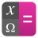                                      ||`copycat/apps/scalable/qalculate.svg`                                      |`qalculate`                                      |                                                                                  |`apps/scalable/`       |
|                                    ||`copycat/apps/scalable/qbittorrent.svg`                                    |`qbittorrent`                                    |                                                                                  |`apps/scalable/`       |
|                                  ||`copycat/apps/scalable/qcalcfilehash.svg`                                  |`qcalcfilehash`                                  |                                                                                  |`apps/scalable/`       |
|                                        ||`copycat/apps/scalable/qctools.svg`                                        |`qctools`                                        |                                                                                  |`apps/scalable/`       |
|                                          ||`copycat/apps/scalable/qnapi.svg`                                          |`qnapi`                                          |                                                                                  |`apps/scalable/`       |
|                                    ||`copycat/apps/scalable/qtassistant.svg`                                    |`qtassistant`                                    |                                                                                  |`apps/scalable/`       |
|                                   ||`copycat/apps/scalable/qtdbusviewer.svg`                                   |`qtdbusviewer`                                   |                                                                                  |`apps/scalable/`       |
|                                     ||`copycat/apps/scalable/qtdesigner.svg`                                     |`qtdesigner`                                     |                                                                                  |`apps/scalable/`       |
|                                     ||`copycat/apps/scalable/qtlinguist.svg`                                     |`qtlinguist`                                     |                                                                                  |`apps/scalable/`       |
|                                       ||`copycat/apps/scalable/qtodotxt.svg`                                       |`qtodotxt`                                       |                                                                                  |`apps/scalable/`       |
|                                             ||`copycat/apps/scalable/qt.svg`                                             |`qt`                                             |                                                                                  |`apps/scalable/`       |
|                                      ||`copycat/apps/scalable/qtwebflix.svg`                                      |`qtwebflix`                                      |                                                                                  |`apps/scalable/`       |
|                                   ||`copycat/apps/scalable/quadrapassel.svg`                                   |`quadrapassel`                                   |                                                                                  |`apps/scalable/`       |
|                                        ||`copycat/apps/scalable/quassel.svg`                                        |`quassel`                                        |                                                                                  |`apps/scalable/`       |
|                                          ||`copycat/apps/scalable/qubic.svg`                                          |`qubic`                                          |                                                                                  |`apps/scalable/`       |
|                                    ||`copycat/apps/scalable/quickaccess.svg`                                    |`quickaccess`                                    |                                                                                  |`apps/scalable/`       |
|                                      ||`copycat/apps/scalable/quickhash.svg`                                      |`quickhash`                                      |                                                                                  |`apps/scalable/`       |
|                                    ||`copycat/apps/scalable/qutebrowser.svg`                                    |`qutebrowser`                                    |                                                                                  |`apps/scalable/`       |
|                                     ||`copycat/apps/scalable/radiotunes.svg`                                     |`radiotunes`                                     |                                                                                  |`apps/scalable/`       |
|                                           ||`copycat/apps/scalable/rare.svg`                                           |`rare`                                           |                                                                                  |`apps/scalable/`       |
|                                     ||`copycat/apps/scalable/rclonetray.svg`                                     |`rclonetray`                                     |                                                                                  |`apps/scalable/`       |
|                                      ||`copycat/apps/scalable/recstudio.svg`                                      |`recstudio`                                      |                                                                                  |`apps/scalable/`       |
|                                     ||`copycat/apps/scalable/remarkable.svg`                                     |`remarkable`                                     |                                                                                  |`apps/scalable/`       |
|                                        ||`copycat/apps/scalable/remmina.svg`                                        |`remmina`                                        |                                                                                  |`apps/scalable/`       |
|                                        ||`copycat/apps/scalable/renoise.svg`                                        |`renoise`                                        |                                                                                  |`apps/scalable/`       |
|                                  ||`copycat/apps/scalable/resharper-c++.svg`                                  |`resharper-c++`                                  |                                                                                  |`apps/scalable/`       |
|                                      ||`copycat/apps/scalable/resharper.svg`                                      |`resharper`                                      |                                                                                  |`apps/scalable/`       |
|                                 ||`copycat/apps/scalable/revolt-desktop.svg`                                 |`revolt-desktop`                                 |                                                                                  |`apps/scalable/`       |
|                                          ||`copycat/apps/scalable/rider.svg`                                          |`rider`                                          |                                                                                  |`apps/scalable/`       |
|                                       ||`copycat/apps/scalable/riot-web.svg`                                       |`riot-web`                                       |                                                                                  |`apps/scalable/`       |
|                                        ||`copycat/apps/scalable/rstudio.svg`                                        |`rstudio`                                        |                                                                                  |`apps/scalable/`       |
|                                       ||`copycat/apps/scalable/rubymine.svg`                                       |`rubymine`                                       |                                                                                  |`apps/scalable/`       |
|                         ||`copycat/apps/scalable/ru.exlmoto.bezierclock.svg`                         |`ru.exlmoto.bezierclock`                         |                                                                                  |`apps/scalable/`       |
|                                   ||`copycat/apps/scalable/satisfactory.svg`                                   |`satisfactory`                                   |                                                                                  |`apps/scalable/`       |
|                                     ||`copycat/apps/scalable/scantailor.svg`                                     |`scantailor`                                     |                                                                                  |`apps/scalable/`       |
|                                           ||`copycat/apps/scalable/scid.svg`                                           |`scid`                                           |                                                                                  |`apps/scalable/`       |
|                                         ||`copycat/apps/scalable/scilab.svg`                                         |`scilab`                                         |                                                                                  |`apps/scalable/`       |
|                                      ||`copycat/apps/scalable/securecrt.svg`                                      |`securecrt`                                      |                                                                                  |`apps/scalable/`       |
|                                     ||`copycat/apps/scalable/sftpclient.svg`                                     |`sftpclient`                                     |                                                                                  |`apps/scalable/`       |
|                                    ||`copycat/apps/scalable/shadow-beta.svg`                                    |`shadow-beta`                                    |                                                                                  |`apps/scalable/`       |
|                                     ||`copycat/apps/scalable/shadow-dev.svg`                                     |`shadow-dev`                                     |                                                                                  |`apps/scalable/`       |
|                                        ||`copycat/apps/scalable/shadps4.svg`                                        |`shadps4`                                        |                                                                                  |`apps/scalable/`       |
|                                      ||`copycat/apps/scalable/shellnoob.svg`                                      |`shellnoob`                                      |                                                                                  |`apps/scalable/`       |
|                               ||`copycat/apps/scalable/sidekick-browser.svg`                               |`sidekick-browser`                               |                                                                                  |`apps/scalable/`       |
|                                          ||`copycat/apps/scalable/sigil.svg`                                          |`sigil`                                          |                                                                                  |`apps/scalable/`       |
|                                          ||`copycat/apps/scalable/simsu.svg`                                          |`simsu`                                          |                                                                                  |`apps/scalable/`       |
|                            ||`copycat/apps/scalable/skype-call-recorder.svg`                            |`skype-call-recorder`                            |                                                                                  |`apps/scalable/`       |
|                                          ||`copycat/apps/scalable/skype.svg`                                          |`skype`                                          |                                                                                  |`apps/scalable/`       |
|                                       ||`copycat/apps/scalable/smartsim.svg`                                       |`smartsim`                                       |                                                                                  |`apps/scalable/`       |
|                                         ||`copycat/apps/scalable/soapui.svg`                                         |`soapui`                                         |                                                                                  |`apps/scalable/`       |
|                                         ||`copycat/apps/scalable/somafm.svg`                                         |`somafm`                                         |                                                                                  |`apps/scalable/`       |
|                                       ||`copycat/apps/scalable/sonic-pi.svg`                                       |`sonic-pi`                                       |                                                                                  |`apps/scalable/`       |
|                                      ||`copycat/apps/scalable/sr-editor.svg`                                      |`sr-editor`                                      |                                                                                  |`apps/scalable/`       |
|                                   ||`copycat/apps/scalable/statalogo_14.svg`                                   |`statalogo_14`                                   |                                                                                  |`apps/scalable/`       |
|                                      ||`copycat/apps/scalable/stretchly.svg`                                      |`stretchly`                                      |                                                                                  |`apps/scalable/`       |
|                                        ||`copycat/apps/scalable/suanPan.svg`                                        |`suanPan`                                        |                                                                                  |`apps/scalable/`       |
|                                  ||`copycat/apps/scalable/sublime-merge.svg`                                  |`sublime-merge`                                  |                                                                                  |`apps/scalable/`       |
|                                        ||`copycat/apps/scalable/sublime.svg`                                        |`sublime`                                        |                                                                                  |`apps/scalable/`       |
|                                      ||`copycat/apps/scalable/substance.svg`                                      |`substance`                                      |                                                                                  |`apps/scalable/`       |
|                               ||`copycat/apps/scalable/subtitlecomposer.svg`                               |`subtitlecomposer`                               |                                                                                  |`apps/scalable/`       |
|                                         ||`copycat/apps/scalable/sudoku.svg`                                         |`sudoku`                                         |                                                                                  |`apps/scalable/`       |
|                                 ||`copycat/apps/scalable/svgcleaner-gui.svg`                                 |`svgcleaner-gui`                                 |                                                                                  |`apps/scalable/`       |
|                                        ||`copycat/apps/scalable/synapse.svg`                                        |`synapse`                                        |                                                                                  |`apps/scalable/`       |
|                                ||`copycat/apps/scalable/system76-driver.svg`                                |`system76-driver`                                |                                                                                  |`apps/scalable/`       |
|                                        ||`copycat/apps/scalable/tanglet.svg`                                        |`tanglet`                                        |                                                                                  |`apps/scalable/`       |
|                                ||`copycat/apps/scalable/teams-for-linux.svg`                                |`teams-for-linux`                                |                                                                                  |`apps/scalable/`       |
|                                       ||`copycat/apps/scalable/tekken-7.svg`                                       |`tekken-7`                                       |                                                                                  |`apps/scalable/`       |
|                                       ||`copycat/apps/scalable/terminal.svg`                                       |`terminal`                                       |                                                                                  |`apps/scalable/`       |
|                                     ||`copycat/apps/scalable/terminator.svg`                                     |`terminator`                                     |                                                                                  |`apps/scalable/`       |
|                                       ||`copycat/apps/scalable/terminix.svg`                                       |`terminix`                                       |                                                                                  |`apps/scalable/`       |
|                                    ||`copycat/apps/scalable/terminology.svg`                                    |`terminology`                                    |                                                                                  |`apps/scalable/`       |
|                                       ||`copycat/apps/scalable/terminus.svg`                                       |`terminus`                                       |                                                                                  |`apps/scalable/`       |
|                                    ||`copycat/apps/scalable/termius-app.svg`                                    |`termius-app`                                    |                                                                                  |`apps/scalable/`       |
|                                      ||`copycat/apps/scalable/terratech.svg`                                      |`terratech`                                      |                                                                                  |`apps/scalable/`       |
|                                 ||`copycat/apps/scalable/tetrio-desktop.svg`                                 |`tetrio-desktop`                                 |                                                                                  |`apps/scalable/`       |
|                                       ||`copycat/apps/scalable/texmaker.svg`                                       |`texmaker`                                       |                                                                                  |`apps/scalable/`       |
|                                      ||`copycat/apps/scalable/texstudio.svg`                                      |`texstudio`                                      |                                                                                  |`apps/scalable/`       |
|                                      ||`copycat/apps/scalable/textadept.svg`                                      |`textadept`                                      |                                                                                  |`apps/scalable/`       |
|                                         ||`copycat/apps/scalable/thonny.svg`                                         |`thonny`                                         |                                                                                  |`apps/scalable/`       |
|                                        ||`copycat/apps/scalable/thorium.svg`                                        |`thorium`                                        |                                                                                  |`apps/scalable/`       |
|                                          ||`copycat/apps/scalable/tidal.svg`                                          |`tidal`                                          |                                                                                  |`apps/scalable/`       |
|                                         ||`copycat/apps/scalable/tiktok.svg`                                         |`tiktok`                                         |                                                                                  |`apps/scalable/`       |
|                                          ||`copycat/apps/scalable/tiled.svg`                                          |`tiled`                                          |                                                                                  |`apps/scalable/`       |
|                                     ||`copycat/apps/scalable/tilesetter.svg`                                     |`tilesetter`                                     |                                                                                  |`apps/scalable/`       |
|                                       ||`copycat/apps/scalable/timidity.svg`                                       |`timidity`                                       |                                                                                  |`apps/scalable/`       |
|                                         ||`copycat/apps/scalable/tipp10.svg`                                         |`tipp10`                                         |                                                                                  |`apps/scalable/`       |
|                                         ||`copycat/apps/scalable/tixati.svg`                                         |`tixati`                                         |                                                                                  |`apps/scalable/`       |
|                                      ||`copycat/apps/scalable/tlauncher.svg`                                      |`tlauncher`                                      |                                                                                  |`apps/scalable/`       |
|                                        ||`copycat/apps/scalable/tokodon.svg`                                        |`tokodon`                                        |                                                                                  |`apps/scalable/`       |
|                                    ||`copycat/apps/scalable/ToneLib-GFX.svg`                                    |`ToneLib-GFX`                                    |                                                                                  |`apps/scalable/`       |
|                                   ||`copycat/apps/scalable/ToneLib-Zoom.svg`                                   |`ToneLib-Zoom`                                   |                                                                                  |`apps/scalable/`       |
|                                   ||`copycat/apps/scalable/torchlight-2.svg`                                   |`torchlight-2`                                   |                                                                                  |`apps/scalable/`       |
|                                   ||`copycat/apps/scalable/tormessenger.svg`                                   |`tormessenger`                                   |                                                                                  |`apps/scalable/`       |
|                                     ||`copycat/apps/scalable/torrserver.svg`                                     |`torrserver`                                     |                                                                                  |`apps/scalable/`       |
|                                     ||`copycat/apps/scalable/tortoisehg.svg`                                     |`tortoisehg`                                     |                                                                                  |`apps/scalable/`       |
|                                      ||`copycat/apps/scalable/tracktion.svg`                                      |`tracktion`                                      |                                                                                  |`apps/scalable/`       |
|                                         ||`copycat/apps/scalable/tumblr.svg`                                         |`tumblr`                                         |                                                                                  |`apps/scalable/`       |
|                                        ||`copycat/apps/scalable/tuxmath.svg`                                        |`tuxmath`                                        |                                                                                  |`apps/scalable/`       |
|                                        ||`copycat/apps/scalable/tuxtype.svg`                                        |`tuxtype`                                        |                                                                                  |`apps/scalable/`       |
|                                      ||`copycat/apps/scalable/twitter-x.svg`                                      |`twitter-x`                                      |                                                                                  |`apps/scalable/`       |
|                                    ||`copycat/apps/scalable/typecatcher.svg`                                    |`typecatcher`                                    |                                                                                  |`apps/scalable/`       |
|                                         ||`copycat/apps/scalable/typora.svg`                                         |`typora`                                         |                                                                                  |`apps/scalable/`       |
|                                      ||`copycat/apps/scalable/ue4editor.svg`                                      |`ue4editor`                                      |                                                                                  |`apps/scalable/`       |
|                       ||`copycat/apps/scalable/uk.co.mrbenshef.Boop-GTK.svg`                       |`uk.co.mrbenshef.Boop-GTK`                       |                                                                                  |`apps/scalable/`       |
|                                      ||`copycat/apps/scalable/ulauncher.svg`                                      |`ulauncher`                                      |                                                                                  |`apps/scalable/`       |
|                                 ||`copycat/apps/scalable/uno-calculator.svg`                                 |`uno-calculator`                                 |                                                                                  |`apps/scalable/`       |
|                                       ||`copycat/apps/scalable/upsource.svg`                                       |`upsource`                                       |                                                                                  |`apps/scalable/`       |
|                                         ||`copycat/apps/scalable/upwork.svg`                                         |`upwork`                                         |                                                                                  |`apps/scalable/`       |
|                                  ||`copycat/apps/scalable/usbguard-icon.svg`                                  |`usbguard-icon`                                  |                                                                                  |`apps/scalable/`       |
|                          ||`copycat/apps/scalable/utilities-terminal_su.svg`                          |`utilities-terminal_su`                          |                                                                                  |`apps/scalable/`       |
|                           ||`copycat/apps/scalable/utilities-x-terminal.svg`                           |`utilities-x-terminal`                           |                                                                                  |`apps/scalable/`       |
|                                          ||`copycat/apps/scalable/vectr.svg`                                          |`vectr`                                          |                                                                                  |`apps/scalable/`       |
|                                        ||`copycat/apps/scalable/veloren.svg`                                        |`veloren`                                        |                                                                                  |`apps/scalable/`       |
|                                      ||`copycat/apps/scalable/veracrypt.svg`                                      |`veracrypt`                                      |                                                                                  |`apps/scalable/`       |
|                                          ||`copycat/apps/scalable/veusz.svg`                                          |`veusz`                                          |                                                                                  |`apps/scalable/`       |
|                                           ||`copycat/apps/scalable/vieb.svg`                                           |`vieb`                                           |                                                                                  |`apps/scalable/`       |
|                                           ||`copycat/apps/scalable/vifm.svg`                                           |`vifm`                                           |                                                                                  |`apps/scalable/`       |
|                                          ||`copycat/apps/scalable/vimeo.svg`                                          |`vimeo`                                          |                                                                                  |`apps/scalable/`       |
|                                            ||`copycat/apps/scalable/vim.svg`                                            |`vim`                                            |                                                                                  |`apps/scalable/`       |
|                                   ||`copycat/apps/scalable/virt-manager.svg`                                   |`virt-manager`                                   |                                                                                  |`apps/scalable/`       |
|                                     ||`copycat/apps/scalable/virtualbox.svg`                                     |`virtualbox`                                     |                                                                                  |`apps/scalable/`       |
|                                   ||`copycat/apps/scalable/vivaldi-beta.svg`                                   |`vivaldi-beta`                                   |                                                                                  |`apps/scalable/`       |
|                               ||`copycat/apps/scalable/vivaldi-snapshot.svg`                               |`vivaldi-snapshot`                               |                                                                                  |`apps/scalable/`       |
|                                        ||`copycat/apps/scalable/vivaldi.svg`                                        |`vivaldi`                                        |                                                                                  |`apps/scalable/`       |
|                                            ||`copycat/apps/scalable/vmd.svg`                                            |`vmd`                                            |                                                                                  |`apps/scalable/`       |
|                                      ||`copycat/apps/scalable/vncviewer.svg`                                      |`vncviewer`                                      |                                                                                  |`apps/scalable/`       |
|                                          ||`copycat/apps/scalable/vnote.svg`                                          |`vnote`                                          |                                                                                  |`apps/scalable/`       |
|                                   ||`copycat/apps/scalable/vroid-studio.svg`                                   |`vroid-studio`                                   |                                                                                  |`apps/scalable/`       |
|                                         ||`copycat/apps/scalable/warsow.svg`                                         |`warsow`                                         |                                                                                  |`apps/scalable/`       |
|                                       ||`copycat/apps/scalable/waterfox.svg`                                       |`waterfox`                                       |                                                                                  |`apps/scalable/`       |
|                                        ||`copycat/apps/scalable/wavebox.svg`                                        |`wavebox`                                        |                                                                                  |`apps/scalable/`       |
|                                     ||`copycat/apps/scalable/waveform11.svg`                                     |`waveform11`                                     |                                                                                  |`apps/scalable/`       |
|                                       ||`copycat/apps/scalable/waydroid.svg`                                       |`waydroid`                                       |                                                                                  |`apps/scalable/`       |
|                                        ||`copycat/apps/scalable/wayland.svg`                                        |`wayland`                                        |                                                                                  |`apps/scalable/`       |
|                                         ||`copycat/apps/scalable/Weasis.svg`                                         |`Weasis`                                         |                                                                                  |`apps/scalable/`       |
|                                          ||`copycat/apps/scalable/webby.svg`                                          |`webby`                                          |                                                                                  |`apps/scalable/`       |
|                                         ||`copycat/apps/scalable/webide.svg`                                         |`webide`                                         |                                                                                  |`apps/scalable/`       |
|                                       ||`copycat/apps/scalable/webstorm.svg`                                       |`webstorm`                                       |                                                                                  |`apps/scalable/`       |
|                                 ||`copycat/apps/scalable/welcome-screen.svg`                                 |`welcome-screen`                                 |                                                                                  |`apps/scalable/`       |
|                                        ||`copycat/apps/scalable/WickrMe.svg`                                        |`WickrMe`                                        |                                                                                  |`apps/scalable/`       |
|                                      ||`copycat/apps/scalable/wikipedia.svg`                                      |`wikipedia`                                      |                                                                                  |`apps/scalable/`       |
|                                     ||`copycat/apps/scalable/windscribe.svg`                                     |`windscribe`                                     |                                                                                  |`apps/scalable/`       |
|                                      ||`copycat/apps/scalable/wine-help.svg`                                      |`wine-help`                                      |                                                                                  |`apps/scalable/`       |
|                               ||`copycat/apps/scalable/wine-uninstaller.svg`                               |`wine-uninstaller`                               |                                                                                  |`apps/scalable/`       |
|                                        ||`copycat/apps/scalable/wiznote.svg`                                        |`wiznote`                                        |                                                                                  |`apps/scalable/`       |
|                                      ||`copycat/apps/scalable/wordpress.svg`                                      |`wordpress`                                      |                                                                                  |`apps/scalable/`       |
|                             ||`copycat/apps/scalable/workspace-overview.svg`                             |`workspace-overview`                             |                                                                                  |`apps/scalable/`       |
|                     ||`copycat/apps/scalable/wps-office2019-kprometheus.svg`                     |`wps-office2019-kprometheus`                     |                                                                                  |`apps/scalable/`       |
|                              ||`copycat/apps/scalable/wps-office-etmain.svg`                              |`wps-office-etmain`                              |                                                                                  |`apps/scalable/`       |
|                             ||`copycat/apps/scalable/wps-office-pdfmain.svg`                             |`wps-office-pdfmain`                             |                                                                                  |`apps/scalable/`       |
|                             ||`copycat/apps/scalable/wps-office-wppmain.svg`                             |`wps-office-wppmain`                             |                                                                                  |`apps/scalable/`       |
|                             ||`copycat/apps/scalable/wps-office-wpsmain.svg`                             |`wps-office-wpsmain`                             |                                                                                  |`apps/scalable/`       |
|                                     ||`copycat/apps/scalable/x2goclient.svg`                                     |`x2goclient`                                     |                                                                                  |`apps/scalable/`       |
|                                    ||`copycat/apps/scalable/fontypython.svg`                                    |`fontypython`                                    |                                                                                  |`apps/scalable/`       |
|                                          ||`copycat/apps/scalable/xampp.svg`                                          |`xampp`                                          |                                                                                  |`apps/scalable/`       |
|                                         ||`copycat/apps/scalable/xash3d.svg`                                         |`xash3d`                                         |                                                                                  |`apps/scalable/`       |
|                                          ||`copycat/apps/scalable/xchat.svg`                                          |`xchat`                                          |                                                                                  |`apps/scalable/`       |
|                                      ||`copycat/apps/scalable/xdiagnose.svg`                                      |`xdiagnose`                                      |                                                                                  |`apps/scalable/`       |
|                                           ||`copycat/apps/scalable/xemu.svg`                                           |`xemu`                                           |                                                                                  |`apps/scalable/`       |
|                                          ||`copycat/apps/scalable/xenia.svg`                                          |`xenia`                                          |                                                                                  |`apps/scalable/`       |
|                    ||`copycat/apps/scalable/xfce4-statusnotifier-plugin.svg`                    |`xfce4-statusnotifier-plugin`                    |                                                                                  |`apps/scalable/`       |
|                                          ||`copycat/apps/scalable/xfwm4.svg`                                          |`xfwm4`                                          |                                                                                  |`apps/scalable/`       |
|                                     ||`copycat/apps/scalable/xiaomitool.svg`                                     |`xiaomitool`                                     |                                                                                  |`apps/scalable/`       |
|                                          ||`copycat/apps/scalable/xmind.svg`                                          |`xmind`                                          |                                                                                  |`apps/scalable/`       |
|                                          ||`copycat/apps/scalable/xmoto.svg`                                          |`xmoto`                                          |                                                                                  |`apps/scalable/`       |
|                                          ||`copycat/apps/scalable/xneur.svg`                                          |`xneur`                                          |                                                                                  |`apps/scalable/`       |
|                                         ||`copycat/apps/scalable/xnoise.svg`                                         |`xnoise`                                         |                                                                                  |`apps/scalable/`       |
|                                           ||`copycat/apps/scalable/xorg.svg`                                           |`xorg`                                           |                                                                                  |`apps/scalable/`       |
|                                        ||`copycat/apps/scalable/xournal.svg`                                        |`xournal`                                        |                                                                                  |`apps/scalable/`       |
|                                          ||`copycat/apps/scalable/XRCed.svg`                                          |`XRCed`                                          |                                                                                  |`apps/scalable/`       |
|                                          ||`copycat/apps/scalable/xterm.svg`                                          |`xterm`                                          |                                                                                  |`apps/scalable/`       |
|                                         ||`copycat/apps/scalable/x-tile.svg`                                         |`x-tile`                                         |                                                                                  |`apps/scalable/`       |
|                                     ||`copycat/apps/scalable/yahoo-mail.svg`                                     |`yahoo-mail`                                     |                                                                                  |`apps/scalable/`       |
|                                        ||`copycat/apps/scalable/yakuake.svg`                                        |`yakuake`                                        |                                                                                  |`apps/scalable/`       |
|                                      ||`copycat/apps/scalable/yaourtgui.svg`                                      |`yaourtgui`                                      |                                                                                  |`apps/scalable/`       |
|                                  ||`copycat/apps/scalable/yast-language.svg`                                  |`yast-language`                                  |                                                                                  |`apps/scalable/`       |
|                                   ||`copycat/apps/scalable/yast-support.svg`                                   |`yast-support`                                   |                                                                                  |`apps/scalable/`       |
|                                         ||`copycat/apps/scalable/yokadi.svg`                                         |`yokadi`                                         |                                                                                  |`apps/scalable/`       |
|                                       ||`copycat/apps/scalable/youtrack.svg`                                       |`youtrack`                                       |                                                                                  |`apps/scalable/`       |
|                                  ||`copycat/apps/scalable/y-ppa-manager.svg`                                  |`y-ppa-manager`                                  |                                                                                  |`apps/scalable/`       |
|                            ||`copycat/apps/scalable/yubikey-neo-manager.svg`                            |`yubikey-neo-manager`                            |                                                                                  |`apps/scalable/`       |
|                    ||`copycat/apps/scalable/yubikey-personalization-gui.svg`                    |`yubikey-personalization-gui`                    |                                                                                  |`apps/scalable/`       |
|                            ||`copycat/apps/scalable/yubikey-piv-manager.svg`                            |`yubikey-piv-manager`                            |                                                                                  |`apps/scalable/`       |
|                                       ||`copycat/apps/scalable/yubioath.svg`                                       |`yubioath`                                       |                                                                                  |`apps/scalable/`       |
|                                           ||`copycat/apps/scalable/yuna.svg`                                           |`yuna`                                           |                                                                                  |`apps/scalable/`       |
|                                          ||`copycat/apps/scalable/zdoom.svg`                                          |`zdoom`                                          |                                                                                  |`apps/scalable/`       |
|                                           ||`copycat/apps/scalable/zeal.svg`                                           |`zeal`                                           |                                                                                  |`apps/scalable/`       |
|                                            ||`copycat/apps/scalable/zed.svg`                                            |`zed`                                            |                                                                                  |`apps/scalable/`       |
|                                        ||`copycat/apps/scalable/ZeroNet.svg`                                        |`ZeroNet`                                        |                                                                                  |`apps/scalable/`       |
|                                        ||`copycat/apps/scalable/zevdocs.svg`                                        |`zevdocs`                                        |                                                                                  |`apps/scalable/`       |
|                                       ||`copycat/apps/scalable/ziggurat.svg`                                       |`ziggurat`                                       |                                                                                  |`apps/scalable/`       |
|                                           ||`copycat/apps/scalable/zint.svg`                                           |`zint`                                           |                                                                                  |`apps/scalable/`       |
|                                         ||`copycat/apps/scalable/zotero.svg`                                         |`zotero`                                         |                                                                                  |`apps/scalable/`       |
|                                         ||`copycat/apps/scalable/zrythm.svg`                                         |`zrythm`                                         |                                                                                  |`apps/scalable/`       |
|                                          ||`copycat/apps/scalable/zulip.svg`                                          |`zulip`                                          |                                                                                  |`apps/scalable/`       |
|                                      ||`copycat/apps/scalable/zuluCrypt.svg`                                      |`zuluCrypt`                                      |                                                                                  |`apps/scalable/`       |
|                                      ||`copycat/apps/scalable/zuluMount.svg`                                      |`zuluMount`                                      |                                                                                  |`apps/scalable/`       |
|                                       |  |<i>`copycat/apps/scalable/clawsker.svg`</i>                                |<i>`clawsker`</i>                                |<i>`/mnt/seagate/symlinks/copycat-repo/copycat/apps/scalable/mail_generic.svg`</i>|<i>`apps/scalable/`</i>|
|                                       |  |<i>`copycat/apps/scalable/ipython3.svg`</i>                                |<i>`ipython3`</i>                                |<i>`ipython.svg`</i>                                                              |<i>`apps/scalable/`</i>|
