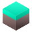
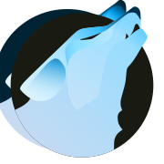

|                                        Icon                                        |      Icon name      |                                                                           Source                                                                           |                                                                     Changes                                                                      |
|------------------------------------------------------------------------------------|---------------------|------------------------------------------------------------------------------------------------------------------------------------------------------------|--------------------------------------------------------------------------------------------------------------------------------------------------|
|                      |Blender              |<a href="https://commons.wikimedia.org/wiki/File:Blender_logo_no_text.svg">original Blender SVG</a>                                                         |added a subtle gradient                                                                                                                           |
|                        |Godot                |<a href="https://www.gnome-look.org/p/1367155" target="_blank">PlasmaX</a>                                                                                  |edited SVG to make the tones match                                                                                                                |
|                     |Inkscape             |<a href="https://www.gnome-look.org/p/1367155" target="_blank">PlasmaX</a>                                                                                  |edited SVG to make it darker                                                                                                                      |
|                        |Krita                |<a href="https://www.gnome-look.org/p/1239855" target="_blank">Marwaita</a>                                                                                 |                                                                                                                                                  |
|               |Spotify              |<a href="https://www.gnome-look.org/p/1239855" target="_blank">Marwaita</a>                                                                                 |added a subtle gradient                                                                                                                           |
|                      |Discord              |<a href="https://store.kde.org/p/1256209" target="_blank">Kora</a>                                                                                          |edited SVG to make the color closer to the official Discord burple                                                                                |
|               |Discord Canary       |<a href="https://store.kde.org/p/1256209" target="_blank">Kora</a>                                                                                          |background shape changed to be like regular Discord                                                                                               |
|          |Discord Development  |<a href="https://store.kde.org/p/1256209" target="_blank">Kora</a>                                                                                          |modified to match size and style of other Discord variants                                                                                        |
|                         |GIMP                 |<a href="https://github.com/KDE/breeze-icons" target="_blank">Breeze</a>                                                                                    |edited SVG to make it bigger                                                                                                                      |
|                        |Steam                |<a href="https://www.gnome-look.org/p/1239855" target="_blank">Marwaita</a>                                                                                 |                                                                                                                                                  |
|                          |OBS                  |<a href="https://store.kde.org/p/1256209" target="_blank">Kora</a>                                                                                          |edited SVG to make it darker                                                                                                                      |
|                  |Libresprite          |made from scratch                                                                                                                                           |                                                                                                                                                  |
|                     |Aseprite             |made from scratch                                                                                                                                           |                                                                                                                                                  |
|                      |PureRef              |<a href="https://store.kde.org/p/1256209" target="_blank">Kora</a>                                                                                          |edited SVG to make it darker                                                                                                                      |
|                |DB Browser for SQLite|made from scratch                                                                                                                                           |                                                                                                                                                  |
|                     |Audacity             |based on <a href="https://www.gnome-look.org/p/1340791" target="_blank">Reversal</a>, but made from scratch                                                 |changed colors and shapes                                                                                                                         |
|                     |VSCodium             |<a href="https://github.com/VSCodium/icons/blob/main/icons/linux/nobg/blue1/paulo22s.png">from VSCodium's repository</a>                                    |                                                                                                                                                  |
|             |AppImageLauncher     |<a href="https://store.kde.org/p/1012430" target="_blank">Flat Remix</a>                                                                                    |modified colors and shapes                                                                                                                        |
|        |Android Studio Canary|<a href="https://www.gnome-look.org/p/1684521" target="_blank">FairyWren</a>                                                                                |adjusted colors                                                                                                                                   |
|                         |btop++               |partially from <a href="https://store.kde.org/p/1256209" target="_blank">Kora</a>                                                                           |remade btop logo from scratch, used Kora's system monitor background, MoreWaita's btop color                                                      |
|                          |Ark                  |<a href="https://www.gnome-look.org/p/1196255/" target="_blank">Yosa Max</a>                                                                                |made the gradient more noticeable, rounded the corners and replaced the original zipper with Kora's zipper (from the application-x-sogouskin icon)|
|   |GitHub Desktop       |<a href="https://store.kde.org/p/1256209" target="_blank">Kora</a>                                                                                          |adjusted colors                                                                                                                                   |
|           |Color Picker         |<a href="https://www.gnome-look.org/p/1239855" target="_blank">Marwaita</a> and <a href="https://www.gnome-look.org/p/1196255/" target="_blank">Yosa Max</a>|used Marwaita's color picker background and Yosa Max drop symbol                                                                                  |
|                      |Kvantum              |<a href="https://store.kde.org/p/1256209" target="_blank">Kora</a>                                                                                          |switched the colors to Marwaita's Kvantum icon                                                                                                    |
|                        |CMake                |<a href="https://store.kde.org/p/1256209" target="_blank">Kora</a>                                                                                          |removed background and added gradients                                                                                                            |
|     |Roblox               |made from scratch                                                                                                                                           |                                                                                                                                                  |
| |Roblox Studio        |made from scratch                                                                                                                                           |                                                                                                                                                  |
|        |Vinegar              |made from scratch, then added <a href="https://www.svgrepo.com/svg/443560/brand-winehq">this SVG</a> on top of it                                           |                                                                                                                                                  |
|          |Sober                |made from scratch                                                                                                                                           |                                                                                                                                                  |
|               |OpenJDK Java 21 Shell|<a href="https://store.kde.org/p/1256209" target="_blank">Kora</a>                                                                                          |                                                                                                                                                  |
|                    |Minecraft            |made from scratch                                                                                                                                           |                                                                                                                                                  |
||Trenchbroom          |made from scratch                                                                                                                                           |                                                                                                                                                  |
|                    |Librewolf            |vectorized version of <a href="https://www.reddit.com/r/LibreWolf/comments/t9c84n/icon_update/">this Reddit post</a>                                        |                                                                                                                                                  |
|                 |AnimeEffects         |vectorized version based on <a href="https://github.com/AnimeEffectsDevs/AnimeEffects">AnimeEffects repository</a>                                          |                                                                                                                                                  |
|               |Proton Calendar      |<a href="https://store.kde.org/p/1256209" target="_blank">Kora</a>                                                                                          |removed background to match other Proton applications                                                                                             |
